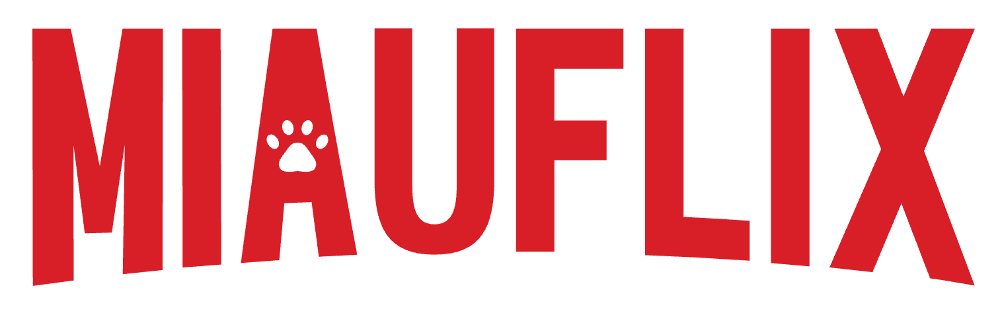
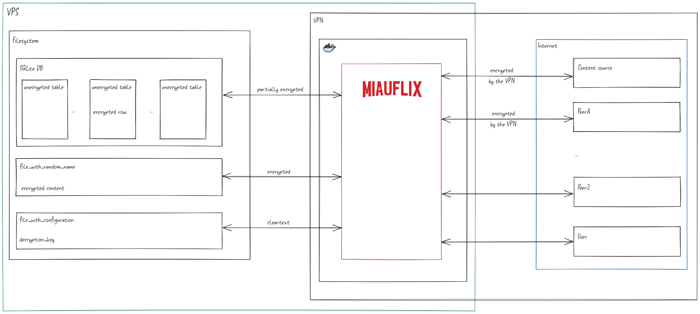

# 🐱 Miauflix

<div align="center">



[](https://opensource.org/licenses/MIT)
[](https://nodejs.org/)
[](https://www.docker.com/)
[](https://github.com/maury91/miauflix/actions/workflows/ci.yml)

**The self-hosted streaming service that meows!**

</div>

## 📋 Table of Contents

- [Overview](#overview)
- [Features](#features)
  - [Currently Available](#currently-available)
  - [In Development](#in-development)
  - [Planned Features](#planned-features)
- [Implementation Status](#implementation-status)
- [Project Architecture](#project-architecture)
- [Getting Started](#getting-started)
  - [Prerequisites](#prerequisites)
  - [Setup](#setup)
- [CI/CD](#cicd)
  - [GitHub Actions](#github-actions)
- [Contributing](#contributing)
- [License](#license)

## 🔍 Overview

Miauflix is a self-hosted media streaming platform that enables users to discover and stream content from various sources. It provides a modern web interface for accessing media content through peer-to-peer streaming technology. Built with Node.js and designed for personal server deployment, Miauflix offers a customizable streaming solution for your media library.

## Philosophy

Miauflix is based on these principles:

### Simplicity

Starting Miauflix on your machine or VPS must be as easy as possible.
The setup accommodates both beginners and advanced users.

If you’re a beginner running Miauflix locally, run the wizard and start a single Docker container—you don’t even need to clone this repository.

If you’re an advanced user, everything is ready for you to set up a full website with SSL, custom domain, VPN, and anything else you might need.

### Resilience

Miauflix is designed to work with multiple sources. Many are integrated into the codebase so you can use them without installing anything else (simplicity principle).  
Others can be added so Miauflix can still work even if those sources are not available anymore.

> Note: This principle is not fully implemented yet; integration with Prowlarr and Jackett is planned.

### Running everywhere

Miauflix is designed so you can run it in a possibly hostile environment, like a VPS that is partially monitored by the provider.

### First part: obfuscation

Miauflix encrypts sensitive data at rest. The application must access the decryption key at runtime; accordingly, a host with root access could also access it.

When SSL is configured, data in transit is protected via HTTPS (TLS). A VPN is recommended for upstream privacy and ISP/provider exposure reduction, but it is not a substitute for HTTPS.



### Second part: authentication

Miauflix in order to be able to run outside of your local network, needs to support user authentication.

Miauflix provides a closed authentication system, it provides you with an admin user that can create other users, it does not provide a self signup system.

The purpose is to let you deploy your instance of Miauflix in a server exposed to the internet, while ensuring only authorized users can access it.

## Speed

Miauflix is designed for fast start times. The tenet is: "When a user clicks Watch Now, streaming should start in under 2 seconds."

To achieve this, Miauflix uses background processing, preloading, and priority queues.

When idle, Miauflix searches for new content and preloads data needed for streaming.

- Periodic synchronization of TMDB and Trakt.tv lists
- Periodic source discovery of recently acquired content and re-discovery of older content
- Pre-download of content marked as "continue watching" (e.g., new episode of a TV show)

Miauflix prioritizes content the user shows intent to watch (e.g., opening a movie detail). If data isn't present, it's fetched with priority and downloading begins so some content is ready when the user clicks Watch Now.

Miauflix supports streaming while downloading.

## ✨ Features

### 🚀 Currently Available

- **🔐 User Authentication**: Multi-layered authentication system with comprehensive login flows
- **🎬 Movie Database**: TMDB integration for posters, ratings, and metadata
- **🔍 Source Discovery**: Automatic search across multiple content directories (YTS and THERARBG with more to come)
- **📺 Video Streaming**: Complete peer-to-peer streaming with quality selection
- **🛡️ VPN Integration**: Built-in VPN detection and enforcement (optional)
- **📊 Background Processing**: Continuous source discovery and quality scoring
- **🔒 Content Encryption**: All source metadata encrypted at rest with AES-256-GCM
- **🐳 Docker Support**: Ready-to-run containers with nginx and SSL

### 🎯 Planned Features

- **📺 TV Shows**: Episode navigation and season management
- **⛩️ Anime**: Anime support
- **🎯 More Sources**: Additional content directories and indexers ( 1337x, Nyan, Jackett & Prowlarr )
- **📱 Mobile Apps**: Native iOS and Android clients

## 🏗️ Project Architecture

```text
miauflix/
├── backend/                        # Node.js TypeScript backend
│   ├── src/                        # Source code
│   └── docs/                       # API documentation
├── frontend/                       # Client application
│   ├── e2e/                        # End to end tests ( for frontend )
│   ├── storybook/                  # Storybook documentation
│   └── src/                        # Source code
|── packages/                       # Shared libraries
│   ├── backend-client/             # Generated API client
│   ├── *-sanitizer/                # Source metadata sanitizer ( used for testing )
│   └── source-metadata-extractor/  # Content metadata processing
|── docs/                           # Project documentation
├── nginx/                          # Nginx configuration
│   ├── conf.d/                     # Server blocks
│   │   ├── default.conf            # Active configuration (auto-generated)
│   │   └── default.conf.template   # Configuration template
│   ├── certbot/                    # Let's Encrypt certificates
│   └── ssl/                        # SSL certificates (auto-generated)
├── backend-e2e/                    # End to end tests ( for backend )
├── scripts/                        # Support scripts
├── docker-compose.yml              # Container orchestration
```

## ⚡ Quick Setup (5 minutes)

> Just want to try it? Here's the fastest path:

```bash
git clone https://github.com/maury91/miauflix.git && cd miauflix
docker compose run --rm backend npm run config-only
docker compose up
```

First command runs the configuration wizard (TMDB API key, etc.), then start the full stack. No local Node.js installation needed!

## 🚀 Getting Started

### Prerequisites

- [Docker](https://www.docker.com/) and [Docker Compose](https://docs.docker.com/compose/)
- [Node.js](https://nodejs.org/) (for local development)
- VPN subscription (for VPN functionality, currently only NordVPN is supported)
- [TMDB API Access Token](https://developer.themoviedb.org/docs) (for media content)
- [Trakt.tv API Client ID](https://trakt.tv/oauth/applications) (optional, for list synchronization)

### Setup

#### 1. Clone the repository

```bash
git clone https://github.com/maury91/miauflix.git
cd miauflix
```

#### 2. Configure your environment

**Option A: Interactive Configuration Wizard (Recommended)**

Run the configuration wizard directly on your system:

```bash
npm run start:backend
```

Or run it in Docker's interactive mode:

```bash
docker compose run --rm backend npm run start:backend
```

<p align="center">
  
</p>

<details>
<summary>What does the configuration wizard do?</summary>

The application includes a sophisticated configuration system that will:

- ✅ Automatically detect missing environment variables
- 🧙‍♂️ Guide you through an interactive setup process
- 🔄 Test API credentials in real-time as you enter them
- 📝 Provide helpful guidance on how to obtain required tokens
- 🔍 Verify configuration before starting the application
- 💾 Save all settings to a `.env` file when completed

</details>

**Option B: Manual Configuration**

Create a `.env` file in the project root directory and configure the required variables:

```bash
# Required for media content
TMDB_API_URL=https://api.themoviedb.org/3
TMDB_API_ACCESS_TOKEN=your_tmdb_token

# Optional for list synchronization
TRAKT_API_URL=https://api.trakt.tv
TRAKT_CLIENT_ID=your_trakt_client_id
```

> **Note**: If running in a non-interactive environment, you'll need to set all required environment variables manually.

#### 3. Set up VPN (Optional)

If you are not planning to use a VPN, you can use the `docker-compose-no-vpn.yml` file (coming soon).

<details>
<summary><b>🔒 NordVPN Setup Instructions</b></summary>

Currently only NordVPN is officially supported. If you want to contribute and use another VPN provider, contributions are welcome!

**NordVPN Configuration:**

1. Follow the [guide in Bubuntux/NordLynx](https://github.com/bubuntux/nordlynx/pkgs/container/nordlynx#how-to-get-your-private_key) to obtain your private key
2. Add your private key to the `.env` file:

```bash
NORDVPN_PRIVATE_KEY=your-nordvpn-private-key
```

</details>

#### 4. Set up HTTPS

Run the interactive SSL setup wizard:

```bash
chmod +x setup-ssl.sh
./setup-ssl.sh -d yourdomain.com
```

<details>
<summary><b>🔐 SSL Setup Details</b></summary>

This wizard will:

- 🔍 Guide you through domain verification and troubleshooting
- 📜 Help set up Let's Encrypt certificates (recommended for production)
- 🔒 Or create self-signed certificates (for development/testing)
- 📋 Provide step-by-step assistance with clear prompts
- ⚙️ Handle validation, certificate requests, and Nginx configuration

For detailed information, see:

- [SSL Certificates Guide](docs/setup/ssl-certificates.md)
</details>

#### 5. Start the Docker Compose environment

```bash
docker compose up -d
```

#### 6. Access the application

- 🌐 App origin: `https://yourdomain.com/`
- 🧭 API base: `https://yourdomain.com/api`
- ✅ Health check: `https://yourdomain.com/api/health`

## 💻 Local Development

For local development without Docker:

### Frontend Development

```bash
# Install dependencies
npm install

# Start frontend with hot reload (recommended for development)
npm run start:frontend
# or
npm run dev:frontend
```

The frontend development server provides:

- ✅ **Hot reload** - Changes appear instantly without manual refresh
- 🔥 **Fast feedback** - Perfect for UI development and styling
- 🚀 **Client-side rendering** - No SSR overhead during development

### Frontend SSR Testing

```bash
# Test with Server-Side Rendering (for production-like behavior)
npm run dev:frontend:ssr
```

Use SSR mode when:

- 🔍 **Testing SSR functionality** - Debug server-side rendering issues
- 🎯 **Production verification** - Ensure production-like behavior
- 📱 **SEO testing** - Verify meta tags and initial page load

> **Note**: SSR mode requires manual rebuild after changes - use regular dev mode for active development.

### Backend Development

```bash
# Interactive configuration and start
npm run start:backend

# Development with Docker (includes mock data)
npm run start:backend:e2e
```

## 🔄 CI/CD

This project uses GitHub Actions for continuous integration and testing. Tests run automatically in networkless mode using pre-recorded fixtures. For more details, see the [CI/CD Guide](docs/development/ci-cd-guide.md).

## 📚 Documentation

For comprehensive guides and development resources, see our [Documentation](docs/README.md):

- **[Setup Guides](docs/setup/)** - Installation, Docker, and HTTPS setup
- **[Development](docs/development/)** - Workflow, testing, and coding standards
- **[Architecture](docs/architecture/)** - System overview and technical details
- **[AI Assistance](docs/ai/)** - Guidelines for AI development tools

## 🤝 Contributing

Contributions are welcome and appreciated! Here's how you can contribute:

1. Fork the repository
2. Create a feature branch: `git checkout -b feature/amazing-feature`
3. Follow the [Development Workflow](docs/development/workflow.md)
4. Commit your changes: `git commit -m 'Add amazing feature'`
5. Push to the branch: `git push origin feature/amazing-feature`
6. Open a Pull Request

## 📄 License

This project is licensed under the MIT License - see the [LICENSE](LICENSE) file for details.

---

<div align="center">
  <p>Built with 😻 by the Miauflix team</p>
</div>
