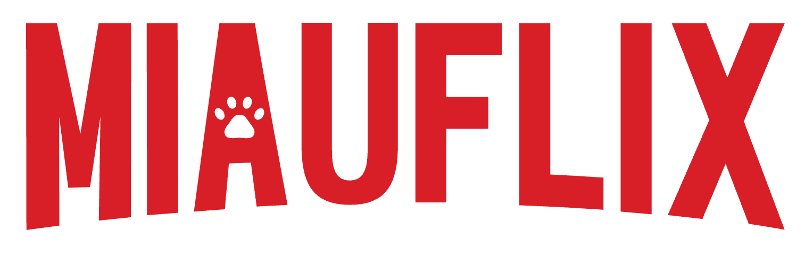

# 🐱 Miauflix

<div align="center">



[](https://opensource.org/licenses/MIT)
[](https://nodejs.org/)
[](https://www.docker.com/)
[](https://github.com/maury91/miauflix-bun/actions/workflows/ci.yml)

**The self-hosted streaming service that meows!**

</div>

## 📋 Table of Contents

- [Overview](#overview)
- [Features](#features)
  - [Currently Available](#currently-available)
  - [In Development](#in-development)
  - [Planned Features](#planned-features)
- [Implementation Status](#implementation-status)
- [Project Architecture](#project-architecture)
- [Getting Started](#getting-started)
  - [Prerequisites](#prerequisites)
  - [Setup](#setup)
- [CI/CD](#cicd)
  - [GitHub Actions](#github-actions)
- [Contributing](#contributing)
- [License](#license)

## 🔍 Overview

Miauflix is a self-hosted media streaming platform that enables users to discover and stream content from various sources. It provides a modern web interface for accessing media content through peer-to-peer streaming technology. Built with Node.js and designed for personal server deployment, Miauflix offers a customizable streaming solution for your media library.

## ✨ Features

### 🚀 Currently Available

- **🔐 User Authentication**: JWT login system with refresh tokens
- **🎬 Movie Database**: TMDB integration for posters, ratings, and metadata
- **🔍 Source Discovery**: Automatic search across multiple content directories, currently supported YTS and THERARBG but more to come
- **🛡️ VPN Integration**: Built-in VPN detection and enforcement ( optional )
- **📊 Background Processing**: Continuous source discovery and quality scoring
- **🔒 Content Encryption**: All source metadata is encrypted at rest, either if it's in the database or in the file system ( you may be safe from automated detection, protection from a human is impossible )
- **🐳 Docker Support**: Ready-to-run containers with nginx and SSL

### 🔄 In Development

- **📺 Video Streaming**: Stream endpoint for peer-to-peer content (backend 95% done)
- **📱 Web Interface**: Frontend JWT integration and build fixes needed

### 🎯 Planned Features

- **📺 TV Shows**: Episode navigation and season management
- **⛩️ Anime**: Anime support
- **🎯 More Sources**: Additional content directories and indexers ( 1337x, Nyan, Jackett & Prowlarr )
- **📱 Mobile Apps**: Native iOS and Android clients

> **Current Status**: Backend is nearly complete (95%), frontend needs JWT auth and build fixes. About 2-3 weeks from full functionality.

The application is a self-contained Node.js application. Docker image and docker-compose files are provided for easy server setup. Note: Docker and docker-compose are not mandatory but are recommended as they provide pre-configured VPN and reverse proxy setup.

## 🏗️ Project Architecture

```
miauflix/
├── backend/                  # Node.js TypeScript backend
│   ├── src/                  # Source code
│   └── docs/                 # API documentation
├── frontend/                 # Client application
├── nginx/                    # Nginx configuration
│   ├── conf.d/               # Server blocks
│   │   ├── default.conf      # Active configuration (auto-generated)
│   │   └── default.conf.template # Configuration template
│   ├── certbot/              # Let's Encrypt certificates
│   └── ssl/                  # SSL certificates (auto-generated)
├── scripts/                  # Support scripts
├── setup-git.sh              # Git setup script
├── setup-ssl.sh              # SSL setup wizard
├── docker-compose.yml        # Container orchestration
```

## ⚡ Quick Setup (5 minutes)

> Just want to try it? Here's the fastest path:

```bash
git clone <repository-url> && cd miauflix-bun
docker compose run --rm backend npm run start:backend -- --only-config
docker compose up
```

First command runs the configuration wizard (TMDB API key, etc.), then start the full stack. No local Node.js installation needed!

## 🚀 Getting Started

### Prerequisites

- [Docker](https://www.docker.com/) and [Docker Compose](https://docs.docker.com/compose/)
- VPN subscription (for VPN functionality, currently only NordVPN is supported)
- [TMDB API Access Token](https://developer.themoviedb.org/docs) (for media content)
- [Trakt.tv API Client ID](https://trakt.tv/oauth/applications) (optional, for list synchronization)

### Setup

#### 1. Clone the repository

```bash
git clone <repository-url>
cd miauflix-bun
```

#### 2. Configure your environment

**Option A: Interactive Configuration Wizard (Recommended)**

Run the configuration wizard directly on your system:

```bash
npm run start:backend
```

Or run it in Docker's interactive mode:

```bash
docker compose run --rm backend npm run start:backend
```

<p align="center">
  
</p>

<details>
<summary>What does the configuration wizard do?</summary>

The application includes a sophisticated configuration system that will:

- ✅ Automatically detect missing environment variables
- 🧙‍♂️ Guide you through an interactive setup process
- 🔄 Test API credentials in real-time as you enter them
- 📝 Provide helpful guidance on how to obtain required tokens
- 🔍 Verify configuration before starting the application
- 💾 Save all settings to a `.env` file when completed

</details>

**Option B: Manual Configuration**

Create a `.env` file in the project root directory and configure the required variables:

```bash
# Required for media content
TMDB_API_URL=https://api.themoviedb.org/3
TMDB_API_ACCESS_TOKEN=your_tmdb_token

# Optional for list synchronization
TRAKT_API_URL=https://api.trakt.tv
TRAKT_CLIENT_ID=your_trakt_client_id
```

> **Note**: If running in a non-interactive environment, you'll need to set all required environment variables manually.

#### 3. Set up VPN (Optional)

If you are not planning to use a VPN, you can use the `docker-compose-no-vpn.yml` file (coming soon).

<details>
<summary><b>🔒 NordVPN Setup Instructions</b></summary>

Currently only NordVPN is officially supported. If you want to contribute and use another VPN provider, contributions are welcome!

**NordVPN Configuration:**

1. Follow the [guide in Bubuntux/NordLynx](https://github.com/bubuntux/nordlynx/pkgs/container/nordlynx#how-to-get-your-private_key) to obtain your private key
2. Add your private key to the `.env` file:

```bash
NORDVPN_PRIVATE_KEY=your-nordvpn-private-key
```

</details>

#### 4. Set up HTTPS

Run the interactive SSL setup wizard:

```bash
chmod +x setup-ssl.sh
./setup-ssl.sh -d yourdomain.com
```

<details>
<summary><b>🔐 SSL Setup Details</b></summary>

This wizard will:

- 🔍 Guide you through domain verification and troubleshooting
- 📜 Help set up Let's Encrypt certificates (recommended for production)
- 🔒 Or create self-signed certificates (for development/testing)
- 📋 Provide step-by-step assistance with clear prompts
- ⚙️ Handle validation, certificate requests, and Nginx configuration

For detailed information, see:

- [HTTPS Setup Guide](docs/HTTPS_SETUP.md)
- [Let's Encrypt Setup Guide](docs/LETSENCRYPT_SETUP.md)
</details>

#### 5. Start the Docker Compose environment

```bash
docker compose up -d
```

#### 6. Access the application

- 🌐 Backend API: `https://yourdomain.com/`
- ✅ Health check: `https://yourdomain.com/health`

## 🔄 CI/CD

This project uses GitHub Actions for continuous integration and testing. Tests run automatically in networkless mode using pre-recorded fixtures. For more details, see the [GitHub Actions Guide](docs/GITHUB_ACTIONS.md).

## 🤝 Contributing

Contributions are welcome and appreciated! Here's how you can contribute:

1. Fork the repository
2. Create a feature branch: `git checkout -b feature/amazing-feature`
3. Commit your changes: `git commit -m 'Add amazing feature'`
4. Push to the branch: `git push origin feature/amazing-feature`
5. Open a Pull Request

## 📄 License

This project is licensed under the MIT License - see the [LICENSE](LICENSE) file for details.

---

<div align="center">
  <p>Built with 😻 by the Miauflix team</p>
</div>
