# Miauflix — \*Roadmap\*\*

> **Legend** **SP** = Story Points (≈½‑day) ☑ Done 🔄 In‑Progress ⬜ Not Started  
> **Issue ref** links to [`backend-todos.md`](todo/backend-todos.md), [`frontend-todos.md`](todo/frontend-todos.md), [`infra-todos.md`](todo/infra-todos.md).

---

## 0 · Bootstrapping (complete)

| Task                          | Status |
| ----------------------------- | ------ |
| Node 20 ESM + Hono scaffold   | ☑     |
| TypeORM + SQLite (auto‑sync)  | ☑     |
| Admin seed + JWT auth         | ☑     |
| YTS movie tracker             | ☑     |
| TMDB Popular / Top‑Rated sync | ☑     |
| Dockerised e2e harness        | ☑     |

---

## Priority 1: Core Movie Playback — **Essential streaming functionality**

**Objective —** User logs in & plays a movie with ≤ 2 s startup while identifiers are encrypted.

| #       | Task                                                         | SP  | Issue ref                                                                                                          | Owner     | Status  |
| ------- | ------------------------------------------------------------ | --- | ------------------------------------------------------------------------------------------------------------------ | --------- | ------- |
| 1.1     | Front‑end JWT login & refresh                                | 5   | [`frontend#login-jwt`](todo/frontend-todos.md#frontendlogin-jwt--jwt-authentication-system-5-sp)                   | @ui‑dev   | ⬜      |
| 1.2     | Range‑enabled `/api/stream/:sourceId`                        | 8   | [`backend#stream`](todo/backend-todos.md#backendstream--apistreamsourceid-endpoint-8-sp)                           | @core‑dev | ⬜      |
| 1.3     | Torrent source aggregator (YTS + scoring)                    | 8   | [`backend#sources`](todo/backend-todos.md#backendsources--torrent-source-aggregator-8-sp)                          | @core‑dev | ⬜      |
| 1.4     | Focused‑item preload queue                                   | 5   | [`backend#preload`](todo/backend-todos.md#backendpreload--focuseditem-preload-queue-5-sp)                          | @core‑dev | ⬜      |
| **1.5** | **AES‑GCM encrypt `infoHash` / `magnet` / `.torrent` blobs** | 3   | [`backend#encrypt-blobs`](todo/backend-todos.md#backendencryptblobs--encrypt-torrent-identifiers-3-sp--completed)  | @sec‑dev  | ☑ Done |
| **1.6** | **Migration script encrypts pre‑existing rows**              | 5   | [`scripts#migrate-encrypt`](todo/backend-todos.md#scriptsmigrate-encrypt--data-migration-5-sp--completed)          | @sec‑dev  | ☑ Done |
| **1.7** | (opt) Column name obfuscation → `d1`,`d2`,`blob1`            | 1   | [`db#rename`](todo/backend-todos.md#dbrename--columnname-obfuscation-1-sp--completed)                              | @sec‑dev  | ☑ Done |
| 1.8     | Docker Compose infrastructure                                | 2   | [`infra#compose`](todo/infra-todos.md#infracompose--docker-compose-infrastructure-2-sp)                            | @infra    | ⬜      |
| 1.9     | Seed script + TMDB daily sync                                | 3   | [`infra#seed`](todo/infra-todos.md#infraseed--database-seeding-system-3-sp)                                        | @infra    | ⬜      |
| 1.10    | Happy‑path e2e CI spec                                       | 3   | _TBD_                                                                                                              | @qa       | ⬜      |
| 1.11    | Viewport payload for preload                                 | 2   | [`frontend#viewport-payload`](todo/frontend-todos.md#frontendviewport-payload--viewport-tracking-for-preload-2-sp) | @ui‑dev   | ⬜      |
| 1.12    | Docs patch (README, auth, streaming)                         | 1   | _TBD_                                                                                                              | @docs     | ⬜      |
| 1.13    | Nginx/Backend UI Serving                                     | 3   | [`infra#nginx-ui`](todo/infra-todos.md#infranginx-ui--nginxbackend-ui-serving-3-sp)                                | @infra    | ⬜      |

### 🎯 Exit Criteria

Demo server: login _demo@…_ → play **Big Buck Bunny** (<2 s buffer) → DB/torrent dump shows only ciphertext "iv tag ciphertext…".

---

## Priority 2: TV Show Episodes — **Episode streaming and navigation**

**Objective —** Users can stream TV show episodes with proper season/episode navigation.

| #   | Task                         | SP  | Issue ref                                                                                                         | Owner     | Status |
| --- | ---------------------------- | --- | ----------------------------------------------------------------------------------------------------------------- | --------- | ------ |
| 2.1 | EZTV provider (TV episodes)  | 5   | [`backend#eztv-provider`](todo/backend-todos.md#backendeztv-provider--eztv-torrent-provider-5-sp)                 | @core‑dev | ⬜     |
| 2.2 | Episode entity & endpoints   | 5   | [`backend#episode-entities`](todo/backend-todos.md#backendepisode-entities--episode-data-models-5-sp)             | @core‑dev | ⬜     |
| 2.3 | Season/Episode UI navigation | 5   | [`frontend#episode-navigation`](todo/frontend-todos.md#frontendepisode-navigation--seasonepisode-navigation-5-sp) | @ui‑dev   | ⬜     |
| 2.4 | Episode streaming endpoint   | 3   | [`backend#episode-stream`](todo/backend-todos.md#backendepisode-stream--episode-streaming-endpoint-3-sp)          | @core‑dev | ⬜     |
| 2.5 | TV show metadata sync        | 3   | [`backend#tv-metadata`](todo/backend-todos.md#backendtv-metadata--tv-show-metadata-sync-3-sp)                     | @core‑dev | ⬜     |
| 2.6 | Storage Management System    | 8   | [`backend#storage-management`](todo/backend-todos.md#backendstorage-management--storage-management-system-8-sp)   | @core‑dev | ⬜     |

### 🎯 Exit Criteria

User can browse TV shows → select season → select episode → stream with <2s startup.

---

## Priority 3: Nice-to-Have Features — **Tracking, subtitles, auto-play**

**Objective —** Enhanced user experience with progress tracking and quality-of-life features.

| #   | Task                              | SP  | Issue ref                                                                                                       | Owner     | Status |
| --- | --------------------------------- | --- | --------------------------------------------------------------------------------------------------------------- | --------- | ------ |
| 3.1 | Continue‑Watching slider          | 5   | [`frontend#continue-watching`](todo/frontend-todos.md#frontendcontinue-watching--continue-watching-slider-5-sp) | @ui‑dev   | ⬜     |
| 3.2 | Subtitle fetch (OpenSubtitles)    | 3   | [`backend#subtitles`](todo/backend-todos.md#backendsubtitles--subtitle-integration-3-sp)                        | @core‑dev | ⬜     |
| 3.3 | Quality selector (720/1080/2160)  | 3   | [`frontend#quality-selector`](todo/frontend-todos.md#frontendquality-selector--quality-selection-ui-3-sp)       | @ui‑dev   | ⬜     |
| 3.4 | Episode auto‑play (Next‑Up)       | 3   | [`frontend#next-up`](todo/frontend-todos.md#frontendnext-up--auto-play-next-episode-3-sp)                       | @ui‑dev   | ⬜     |
| 3.5 | Trakt device‑code link (optional) | 5   | [`frontend#link-trakt`](todo/frontend-todos.md#frontendlink-trakt--trakt-integration-ui-5-sp)                   | @ui‑dev   | ⬜     |
| 3.6 | Progress tracking & resume        | 4   | [`backend#progress-tracking`](todo/backend-todos.md#backendprogress-tracking--progress-tracking-system-4-sp)    | @core‑dev | ⬜     |
| 3.7 | UI Configuration Menu             | 5   | [`frontend#ui-config`](todo/frontend-todos.md#frontendui-config--ui-configuration-menu-5-sp)                    | @ui‑dev   | ⬜     |
| 3.8 | Profile Customization             | 4   | [`frontend#profile-custom`](todo/frontend-todos.md#frontendprofile-custom--profile-customization-4-sp)          | @ui‑dev   | ⬜     |
| 3.9 | Notification System               | 6   | [`backend#notifications`](todo/backend-todos.md#backendnotifications--notification-system-6-sp)                 | @core‑dev | ⬜     |

### 🎯 Exit Criteria

Users can track progress, resume playback, switch quality mid-stream, and get subtitles.

---

## Priority 4: Anime Support — **Anime-specific features and trackers**

**Objective —** Dedicated anime streaming with specialized trackers and features.

| #   | Task                       | SP  | Issue ref                                                                                           | Owner     | Status |
| --- | -------------------------- | --- | --------------------------------------------------------------------------------------------------- | --------- | ------ |
| 4.1 | Nyaa.si anime tracker      | 5   | [`backend#nyaa-tracker`](todo/backend-todos.md#backendnyaa-tracker)                                 | @core‑dev | ⬜     |
| 4.2 | AniList/MAL integration    | 8   | [`backend#anime-metadata`](todo/backend-todos.md#backendanime-metadata)                             | @core‑dev | ⬜     |
| 4.3 | Anime-specific UI          | 5   | [`frontend#anime-ui`](todo/frontend-todos.md#frontendanime-ui)                                      | @ui‑dev   | ⬜     |
| 4.4 | Fansub group preferences   | 3   | [`backend#fansub-groups`](todo/backend-todos.md#backendfansub-groups)                               | @core‑dev | ⬜     |
| 4.5 | Enhanced scoring for anime | 2   | [`backend#anime-scoring`](todo/backend-todos.md#backendanime-scoring)                               | @core‑dev | ⬜     |
| 4.6 | Auto-Download Features     | 12  | [`backend#auto-download`](todo/backend-todos.md#backendauto-download--auto-download-features-12-sp) | @core‑dev | ⬜     |

### 🎯 Exit Criteria

Users can discover, track, and stream anime with proper metadata and fansub preferences.

---

## Priority 5: More Trackers — **Additional torrent sources**

**Objective —** Expand content availability through multiple torrent providers.

| #   | Task                          | SP  | Issue ref                                                                             | Owner     | Status |
| --- | ----------------------------- | --- | ------------------------------------------------------------------------------------- | --------- | ------ |
| 5.1 | RARBG provider (movies & TV)  | 5   | [`backend#rarbg-provider`](todo/backend-todos.md#backendrarbg-provider)               | @core‑dev | ⬜     |
| 5.2 | 1337x provider integration    | 5   | [`backend#1337x-provider`](todo/backend-todos.md#backend1337x-provider)               | @core‑dev | ⬜     |
| 5.3 | Multi‑tracker scoring upgrade | 3   | [`backend#multi-tracker-scoring`](todo/backend-todos.md#backendmulti-tracker-scoring) | @core‑dev | ⬜     |
| 5.4 | Provider health monitoring    | 3   | [`backend#provider-health`](todo/backend-todos.md#backendprovider-health)             | @core‑dev | ⬜     |
| 5.5 | Torrent quality verification  | 4   | [`backend#quality-verification`](todo/backend-todos.md#backendquality-verification)   | @core‑dev | ⬜     |

### 🎯 Exit Criteria

Multiple reliable torrent sources with intelligent failover and quality assessment.

---

## Priority 6: Prowlarr/Jackett — **Indexer integrations**

**Objective —** Professional-grade indexer management and private tracker support.

| #   | Task                         | SP  | Issue ref                                                                           | Owner     | Status |
| --- | ---------------------------- | --- | ----------------------------------------------------------------------------------- | --------- | ------ |
| 6.1 | Prowlarr API integration     | 8   | [`backend#prowlarr-integration`](todo/backend-todos.md#backendprowlarr-integration) | @core‑dev | ⬜     |
| 6.2 | Jackett fallback support     | 5   | [`backend#jackett-integration`](todo/backend-todos.md#backendjackett-integration)   | @core‑dev | ⬜     |
| 6.3 | Private tracker auth         | 5   | [`backend#private-trackers`](todo/backend-todos.md#backendprivate-trackers)         | @core‑dev | ⬜     |
| 6.4 | Indexer management UI        | 5   | [`frontend#indexer-management`](todo/frontend-todos.md#frontendindexer-management)  | @ui‑dev   | ⬜     |
| 6.5 | Advanced search capabilities | 4   | [`backend#advanced-search`](todo/backend-todos.md#backendadvanced-search)           | @core‑dev | ⬜     |

### 🎯 Exit Criteria

Full indexer ecosystem integration with private tracker support and advanced search.

---

## Stretch Goals & R&D

**Future Considerations** (not prioritized):

- DLNA / Chromecast casting (8 SP)
- Parental PIN & kid profiles (5 SP)
- Signed stream URLs (3 SP)
- Piece‑prefetch buffer (3 SP)
- Watch‑party functionality
- Offline PWA capabilities
- Server‑side HLS transcoding
- Push notifications
- Docker Image Publication (4 SP) - [`infra#docker-publish`](todo/infra-todos.md#infradocker-publish--docker-image-publication-4-sp)
- Tizen App Publication (8 SP) - [`infra#tizen-publish`](todo/infra-todos.md#infratizen-publish--tizen-app-publication-8-sp)

See `docs/stretch-goals.md` for detailed R&D items.

---

# 📋 Task Briefs & Snippets

## backend#encrypt‑blobs (3 SP) ☑ **COMPLETED**

> Store identifiers as AES‑256‑GCM ciphertext.

```ts
import { randomBytes, createCipheriv, createDecipheriv } from 'crypto';
const key = Buffer.from(process.env.SOURCE_SECURITY_KEY!, 'base64');
const ivLen = 12;
export const enc = (buf: Buffer): Buffer => {
  const iv = randomBytes(ivLen);
  const c = createCipheriv('aes-256-gcm', key, iv);
  const ct = Buffer.concat([c.update(buf), c.final()]);
  return Buffer.concat([iv, c.getAuthTag(), ct]); // iv‖tag‖ciphertext
};
export const dec = (data: Buffer): Buffer => {
  const iv = data.subarray(0, ivLen);
  const tag = data.subarray(ivLen, ivLen + 16);
  const ct = data.subarray(ivLen + 16);
  const d = createDecipheriv('aes-256-gcm', key, iv);
  d.setAuthTag(tag);
  return Buffer.concat([d.update(ct), d.final()]);
};
```

Apply via TypeORM transformer:

```ts
@Column({
  type: 'blob',
  transformer: { to: (v?: string) => v && enc(Buffer.from(v)), from: (b?: Buffer) => b && dec(b).toString() }
})
magnet!: string;
```

## scripts#migrate‑encrypt (5 SP) ☑ **COMPLETED**

1. Backup DB → `database_before_encrypt.sqlite`.
2. For each entity (`MovieSource`, later `EpisodeSource`) update rows lacking GCM tag (`length < 60`).
3. Print processed / skipped counts.

**CLI**

```bash
npx ts-node scripts/migrate-encrypt.ts
```

Idempotent – safe to rerun.

---

## backend#sources (8 SP) — **Scoring Formula**

A torrent **score** combines seeders and size:

$$
\text{score} = \text{seeders} \; \minus \; 10 \times \text{size}_{\text{GB}}
$$

\* Prefer torrents with ≥ 50 seeders; if `< 50`, down‑weight by ×0.5 before scoring. \* Aggregator picks the torrent with the **highest score** and sets `isDefault=true`.

---

## backend#preload (5 SP) — Flow Diagram

```mermaid
flowchart TD
  FE[Frontend → /api/ui/viewport]
  FE -->|visible payload| Q[PreloadQueue]
  Q -->|dequeue| Src[SourceSearch]
  Src --> DB[(SQLite)]
  Src -->|fetch magnet| WT[MagnetService]
  WT -->|.torrent| Cache((Redis? soon))
  Cache -. first chunk .-> Stream
```



\*Queue priority: **focused item › adjacent items › visible slider › near sliders\***.

---

_(See [`backend-todos.md`](todo/backend-todos.md) for full acceptance criteria of every backend task. Frontend tasks are in [`frontend-todos.md`](todo/frontend-todos.md) and infrastructure tasks are in [`infra-todos.md`](todo/infra-todos.md).)_
