# Miauflix‑bun — **Master Roadmap v0.1 → v0.5**

_(updated 29 May 2025 — security items pulled into v0.1)_

> **Legend** **SP** = Story Points (≈½‑day) ☑ Done 🔄 In‑Progress ⬜ Not Started
> **Issue ref** links to `backend-todos.md`, `frontend-todos.md`, `infra-todos.md`.

---

## 0 · Bootstrapping (complete)

| Task                          | Status |
| ----------------------------- | ------ |
| Node 20 ESM + Hono scaffold   | ☑     |
| TypeORM + SQLite (auto‑sync)  | ☑     |
| Admin seed + JWT auth         | ☑     |
| YTS movie tracker             | ☑     |
| TMDB Popular / Top‑Rated sync | ☑     |
| Dockerised e2e harness        | ☑     |

---

## 1 · **MVP Core (v0.1)** — ⬜ **Week 23–24**

**Objective —** user logs in & plays a movie with ≤ 2 s startup **while identifiers are already encrypted**.

| #       | Task                                                         | SP  | Issue ref                                                                                              | Owner     | Target  |
| ------- | ------------------------------------------------------------ | --- | ------------------------------------------------------------------------------------------------------ | --------- | ------- |
| 1.1     | Front‑end JWT login & refresh                                | 5   | [`frontend#login-jwt`](todo/frontend-todos.md#frontendlogin-jwt)                                       | @ui‑dev   | W23–24  |
| 1.2     | Range‑enabled `/api/stream/:sourceId`                        | 8   | [`backend#stream`](todo/backend-todos.md#backendstream--apistreamsourceid-endpoint-8-sp)               | @core‑dev | W23–24  |
| 1.3     | Trakt device‑code link (opt.)                                | 5   | [`frontend#link-trakt`](todo/frontend-todos.md#frontendlink-trakt)                                     | @ui‑dev   | W24     |
| 1.4     | Torrent source aggregator (YTS + scoring)                    | 8   | [`backend#sources`](todo/backend-todos.md#backendsources--torrent-source-aggregator-8-sp)              | @core‑dev | W24     |
| 1.5     | Focused‑item preload queue                                   | 5   | [`backend#preload`](todo/backend-todos.md#backendpreload--focuseditem-preload-queue-5-sp)              | @core‑dev | W24–25  |
| **1.6** | **AES‑GCM encrypt `infoHash` / `magnet` / `.torrent` blobs** | 3   | [`backend#encrypt-blobs`](todo/backend-todos.md#backendencryptblobs--encrypt-torrent-identifiers-3-sp) | @sec‑dev  | ☑ Done |
| **1.7** | **Migration script encrypts pre‑existing rows**              | 5   | [`scripts#migrate-encrypt`](todo/backend-todos.md#scriptsmigrate-encrypt--data-migration-5-sp)         | @sec‑dev  | ☑ Done |
| **1.8** | (opt) column name obfuscation → `d1`,`d2`,`blob1`            | 1   | [`db#rename`](todo/backend-todos.md#dbrename--columnname-obfuscation-1-sp-optional)                    | @sec‑dev  | ☑ Done |
| 1.9     | Seed script + TMDB daily sync                                | 3   | [`infra#seed`](todo/infra-todos.md#infraseed--3-sp--milestone-v01)                                     | @infra    | W24     |
| 1.10    | Happy‑path e2e CI spec                                       | 3   | _TBD_                                                                                                  | @qa       | W24     |
| 1.11    | Docker Compose refresh                                       | 2   | [`infra#compose`](todo/infra-todos.md#infracompose--2-sp--milestone-v01)                               | @infra    | W23     |
| 1.12    | Docs patch (README, auth, streaming)                         | 1   | _TBD_                                                                                                  | @docs     | W24     |

### 🎯 Exit Criteria

Demo server: login _demo@…_ → play **Big Buck Bunny** (<2 s buffer) → DB/torrent dump shows only ciphertext "iv tag ciphertext…".

---

## 2 · Short‑Term UX Wins (v0.2)

| Task                                 | SP  | Owner     | Issue ref                                                                        |
| ------------------------------------ | --- | --------- | -------------------------------------------------------------------------------- |
| Continue‑Watching slider             | 5   | @ui‑dev   | [`frontend#continue-watching`](todo/frontend-todos.md#frontendcontinue-watching) |
| Subtitle fetch (OpenSubtitles)       | 3   | @core‑dev | _TBD_                                                                            |
| Quality selector (720 / 1080 / 2160) | 3   | @ui‑dev   | [`frontend#quality-selector`](todo/frontend-todos.md#frontendquality-selector)   |
| Episode auto‑play (Next‑Up)          | 3   | @ui‑dev   | [`frontend#next-up`](todo/frontend-todos.md#frontendnext-up)                     |

ETA W27 → W30.

---

## 3 · Tracker Expansion (v0.3)

| Task                          | SP  | Owner     |
| ----------------------------- | --- | --------- |
| EZTV provider (TV)            | 5   | @core‑dev |
| RARBG provider (movies & TV)  | 5   | @core‑dev |
| Multi‑tracker scoring upgrade | 3   | @core‑dev |

ETA W31 → W34.

---

## 4 · Medium‑Term (v0.4)

| Feature                     | SP  |
| --------------------------- | --- |
| DLNA / Chromecast casting   | 8   |
| Parental PIN & kid profiles | 5   |
| Signed stream URLs          | 3   |
| Piece‑prefetch buffer       | 3   |

Target Q4‑2025.

---

## 5 · Stretch / R\&D

See `docs/stretch-goals.md` – watch‑party, offline PWA, server‑side HLS, push notifications.

---

# 📋 Task Briefs & Snippets

## backend#encrypt‑blobs (3 SP)

> Store identifiers as AES‑256‑GCM ciphertext.

```ts
import { randomBytes, createCipheriv, createDecipheriv } from 'crypto';
const key = Buffer.from(process.env.SOURCE_SECURITY_KEY!, 'base64');
const ivLen = 12;
export const enc = (buf: Buffer): Buffer => {
  const iv = randomBytes(ivLen);
  const c = createCipheriv('aes-256-gcm', key, iv);
  const ct = Buffer.concat([c.update(buf), c.final()]);
  return Buffer.concat([iv, c.getAuthTag(), ct]); // iv‖tag‖ciphertext
};
export const dec = (data: Buffer): Buffer => {
  const iv = data.subarray(0, ivLen);
  const tag = data.subarray(ivLen, ivLen + 16);
  const ct = data.subarray(ivLen + 16);
  const d = createDecipheriv('aes-256-gcm', key, iv);
  d.setAuthTag(tag);
  return Buffer.concat([d.update(ct), d.final()]);
};
```

Apply via TypeORM transformer:

```ts
@Column({
  type: 'blob',
  transformer: { to: (v?: string) => v && enc(Buffer.from(v)), from: (b?: Buffer) => b && dec(b).toString() }
})
magnet!: string;
```

## scripts#migrate‑encrypt (5 SP)

1. Backup DB → `database_before_encrypt.sqlite`.
2. For each entity (`MovieSource`, later `EpisodeSource`) update rows lacking GCM tag (`length < 60`).
3. Print processed / skipped counts.

**CLI**

```bash
npx ts-node scripts/migrate-encrypt.ts
```

Idempotent – safe to rerun.

---

## backend#sources (8 SP) — **Scoring Formula**

A torrent **score** combines seeders and size:

$$
\text{score} = \text{seeders} \; \minus \; 10 \times \text{size}_{\text{GB}}
$$

\* Prefer torrents with ≥ 50 seeders; if `< 50`, down‑weight by ×0.5 before scoring. \* Aggregator picks the torrent with the **highest score** and sets `isDefault=true`.

---

## backend#preload (5 SP) — Flow Diagram

```mermaid
flowchart TD
  FE[Frontend → /api/ui/viewport]
  FE -->|visible payload| Q[PreloadQueue]
  Q -->|dequeue| Src[SourceSearch]
  Src --> DB[(SQLite)]
  Src -->|fetch magnet| WT[MagnetService]
  WT -->|.torrent| Cache((Redis? soon))
  Cache -. first chunk .-> Stream
```



\*Queue priority: **focused item › adjacent items › visible slider › near sliders\***.

---

_(See [`backend-todos.md`](todo/backend-todos.md) for full acceptance criteria of every backend task. Frontend tasks are in [`frontend-todos.md`](todo/frontend-todos.md) and infrastructure tasks are in [`infra-todos.md`](todo/infra-todos.md).)_
