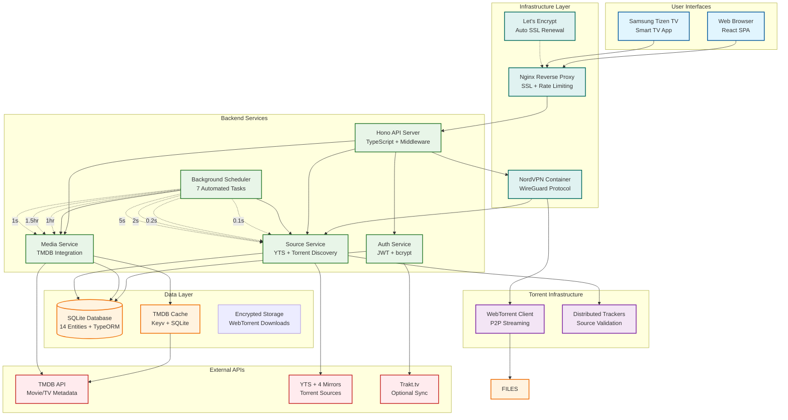

# Complete System Architecture

## Miauflix System Overview

## Key Architecture Characteristics

### 🔐 Security-First Design

- **VPN Protection**: All torrent traffic routed through NordVPN
- **Encryption**: Field-level database encryption for sensitive data
- **Authentication**: JWT with bcrypt password hashing
- **SSL/TLS**: Let's Encrypt certificates with auto-renewal

### 📊 Database Schema (14 Entities - VERIFIED)

#### Core Entities

1. **Movie**: `id`, `tmdbId`, `imdbId`, `title`, `overview`, `runtime`, `tagline`, `trailer`, `rating`, `popularity`, `releaseDate`, `poster`, `backdrop`, `logo`, `sourceSearched`
2. **MovieSource**: `id`, `movieId`, `hash` (encrypted), `magnetLink` (encrypted), `url` (encrypted), `quality`, `resolution`, `size`, `videoCodec`, `broadcasters`, `watchers`, `source`, `sourceType`, `file` (encrypted), `sourceUploadedAt`, `lastStatsCheck`, `nextStatsCheckAt`
3. **User**: `id`, `username`, `passwordHash`, `role`, `isActive`
4. **RefreshToken**: `id`, `userId`, `token`, `expiresAt`

#### Content Organization

5. **Genre**: `id`, `tmdbId`, `name`
6. **MovieTranslation**: `id`, `movieId`, `language`, `overview`, `title`, `tagline`
7. **MediaList**: Curated content collections
8. **Storage**: Download progress tracking
9. **SyncState**: Background task state management
10. **AuditLog**: Security event logging
11. **TraktUser**: Optional Trakt.tv integration

#### TV Content (Future)

12. **TVShow**: Television series metadata
13. **Season**: Season information
14. **Episode**: Individual episodes

### ⏰ Background Processing (7 Tasks - VERIFIED)

#### High Frequency (Sub-second)

- **Movie Source Search** (0.1s): Continuous torrent discovery from YTS
- **Torrent File Processing** (0.2s): Validate and process torrent files

#### Medium Frequency (1-5 seconds)

- **Season Completion** (1s): Complete incomplete TV show data
- **Source Statistics** (2s): Update seeds/peers from trackers
- **Source Resync** (5s): Validate and cleanup existing sources

#### Low Frequency (Hours)

- **List Refresh** (1hr): Synchronize content lists from TMDB
- **Movie Sync** (1.5hr): Update movie metadata from TMDB

### 🔄 Data Flow Priorities

#### Database-First Approach

1. **Check Database**: Always query local data first
2. **TMDB Cache**: Only when database lacks data
3. **External API**: Only when cache misses
4. **Store Results**: Save to database for future direct access

#### Caching Strategy

- **Purpose**: Reduce TMDB API rate limit impact
- **Scope**: TMDB API responses only (not database queries)
- **TTL**: 24 hours for metadata
- **Storage**: Keyv with SQLite adapter

### 🛡️ Security Implementation

#### Network Security

- **VPN Integration**: NordVPN with WireGuard protocol
- **SSL Termination**: Nginx with Let's Encrypt
- **Rate Limiting**: Per-endpoint limits (not global)

#### Data Protection

- **Field Encryption**: Sensitive MovieSource fields encrypted
- **Password Security**: bcrypt hashing with salts
- **Token Management**: Secure JWT refresh token rotation

#### Infrastructure Security

- **Container Isolation**: Docker-based service separation
- **Secret Management**: Environment variable configuration
- **Audit Logging**: Comprehensive security event tracking

## Technology Stack (VERIFIED)

### Frontend

- **React**: 18.2.0 with TypeScript
- **State**: Redux Toolkit 1.9.7
- **Styling**: Styled Components 6.1.1
- **Build**: Vite 4.5.0

### Backend

- **Framework**: Hono 4.7.10
- **Database**: SQLite 5.0.11 + TypeORM 0.3.10
- **Auth**: JOSE 6.0.10 (JWT handling)
- **Validation**: Zod 3.25.20
- **Torrent**: WebTorrent 2.6.7

### Infrastructure

- **Containers**: Docker multi-service
- **VPN**: NordVPN (ghcr.io/bubuntux/nordlynx)
- **Proxy**: Nginx Alpine
- **SSL**: Let's Encrypt + Certbot
- **Cache**: Keyv 5.3.1

### External APIs

- **Metadata**: TMDB API (primary)
- **Torrents**: YTS + 4 mirror endpoints
- **Tracking**: Trakt.tv (optional)
- **Validation**: Distributed torrent trackers

## Performance Characteristics

- **Response Time**: Sub-second for cached data
- **Scalability**: Stateless API design with connection pooling
- **Reliability**: Multi-mirror redundancy and error handling
- **Privacy**: Complete torrent traffic anonymization
- **Automation**: Continuous background data synchronization
