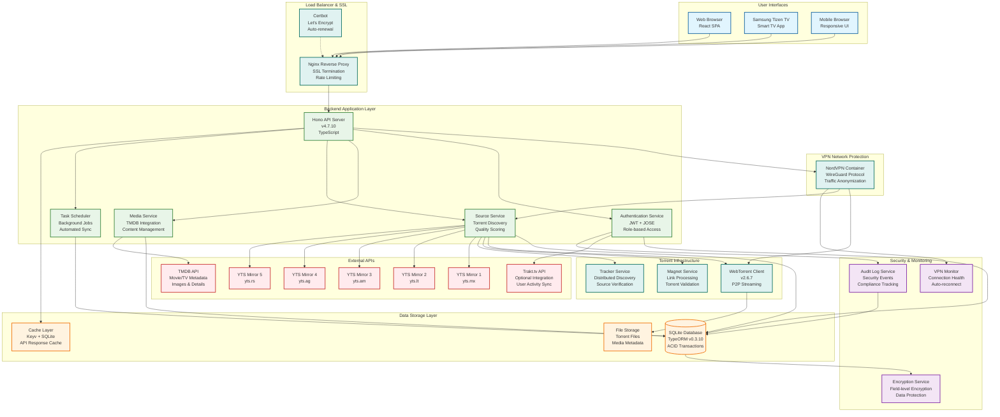

# System Architecture Overview

## Miauflix System Architecture Diagram

## Component Overview

### Frontend Layer (Blue)

- **React SPA**: Modern single-page application with Redux state management
- **Cross-platform**: Web browsers, Samsung Tizen Smart TVs, mobile responsive
- **Real-time UI**: Dynamic content updates and streaming interface

### Backend Services (Green)

- **Hono API**: Lightweight, fast web framework with TypeScript
- **Service Architecture**: Modular services with clear separation of concerns
- **Authentication**: JWT-based authentication with role-based access control
- **Media Management**: Content discovery, metadata management, quality scoring
- **Background Processing**: Automated synchronization and maintenance tasks

### Data Layer (Orange)

- **SQLite Database**: File-based database with TypeORM for entity management
- **Caching**: Multi-level caching for API responses and metadata
- **File Storage**: Efficient storage for torrent files and media assets

### External Integrations (Red)

- **TMDB API**: Comprehensive movie and TV show metadata
- **YTS Mirrors**: Multiple redundant torrent sources for reliability
- **Trakt.tv**: Optional user activity synchronization

### Security Layer (Purple)

- **Audit Logging**: Comprehensive security event tracking
- **Encryption**: Field-level database encryption for sensitive data
- **VPN Monitoring**: Continuous VPN connection health checks

### Infrastructure (Teal)

- **Nginx**: Reverse proxy with SSL termination and rate limiting
- **VPN Integration**: NordVPN container for traffic anonymization
- **Torrent Client**: WebTorrent for P2P streaming capabilities
- **SSL Management**: Automated certificate provisioning and renewal

## Key Architectural Principles

1. **Security-First Design**: All torrent traffic routed through VPN, comprehensive audit logging
2. **Scalable Architecture**: Modular services with clear APIs and separation of concerns
3. **Reliability**: Multiple failover mechanisms and redundant external sources
4. **Performance**: Multi-level caching and optimized database queries
5. **Privacy Protection**: Encrypted storage and anonymized network traffic

## Technology Stack Summary

- **Frontend**: React 18.2.0, Redux Toolkit 1.9.7, Styled Components 6.1.1
- **Backend**: Hono 4.7.10, TypeORM 0.3.10, SQLite 5.0.11
- **Torrent**: WebTorrent 2.6.7, Distributed trackers
- **Infrastructure**: Docker, NordVPN, Nginx, Let's Encrypt
- **Security**: JOSE JWT, bcrypt, field-level encryption
