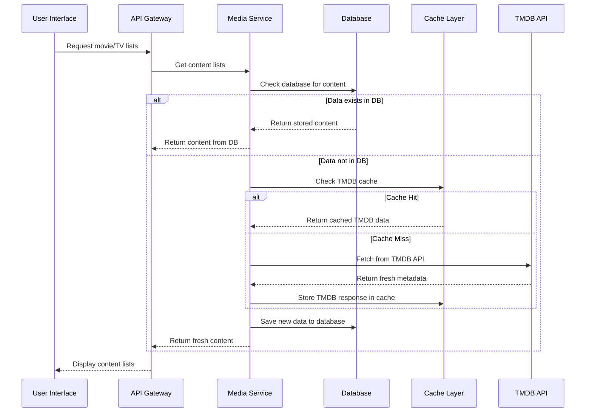
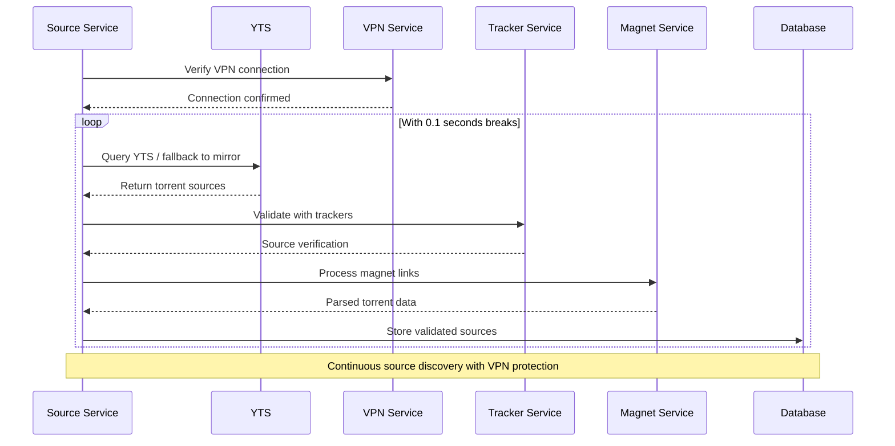
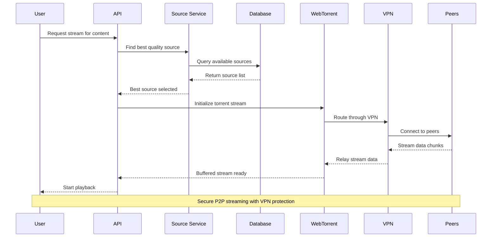
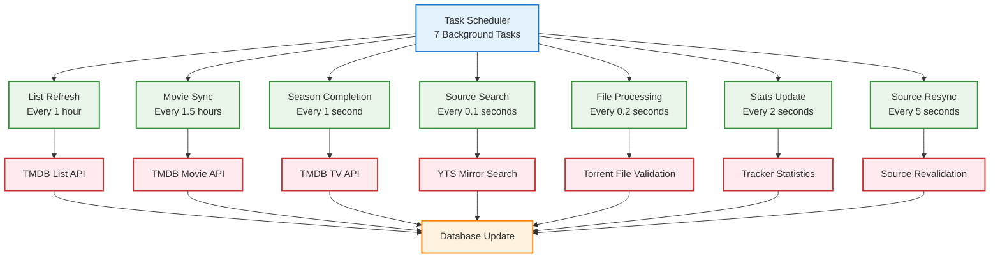
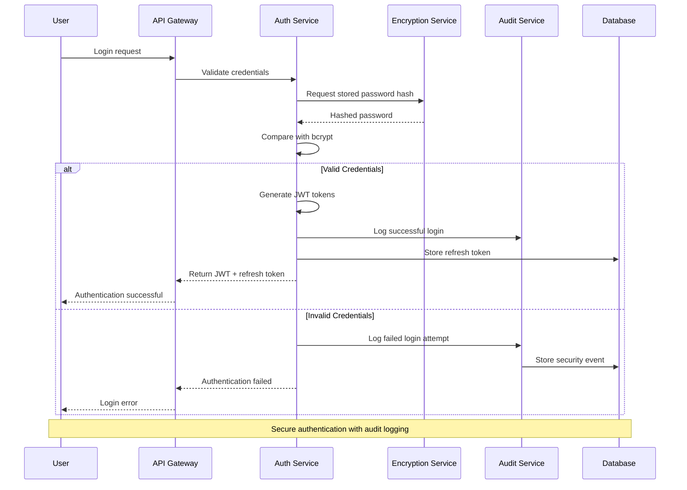
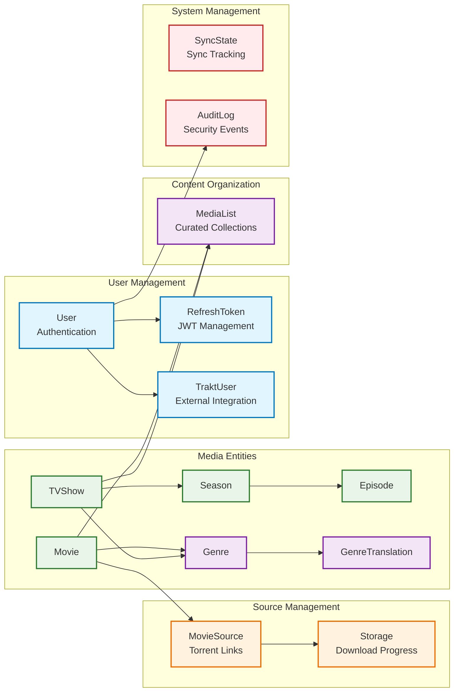
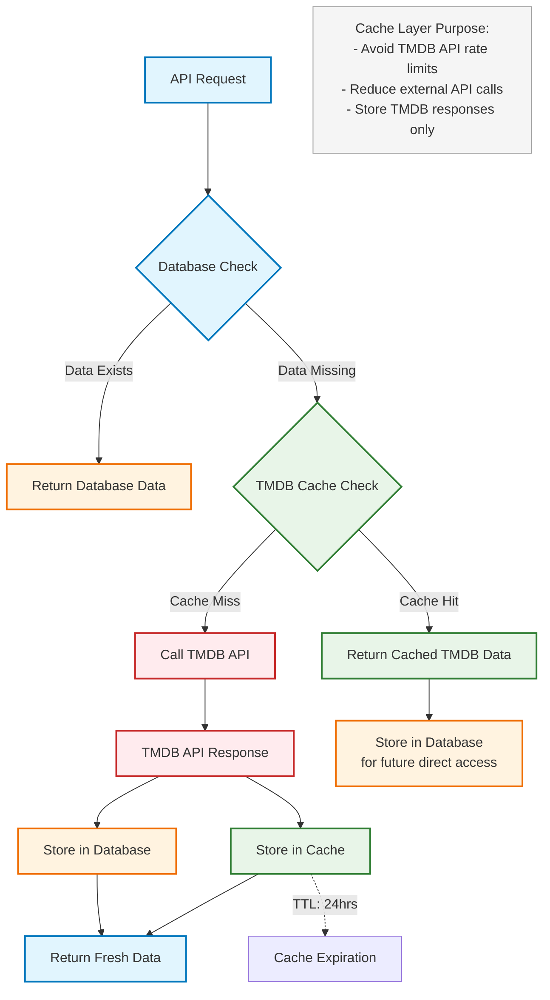
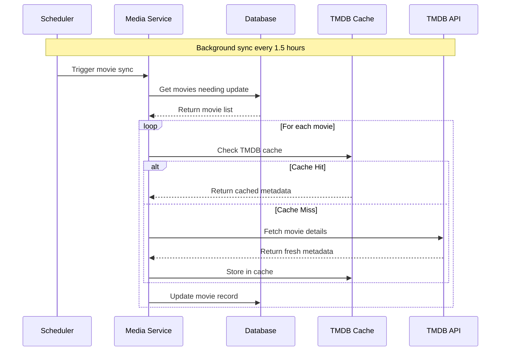

# Data Flow Architecture

## Complete Data Lifecycle Diagrams

### 1. User Content Discovery Flow

### 2. Movie Content Source Discovery Flow

### 3. Content Streaming Initiation Flow

### 4. Background Synchronization Flow

### 5. Authentication & Security Flow

### 6. Database Entity Relationships Flow

### 7. Caching Strategy Flow

### 8. Media Metadata Processing Flow

## Data Flow Characteristics

### Performance Optimizations

- **Database-First**: Check local data before external calls
- **TMDB API Caching**: Reduce external API rate limit impact
- **Background Processing**: Continuous data synchronization
- **Connection Pooling**: Efficient database connections
- **Lazy Loading**: On-demand content loading

### Security Measures

- **VPN Routing**: All external traffic through VPN
- **Audit Logging**: Complete activity tracking
- **Field Encryption**: Sensitive data encryption
- **JWT Security**: Secure token management

### Reliability Features

- **Multiple Sources**: 5 YTS mirror redundancy
- **Graceful Degradation**: Fallback mechanisms
- **Error Handling**: Comprehensive error recovery
- **Connection Monitoring**: VPN health checks

### Scalability Considerations

- **Async Processing**: Non-blocking operations
- **Rate Limiting**: Controlled API usage
- **Resource Management**: Memory and CPU optimization
- **Database Indexing**: Optimized query performance

## Cache Layer Specifications

### TMDB Cache Purpose

- **Primary Goal**: Avoid TMDB API rate limits
- **Secondary Goal**: Reduce external API latency
- **Cache Scope**: TMDB API responses only
- **TTL**: 24 hours for most metadata

### Data Priority Order

1. **Database**: Always check first for existing data
2. **TMDB Cache**: Only when database lacks data
3. **TMDB API**: Only when cache misses
4. **Database Storage**: Store fresh data for future direct access
