# Scheduled Tasks & Background Processes

## Background Task Architecture

### 1. Task Scheduler Overview

### 2. Detailed Task Execution Flow

### 3. Task Priority & Resource Management

```mermaid
flowchart LR
    subgraph "Critical Priority Tasks"
        MOVIE_SOURCE[Movie Source Search<br/>⏱️ 0.1s<br/>🔄 Continuous<br/>📈 High Impact]
        SEASON_SYNC[Season Completion<br/>⏱️ 1s<br/>🔄 Real-time<br/>📈 User Experience]
    end

    subgraph "Standard Priority Tasks"
        FILE_SEARCH[Torrent File Search<br/>⏱️ 0.2s<br/>🔄 Validation<br/>📊 Quality Control]
        STATS_UPDATE[Stats Update<br/>⏱️ 2s<br/>🔄 Monitoring<br/>📊 Source Health]
        RESYNC[Source Resync<br/>⏱️ 5s<br/>🔄 Maintenance<br/>🛠️ Data Integrity]
    end

    subgraph "Background Priority Tasks"
        LIST_REFRESH[List Refresh<br/>⏱️ 1hr<br/>🔄 Periodic<br/>📚 Content Discovery]
        MOVIE_SYNC[Movie Sync<br/>⏱️ 1.5hr<br/>🔄 Batch Update<br/>🎬 Metadata Sync]
    end

    MOVIE_SOURCE --> RESOURCE_MGMT[Resource Management<br/>• VPN bandwidth allocation<br/>• API rate limiting<br/>• Database connection pooling<br/>• Memory optimization]
    SEASON_SYNC --> RESOURCE_MGMT
    FILE_SEARCH --> RESOURCE_MGMT
    STATS_UPDATE --> RESOURCE_MGMT
    RESYNC --> RESOURCE_MGMT
    LIST_REFRESH --> RESOURCE_MGMT
    MOVIE_SYNC --> RESOURCE_MGMT

    %% Styling
    classDef critical fill:#ffcdd2,stroke:#d32f2f,stroke-width:3px
    classDef standard fill:#fff3e0,stroke:#f57c00,stroke-width:2px
    classDef background fill:#e8f5e8,stroke:#2e7d32,stroke-width:2px
    classDef management fill:#e1f5fe,stroke:#0277bd,stroke-width:2px

    class MOVIE_SOURCE,SEASON_SYNC critical
    class FILE_SEARCH,STATS_UPDATE,RESYNC standard
    class LIST_REFRESH,MOVIE_SYNC background
    class RESOURCE_MGMT management
```

### 4. Task Dependencies & Data Flow

### 5. Error Handling & Recovery Mechanisms

## Task Specifications

### High-Priority Tasks (Sub-second intervals)

#### 1. Movie Source Search (0.1 seconds)

- **Purpose**: Continuously discover new torrent sources
- **Service**: `SourceService.searchSourcesForMovies()`
- **External APIs**: YTS mirrors (5 endpoints)
- **VPN Required**: Yes
- **Database Impact**: High (frequent inserts)
- **Error Handling**: Mirror failover, retry logic

#### 2. Torrent File Search (0.2 seconds)

- **Purpose**: Process and validate torrent files
- **Service**: `SourceService.searchTorrentFilesForSources()`
- **Dependencies**: Tracker services
- **VPN Required**: Yes
- **Database Impact**: Medium (updates existing records)
- **Error Handling**: Skip invalid files, log errors

### Medium-Priority Tasks (1-5 second intervals)

#### 3. Season Completion (1 second)

- **Purpose**: Complete incomplete TV show seasons
- **Service**: `MediaService.syncIncompleteSeasons()`
- **External APIs**: TMDB TV API
- **VPN Required**: No
- **Database Impact**: Medium (TV show updates)
- **Error Handling**: Cache fallback, retry logic

#### 4. Stats Update (2 seconds)

- **Purpose**: Update torrent source statistics
- **Service**: `SourceService.syncStatsForSources()`
- **Dependencies**: Tracker services
- **VPN Required**: Yes
- **Database Impact**: High (frequent updates)
- **Error Handling**: Skip unreachable sources

#### 5. Source Resync (5 seconds)

- **Purpose**: Revalidate and maintain source quality
- **Service**: `SourceService.resyncMovieSources()`
- **Dependencies**: Tracker validation
- **VPN Required**: Yes
- **Database Impact**: Medium (cleanup operations)
- **Error Handling**: Remove invalid sources

### Low-Priority Tasks (Hour+ intervals)

#### 6. List Refresh (1 hour)

- **Purpose**: Synchronize content lists and categories
- **Service**: `ListSynchronizer.synchronize()`
- **External APIs**: TMDB Lists API
- **VPN Required**: No
- **Database Impact**: Low (batch operations)
- **Error Handling**: Cache previous results

#### 7. Movie Sync (1.5 hours)

- **Purpose**: Update movie metadata from TMDB
- **Service**: `MediaService.syncMovies()`
- **External APIs**: TMDB Movie API
- **VPN Required**: No
- **Database Impact**: Medium (batch updates)
- **Error Handling**: Process partial results

## Performance Characteristics

### Resource Usage

- **CPU**: Optimized for concurrent task execution
- **Memory**: Controlled memory usage with cleanup
- **Network**: VPN bandwidth allocation and rate limiting
- **Database**: Connection pooling and transaction management

### Monitoring & Metrics

- **Task Execution Time**: Track performance trends
- **Error Rates**: Monitor failure patterns
- **VPN Health**: Connection stability metrics
- **API Rate Limits**: Usage tracking and optimization

### Scalability Considerations

- **Task Queuing**: Priority-based task scheduling
- **Resource Allocation**: Dynamic resource management
- **Load Balancing**: Distributed task execution capability
- **Graceful Degradation**: Fallback mechanisms for high load

## Integration with System Components

### VPN Integration

- All torrent-related tasks route through VPN
- Automatic VPN health monitoring
- Graceful handling of VPN disconnections
- Bandwidth allocation for background tasks

### Database Optimization

- Efficient indexing for frequent queries
- Batch operations for performance
- Connection pooling for concurrent access
- Transaction management for data integrity

### External API Management

- Respect for rate limits and quotas
- Caching strategies for API responses
- Fallback mechanisms for API failures
- Load balancing across multiple endpoints
