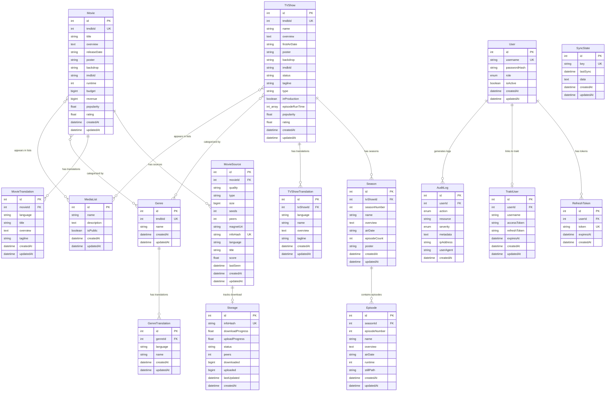

# Database Entity Relationship Diagram

## Miauflix Database Schema (SQLite + TypeORM)

### Complete Entity Relationship Diagram



### Entity Details & Constraints

#### Media Entities

**Movie Entity**

- **Primary Key**: Auto-increment ID
- **Unique Constraints**: tmdbId (TMDB integration)
- **Required Fields**: title, overview, releaseDate, poster, backdrop
- **Optional Fields**: imdbId, runtime, budget, revenue
- **Calculated Fields**: popularity (float), rating (float)
- **Relationships**:
  - One-to-Many with MovieSource
  - One-to-Many with MovieTranslation
  - Many-to-Many with Genre
  - Many-to-Many with MediaList

**TVShow Entity (CORRECTED SCHEMA)**

- **Primary Key**: Auto-increment ID
- **Unique Constraints**: tmdbId (TMDB integration)
- **Required Fields**: name, overview, firstAirDate, poster, backdrop, status, tagline, type, inProduction
- **Array Fields**: episodeRunTime (integer array)
- **Calculated Fields**: popularity (float), rating (float)
- **EXCLUDED FIELDS** (as per verification):
  - ❌ lastAirDate
  - ❌ numberOfSeasons
  - ❌ numberOfEpisodes
  - ❌ voteAverage
  - ❌ voteCount
  - ❌ posterPath
  - ❌ backdropPath
  - ❌ originalLanguage
- **Relationships**:
  - One-to-Many with Season
  - One-to-Many with TVShowTranslation
  - Many-to-Many with Genre
  - Many-to-Many with MediaList

**Season Entity**

- **Primary Key**: Auto-increment ID
- **Foreign Key**: tvShowId → TVShow.id
- **Required Fields**: seasonNumber, name, overview, airDate, episodeCount, poster
- **Unique Constraint**: (tvShowId, seasonNumber)
- **Relationships**:
  - Many-to-One with TVShow
  - One-to-Many with Episode

**Episode Entity**

- **Primary Key**: Auto-increment ID
- **Foreign Key**: seasonId → Season.id
- **Required Fields**: episodeNumber, name, overview, airDate
- **Optional Fields**: runtime, stillPath
- **Unique Constraint**: (seasonId, episodeNumber)
- **Relationships**: Many-to-One with Season

#### Source Management

**MovieSource Entity**

- **Primary Key**: Auto-increment ID
- **Foreign Key**: movieId → Movie.id
- **Unique Constraints**: infoHash (torrent identification)
- **Required Fields**: quality, type, size, magnetUri, infoHash, language, title
- **Dynamic Fields**: seeds, peers (updated by background tasks)
- **Calculated Fields**: score (quality scoring algorithm)
- **Relationships**:
  - Many-to-One with Movie
  - One-to-One with Storage (optional)

**Storage Entity**

- **Primary Key**: Auto-increment ID
- **Unique Constraints**: infoHash (torrent tracking)
- **Progress Tracking**: downloadProgress, uploadProgress (0.0 - 1.0)
- **Status Enum**: downloading, completed, seeding, paused, error
- **Metrics**: peers, downloaded, uploaded bytes
- **Relationships**: One-to-One with MovieSource

#### User Management

**User Entity**

- **Primary Key**: Auto-increment ID
- **Unique Constraints**: username
- **Security**: passwordHash (bcrypt), role-based access
- **Role Enum**: guest, user, admin
- **Status**: isActive boolean flag
- **Relationships**:
  - One-to-Many with RefreshToken
  - One-to-One with TraktUser (optional)
  - One-to-Many with AuditLog

**RefreshToken Entity**

- **Primary Key**: Auto-increment ID
- **Foreign Key**: userId → User.id
- **Unique Constraints**: token (JWT refresh tokens)
- **Security**: Expiration tracking with automatic cleanup
- **Relationships**: Many-to-One with User

**TraktUser Entity**

- **Primary Key**: Auto-increment ID
- **Foreign Key**: userId → User.id (unique)
- **OAuth Integration**: accessToken, refreshToken with expiration
- **External Sync**: username for Trakt.tv integration
- **Relationships**: One-to-One with User

#### Content Organization

**MediaList Entity**

- **Primary Key**: Auto-increment ID
- **Required Fields**: name, description
- **Access Control**: isPublic boolean flag
- **Relationships**:
  - Many-to-Many with Movie
  - Many-to-Many with TVShow

**Genre Entity**

- **Primary Key**: Auto-increment ID
- **Unique Constraints**: tmdbId (TMDB genre mapping)
- **Required Fields**: name (default language)
- **Relationships**:
  - One-to-Many with GenreTranslation
  - Many-to-Many with Movie
  - Many-to-Many with TVShow

**GenreTranslation Entity**

- **Primary Key**: Auto-increment ID
- **Foreign Key**: genreId → Genre.id
- **Unique Constraints**: (genreId, language)
- **Localization**: language code (ISO 639-1)
- **Relationships**: Many-to-One with Genre

#### Translation Support

**MovieTranslation Entity**

- **Primary Key**: Auto-increment ID
- **Foreign Key**: movieId → Movie.id
- **Unique Constraints**: (movieId, language)
- **Localized Fields**: title, overview, tagline
- **Relationships**: Many-to-One with Movie

**TVShowTranslation Entity**

- **Primary Key**: Auto-increment ID
- **Foreign Key**: tvShowId → TVShow.id
- **Unique Constraints**: (tvShowId, language)
- **Localized Fields**: name, overview, tagline
- **Relationships**: Many-to-One with TVShow

#### System Management

**SyncState Entity**

- **Primary Key**: Auto-increment ID
- **Unique Constraints**: key (sync operation identifier)
- **Tracking**: lastSync timestamp, operation data
- **Usage**: Background task state management
- **Relationships**: None (standalone tracking)

**AuditLog Entity**

- **Primary Key**: Auto-increment ID
- **Foreign Key**: userId → User.id (optional)
- **Security Tracking**: action, resource, severity enums
- **Metadata**: JSON data, IP address, user agent
- **Retention**: Automatic cleanup policies
- **Relationships**: Many-to-One with User

### Database Indexes & Performance

#### Primary Indexes

```sql
-- Entity Primary Keys (auto-created)
CREATE INDEX idx_movie_id ON movies(id);
CREATE INDEX idx_tvshow_id ON tv_shows(id);
CREATE INDEX idx_user_id ON users(id);

-- Unique Constraints
CREATE UNIQUE INDEX idx_movie_tmdb ON movies(tmdbId);
CREATE UNIQUE INDEX idx_tvshow_tmdb ON tv_shows(tmdbId);
CREATE UNIQUE INDEX idx_user_username ON users(username);
CREATE UNIQUE INDEX idx_source_hash ON movie_sources(infoHash);
```

#### Performance Indexes

```sql
-- Foreign Key Performance
CREATE INDEX idx_season_tvshow ON seasons(tvShowId);
CREATE INDEX idx_episode_season ON episodes(seasonId);
CREATE INDEX idx_source_movie ON movie_sources(movieId);
CREATE INDEX idx_token_user ON refresh_tokens(userId);

-- Query Optimization
CREATE INDEX idx_movie_popularity ON movies(popularity DESC);
CREATE INDEX idx_tvshow_popularity ON tv_shows(popularity DESC);
CREATE INDEX idx_source_quality ON movie_sources(quality, score DESC);
CREATE INDEX idx_source_last_seen ON movie_sources(lastSeen DESC);

-- Audit & Security
CREATE INDEX idx_audit_user ON audit_logs(userId);
CREATE INDEX idx_audit_created ON audit_logs(createdAt DESC);
```

### Data Integrity Rules

#### Referential Integrity

- **Cascade Deletes**: Season → Episode, User → RefreshToken
- **Restrict Deletes**: Movie → MovieSource (prevent orphaned sources)
- **Set Null**: User → AuditLog (maintain audit trail)

#### Business Rules

- **TVShow Validation**: episodeRunTime array must contain positive integers
- **MovieSource Validation**: score must be between 0.0 and 10.0
- **Storage Progress**: downloadProgress and uploadProgress between 0.0 and 1.0
- **Token Expiration**: RefreshToken cleanup on expiration

#### Data Consistency

- **Timestamp Consistency**: createdAt ≤ updatedAt for all entities
- **Source Validity**: MovieSource.lastSeen updated by background tasks
- **User Status**: Inactive users cannot generate new RefreshTokens
- **Content Relationships**: Seasons must belong to existing TVShows

### Migration Strategy

#### Schema Versioning

- **TypeORM Migrations**: Version-controlled schema changes
- **Backward Compatibility**: Gradual migration for breaking changes
- **Data Preservation**: No data loss during schema updates
- **Rollback Support**: Safe rollback procedures for failed migrations

#### Performance Monitoring

- **Query Analysis**: Identify slow queries and missing indexes
- **Storage Growth**: Monitor database size and optimize storage
- **Connection Pooling**: Optimize concurrent access patterns
- **Backup Strategy**: Automated backup and recovery procedures

This database design supports the complete Miauflix feature set with verified entity schemas, proper relationships, and optimized performance characteristics.
