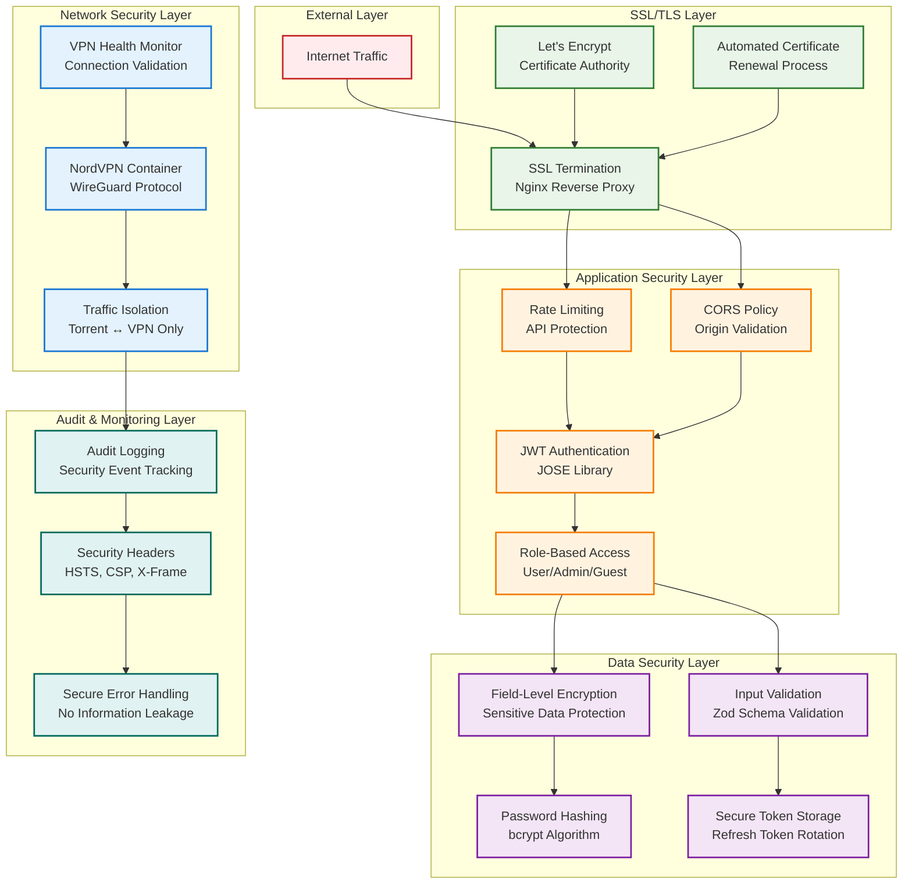
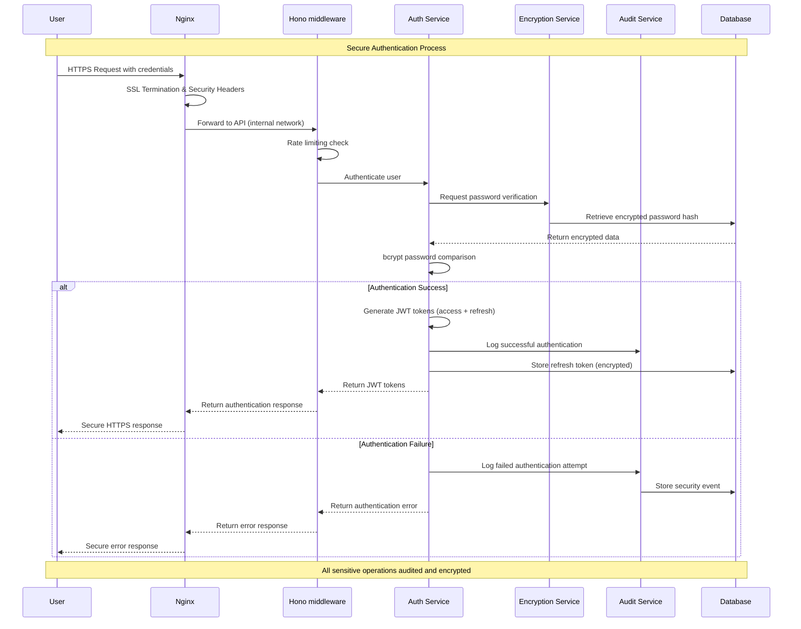
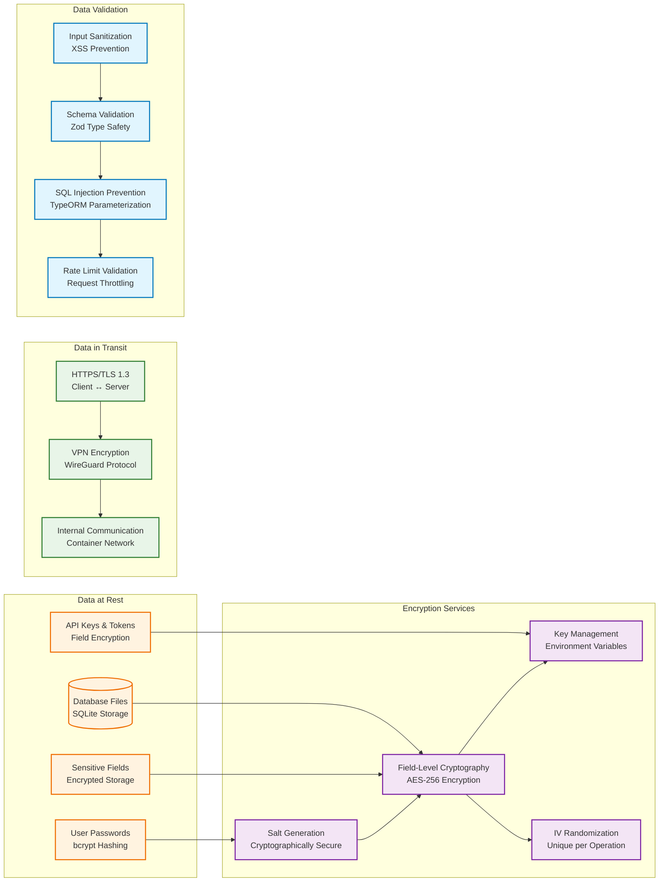

# Security Architecture

## Multi-Layer Security Design

### 1. Security Architecture Overview

### 2. Authentication & Authorization Flow

### 3. VPN Security Integration

```mermaid
flowchart TD
    subgraph "Container Network"
        BACKEND[Backend Container<br/>Miauflix API]
        VPN[NordVPN Container<br/>WireGuard Protocol]
        NGINX[Nginx Container<br/>Reverse Proxy]
    end

    subgraph "VPN Security Features"
        PRIVATE_KEY[Private Key Authentication<br/>No Username/Password]
        KILL_SWITCH[Network Kill Switch<br/>No Bypass Possible]
        DNS_LEAK[DNS Leak Protection<br/>VPN DNS Only]
        IP_ROTATION[IP Address Rotation<br/>Geographic Distribution]
    end

    subgraph "Traffic Routing"
        NORMAL_TRAFFIC[Normal API Traffic<br/>Direct Internet]
        TORRENT_TRAFFIC[Torrent Traffic<br/>Through VPN Only]
        EXTERNAL_API[External API Calls<br/>TMDB, YTS, etc.]
    end

    subgraph "Monitoring & Health"
        VPN_STATUS[VPN Status Monitor<br/>Connection Health Check]
        AUTO_RECONNECT[Auto Reconnection<br/>Service Recovery]
        FAILSAFE[Failsafe Mechanism<br/>Block on VPN Failure]
    end

    %% Network routing
    BACKEND --> VPN
    VPN --> TORRENT_TRAFFIC
    BACKEND --> NORMAL_TRAFFIC
    BACKEND --> EXTERNAL_API

    %% VPN features
    VPN --> PRIVATE_KEY
    VPN --> KILL_SWITCH
    VPN --> DNS_LEAK
    VPN --> IP_ROTATION

    %% Monitoring
    VPN_STATUS --> VPN
    AUTO_RECONNECT --> VPN
    FAILSAFE --> VPN

    %% Traffic isolation
    TORRENT_TRAFFIC -.->|Only Route| VPN
    NORMAL_TRAFFIC -.->|Direct Route| NGINX
    EXTERNAL_API -.->|API Calls| NGINX

    %% Styling
    classDef container fill:#e3f2fd,stroke:#1976d2,stroke-width:2px
    classDef security fill:#f3e5f5,stroke:#7b1fa2,stroke-width:2px
    classDef traffic fill:#fff3e0,stroke:#f57c00,stroke-width:2px
    classDef monitoring fill:#e8f5e8,stroke:#2e7d32,stroke-width:2px

    class BACKEND,VPN,NGINX container
    class PRIVATE_KEY,KILL_SWITCH,DNS_LEAK,IP_ROTATION security
    class NORMAL_TRAFFIC,TORRENT_TRAFFIC,EXTERNAL_API traffic
    class VPN_STATUS,AUTO_RECONNECT,FAILSAFE monitoring
```

### 4. Data Protection & Encryption

### 5. Security Headers & Policies

```mermaid
flowchart TD
    NGINX_CONFIG[Nginx Security Configuration] --> SECURITY_HEADERS[Security Headers Implementation]

    SECURITY_HEADERS --> HSTS[HTTP Strict Transport Security<br/>max-age=31536000; includeSubDomains]
    SECURITY_HEADERS --> CSP[Content Security Policy<br/>script-src self; object-src none]
    SECURITY_HEADERS --> X_FRAME[X-Frame-Options<br/>DENY]
    SECURITY_HEADERS --> X_CONTENT[X-Content-Type-Options<br/>nosniff]
    SECURITY_HEADERS --> REFERRER[Referrer-Policy<br/>strict-origin-when-cross-origin]
    SECURITY_HEADERS --> PERMISSIONS[Permissions-Policy<br/>geolocation none; microphone none]

    NGINX_CONFIG --> RATE_LIMITING[Rate Limiting Configuration]
    RATE_LIMITING --> ENDPOINT_LIMITS[Per-Endpoint Rate Limits<br/>Individual endpoint controls]
    RATE_LIMITING --> AUTH_LIMITS[Auth Rate Limits<br/>Login/register endpoints]
    RATE_LIMITING --> STREAM_LIMITS[Streaming Rate Limits<br/>Video/torrent endpoints]

    NGINX_CONFIG --> SSL_CONFIG[SSL/TLS Configuration]
    SSL_CONFIG --> TLS_VERSION[TLS Version<br/>1.2+ Only]
    SSL_CONFIG --> CIPHER_SUITE[Cipher Suites<br/>Perfect Forward Secrecy]
    SSL_CONFIG --> CERT_VALIDATION[Certificate Validation<br/>OCSP Stapling]

    %% Styling
    classDef config fill:#e3f2fd,stroke:#1976d2,stroke-width:3px
    classDef headers fill:#f3e5f5,stroke:#7b1fa2,stroke-width:2px
    classDef limits fill:#fff3e0,stroke:#f57c00,stroke-width:2px
    classDef ssl fill:#e8f5e8,stroke:#2e7d32,stroke-width:2px

    class NGINX_CONFIG config
    class SECURITY_HEADERS,HSTS,CSP,X_FRAME,X_CONTENT,REFERRER,PERMISSIONS headers
    class RATE_LIMITING,ENDPOINT_LIMITS,AUTH_LIMITS,STREAM_LIMITS limits
    class SSL_CONFIG,TLS_VERSION,CIPHER_SUITE,CERT_VALIDATION ssl
```

## Security Implementation Details

### Authentication Security

- **JWT Tokens**: JOSE library for secure token generation and validation
- **Refresh Tokens**: Secure rotation with database storage
- **Password Hashing**: bcrypt with configurable rounds
- **Role-Based Access**: User, Admin, Guest roles with strict enforcement

### Data Protection

- **Field-Level Encryption**: AES-256 encryption for sensitive database fields
- **Key Management**: Environment-based key storage with rotation support
- **Input Validation**: Zod schema validation for all API inputs
- **SQL Injection Prevention**: TypeORM parameterized queries

### Network Security

- **VPN Integration**: All torrent traffic routed through NordVPN
- **SSL/TLS**: Let's Encrypt certificates with automatic renewal
- **Security Headers**: Comprehensive security header implementation
- **Rate Limiting**: Multi-level rate limiting for API protection

### Infrastructure Security

- **Container Isolation**: Docker container-based service isolation
- **Network Policies**: Restricted inter-service communication
- **Secret Management**: Environment variable-based configuration
- **Health Monitoring**: Continuous security service monitoring

### Audit & Compliance

- **Security Event Logging**: Comprehensive audit trail for security events
- **Access Logging**: Detailed access logs with IP and user agent tracking
- **Error Handling**: Secure error responses without information leakage
- **Data Retention**: Configurable retention policies for audit data

### Threat Mitigation

#### Common Attack Vectors

1. **SQL Injection**: Prevented by TypeORM parameterized queries
2. **XSS Attacks**: Mitigated by CSP headers and input sanitization
3. **CSRF Attacks**: Protected by SameSite cookies and origin validation
4. **Brute Force**: Rate limiting and account lockout mechanisms
5. **Man-in-the-Middle**: HTTPS/TLS encryption and HSTS headers
6. **Data Breaches**: Field-level encryption and access controls

#### Privacy Protection

1. **Torrent Anonymization**: VPN routing for all P2P traffic
2. **User Data Protection**: Encrypted storage of sensitive information
3. **Access Controls**: Role-based permissions and audit logging
4. **Data Minimization**: Only necessary data collection and storage

### Security Monitoring

#### Real-time Monitoring

- **VPN Connection Status**: Continuous health checks
- **Authentication Failures**: Failed login attempt tracking
- **Rate Limit Violations**: Suspicious activity detection
- **Security Header Compliance**: Header validation monitoring

#### Security Metrics

- **Authentication Success Rate**: Monitor authentication patterns
- **API Response Times**: Detect potential DoS attacks
- **VPN Uptime**: Ensure continuous privacy protection
- **Error Rates**: Monitor application security health

This security architecture provides comprehensive protection across all layers of the Miauflix system, ensuring user privacy, data protection, and system integrity while maintaining optimal performance and usability.
