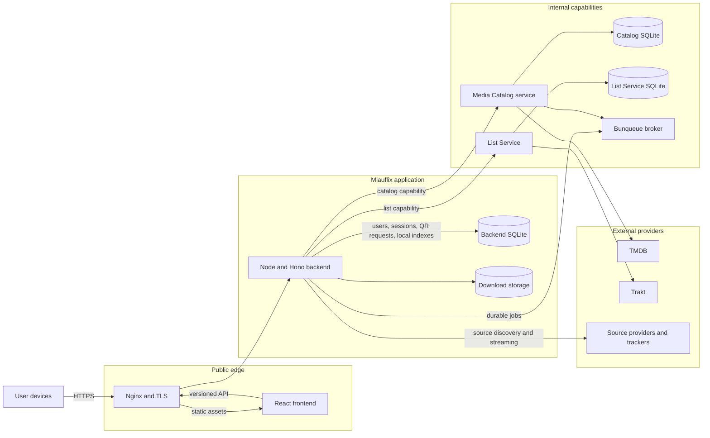
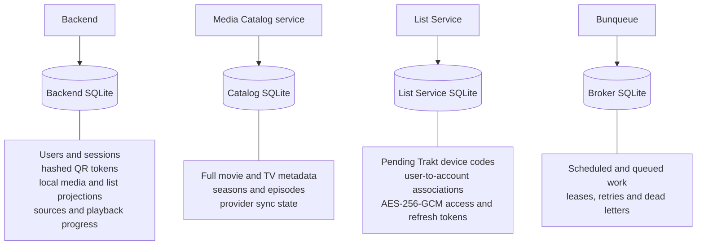
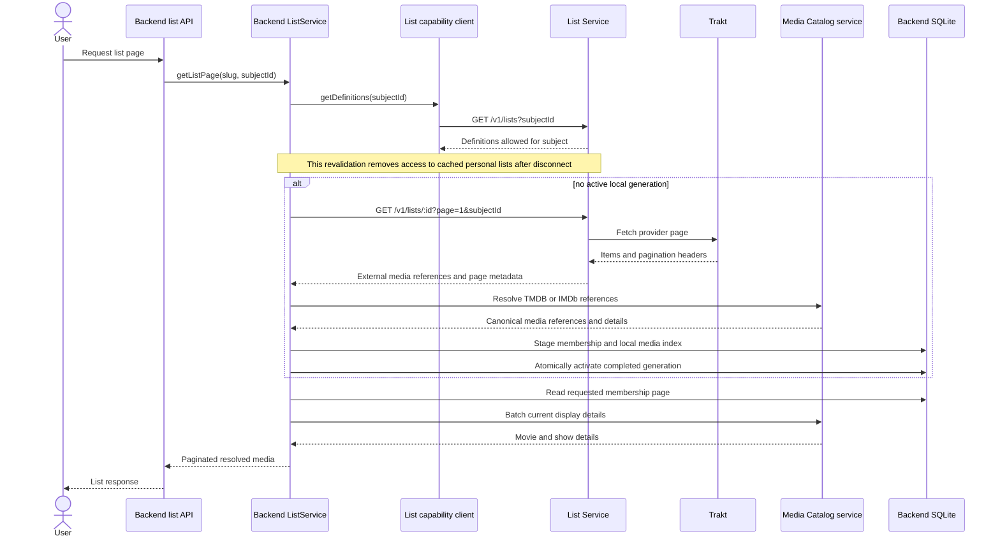
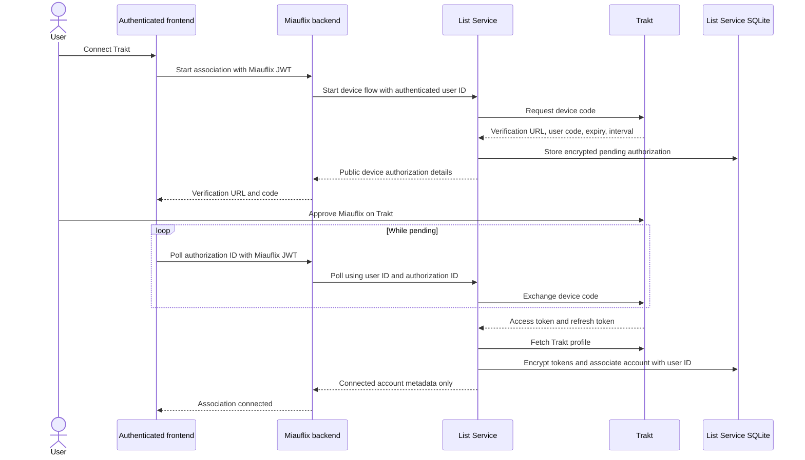
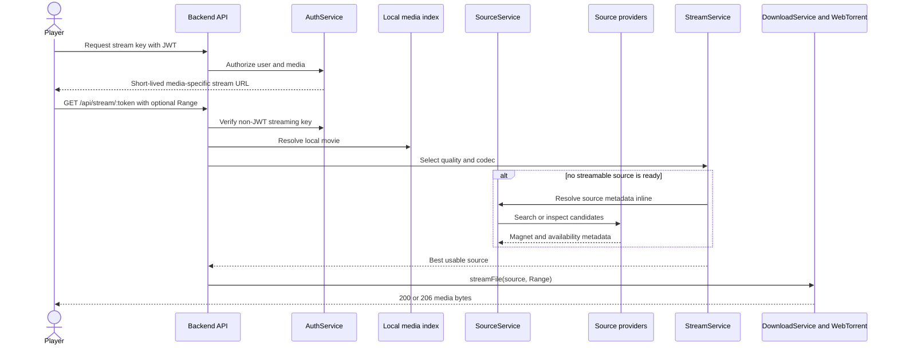
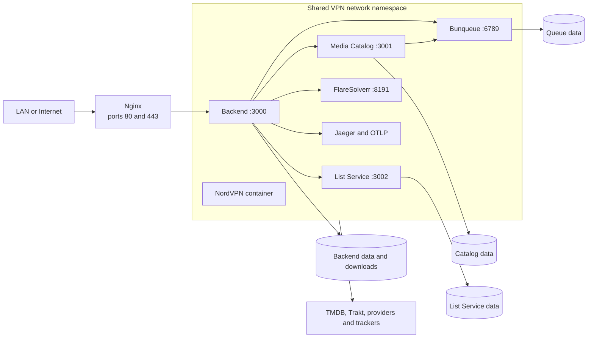
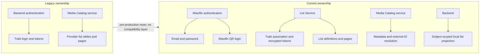

# Miauflix Architecture Diagrams

These diagrams describe the current architecture after the Trakt/list-service extraction and the
Miauflix-owned QR authentication redesign. They are intended as boundary maps: the arrows show who
may call whom, while the database shapes show ownership.

## 1. System context and runtime services



The browser talks only to the public Miauflix edge. The catalog and list capabilities are internal
HTTP services discovered through `/.well-known/miauflix-service` and validated with
`@miauflix/service-contracts`.

## 2. Storage and credential ownership



Ownership invariants:

- The backend never stores Trakt credentials and Trakt is not a Miauflix identity provider.
- The List Service is the only reader and writer of Trakt association secrets.
- The Media Catalog service is the only owner of full provider metadata; the backend keeps only the
  projection needed for lists, source discovery, and playback.
- Public list projections use the `public` subject. Personal projections use the authenticated
  Miauflix user ID and remain available only while the provider still defines that list for the
  subject.

## 3. Provider list ingestion and query



Unresolvable provider items are skipped. A failed refresh discards its staging generation, leaving
the previous active generation readable. Background refreshes carry the same subject ID and use
page fan-out followed by generation activation.

## 4. Authentication and account association are separate

### Miauflix QR login

```mermaid
sequenceDiagram
  actor Screen as Requesting device
  actor Phone as Approving device
  participant API as Miauflix backend
  participant DB as Backend SQLite

  Screen->>API: POST /api/auth/qr
  API->>DB: Store hashed approval and claim tokens with expiry
  API-->>Screen: requestId, claimToken, approval URL, expiry, interval
  Screen-->>Screen: Render approval URL as QR code
  Phone->>API: Open Miauflix approval URL
  API-->>Phone: Device context and pending state
  Phone->>API: Authenticate with Miauflix email and password
  Phone->>API: Approve or reject request
  API->>DB: Conditional pending-to-approved or pending-to-rejected update

  loop Until terminal state or expiry
    Screen->>API: POST /api/auth/qr/:requestId/claim with claimToken
    API->>DB: Match token and request ID; atomically claim once
    API-->>Screen: 202 pending, or session credentials when approved
  end
```

The approval and claim tokens are independent, short-lived, stored only as hashes, and bound to the
same request ID. The final state transition is single-use and race-safe.

### Trakt account association



Trakt proves access to a Trakt account; it never authenticates a Miauflix user. Disconnecting asks
the List Service to revoke the provider token and remove the association.

## 5. Playback and streaming path



Request-time source and metadata resolution does not depend on the queue being available. Bunqueue
adds durable discovery, statistics, and maintenance work around this synchronous fallback.

## 6. Production container topology



The production Compose file places the backend, both capability services, the broker, and outbound
helpers in the VPN container's network namespace. Their ports are therefore reached internally on
`localhost`; only the intended edge ports are published.

## 7. Recent ownership migration



This was a contract-and-data ownership migration, not a dual-running rollout. Fresh catalog and
List Service databases are the forward path. Restoring a pre-extraction code revision together with
its matching development databases is the rollback path; mixing old databases with the new service
layout is unsupported.
