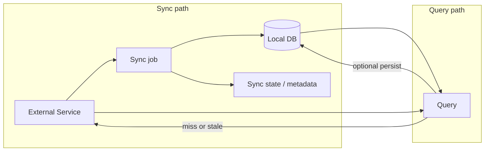
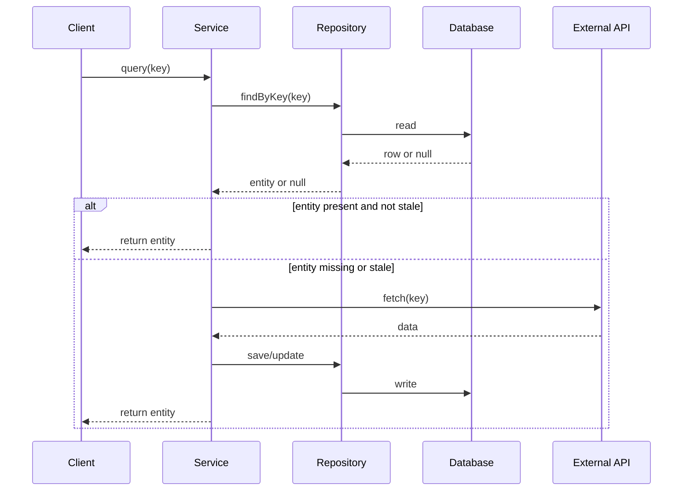
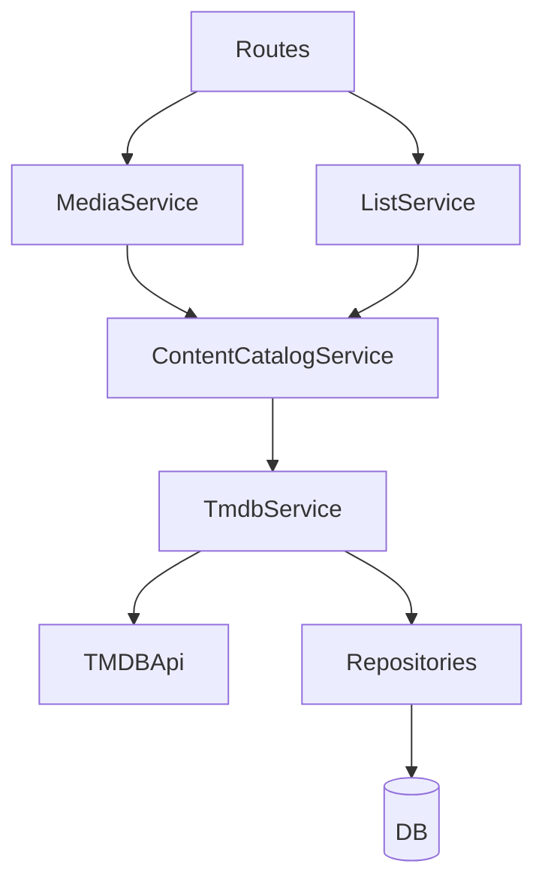

# External Sync + Query with Fallback

This document describes the architecture used to keep local data in sync with external services (e.g. TMDB) and to serve queries with fallback to the external API when data is missing or stale. See [System Overview](system-overview.md) for the broader architecture.

## Goal

- **Sync**: Keep local data aligned with an external service (scheduled and/or on-demand).
- **Query**: Serve reads from local storage; when data is absent or considered stale, fetch from the external service, optionally persist, then return.

## Conceptual Flow

Sync and query are two separate paths that both use the same external service and local store:

- **Sync path**: A sync job (scheduled or triggered) pulls from the external service and writes to the local DB (and optionally updates sync metadata).
- **Query path**: Read from DB; if the resource is missing or considered “not in sync”, call the external service and optionally write back, then return.

## Query Flow (with fallback)

The following sequence diagram shows how a query uses the local store first and falls back to the external API when the entity is missing or stale:

## TmdbService Layering

Within the content-catalog module, the **ContentCatalogService** owns the TMDB-facing call chain used by higher-level services: it sits between `MediaService` / `ListService` and `TmdbService`, while `TmdbService` sits in front of `TMDBApi`. This keeps orchestration at the catalog boundary and preserves the hybrid query approach (DB first, fallback to TMDB API).

- **TMDBApi**: Low-level HTTP/rate-limited client. Domain services do not call it directly for reads or sync.
- **TmdbService**: Owns sync state, repositories, and the “read from DB → on miss/stale call API → persist → return” logic for movies, TV shows, seasons, and list content.
- **ContentCatalogService**: Owns the orchestration boundary for content-catalog calls and forwards TMDB-specific operations from higher-level services to `TmdbService`.
- **MediaService / ListService**: Enter the TMDB flow through `ContentCatalogService` rather than talking to `TMDBApi` directly.

Implementation: `backend/src/services/content-catalog/tmdb/tmdb.service.ts` (via `backend/src/services/content-catalog/content-catalog.service.ts`).
