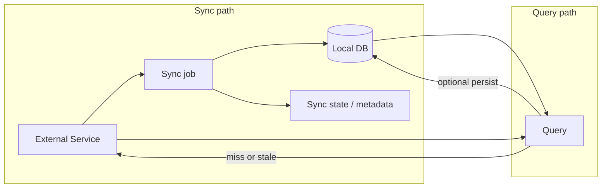
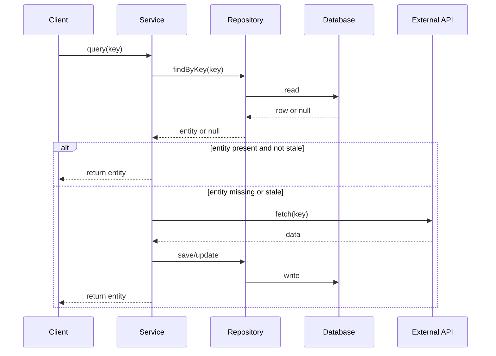
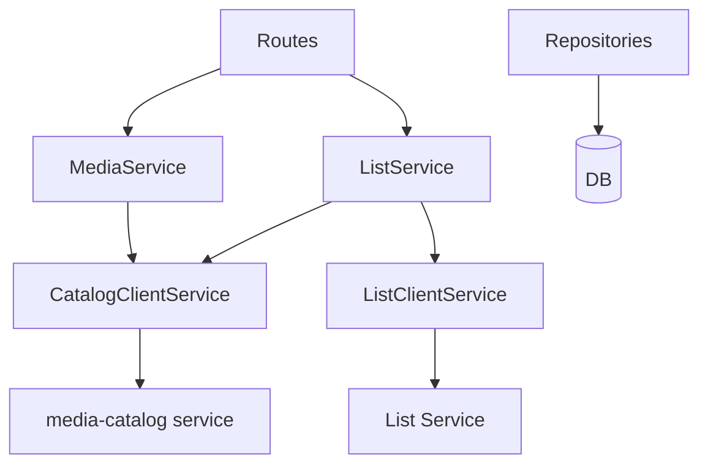

# External Sync + Query with Fallback

This document describes the architecture used to keep local data in sync with external services (e.g. TMDB) and to serve queries with fallback to the external API when data is missing or stale. See [System Overview](system-overview.md) for the broader architecture.

## Goal

- **Sync**: Keep local data aligned with an external service (scheduled and/or on-demand).
- **Query**: Serve reads from local storage; when data is absent or considered stale, fetch from the external service, optionally persist, then return.

## Conceptual Flow

Sync and query are two separate paths that both use the same external service and local store:

```mermaid
flowchart LR
  subgraph sync [Sync path]
    ES[External Service]
    SyncJob[Sync job]
    DB[(Local DB)]
    SyncState[Sync state / metadata]
    ES --> SyncJob
    SyncJob --> DB
    SyncJob --> SyncState
  end
  subgraph query [Query path]
    Q[Query]
    DB --> Q
    Q -->|miss or stale| ES
    ES --> Q
    Q -->|optional persist| DB
  end
```

- **Sync path**: A sync job (scheduled or triggered) pulls from the external service and writes to the local DB (and optionally updates sync metadata).
- **Query path**: Read from DB; if the resource is missing or considered “not in sync”, call the external service and optionally write back, then return.

## Query Flow (with fallback)

The following sequence diagram shows how a query uses the local store first and falls back to the external API when the entity is missing or stale:

```mermaid
sequenceDiagram
  participant C as Client
  participant S as Service
  participant R as Repository
  participant DB as Database
  participant E as External API

  C->>S: query(key)
  S->>R: findByKey(key)
  R->>DB: read
  DB-->>R: row or null
  R-->>S: entity or null

  alt entity present and not stale
    S-->>C: return entity
  else entity missing or stale
    S->>E: fetch(key)
    E-->>S: data
    S->>R: save/update
    R->>DB: write
    S-->>C: return entity
  end
```

## Catalog and list service layering

The standalone **media-catalog** service owns TMDB metadata and exposes the catalog capability over HTTP. The standalone **list-service** owns Trakt list definitions, pagination, and account associations. The backend consumes both capabilities and keeps only the local indexes/projections needed for playback.

```mermaid
flowchart TB
  Routes[Routes]
  MediaService[MediaService]
  ListService[ListService]
  CatalogClient[CatalogClientService]
  ListClient[ListClientService]
  CatalogService[media-catalog service]
  ListProvider[List Service]
  Repos[Repositories]
  DB[(DB)]

  Routes --> MediaService
  Routes --> ListService
  MediaService --> CatalogClient
  ListService --> CatalogClient
  ListService --> ListClient
  CatalogClient --> CatalogService
  ListClient --> ListProvider
  Repos --> DB
```

- **CatalogClientService**: Typed HTTP adapter for the media-catalog capability.
- **ListClientService**: Typed HTTP adapter for list pages and authenticated Trakt association operations.
- **ListService**: Projects external list references into the backend's local playback indexes after catalog resolution.

## Progressive ingestion and durable work

Catalog synchronization is progressive and database-backed:

- List pages are ingested as external references first. Full movie/show details are represented by a
  nullable `detailsSyncedAt` timestamp and hydrated later by prioritized `media.hydrate` jobs.
- Lists use ordered snapshot generations. A refresh builds a staging generation page by page and
  changes `activeGeneration` only after the complete snapshot succeeds. A new installation may
  publish a first-page bootstrap generation while the full snapshot is built.
- Backend list API pagination happens over the local projection; only the requested media rows are
  loaded while the list service remains the source of provider membership.
- Episodes are hydrated per season when requested instead of polling all incomplete seasons.
- Catalog, list, source, source-metadata, source-statistics, and cache work use Bunqueue's
  separate SQLite-backed broker. Typed queues are deduplicated, prioritized, leased with
  heartbeats, retried with backoff, and scheduled persistently by the broker; failed work is kept
  in its dead-letter queue. The legacy `BackgroundJob` table is retained only for one-release
  compatibility and receives no new work.
- Workers execute bounded entity/page jobs. List refreshes use a page fan-out followed by an
  activation fan-in, and movie summaries use an ordered hydration-to-source-discovery flow.
  Independent source metadata and statistics jobs are submitted in bulk rather than coupled.
- HTTP cache misses never wait for queue execution: catalog data, first-list bootstrap data, source
  discovery, and source metadata required for streaming are resolved inline. Broker failures only
  postpone follow-up enrichment and do not take request-time hydration offline.
- List-service pages keep provider membership current. Catalog details are resolved through the
  catalog capability and mirrored locally only when needed for playback.

Legacy catalog list tables and Trakt authentication storage are intentionally absent from the new
pre-production baseline. Reset local development databases when upgrading to this extraction.
