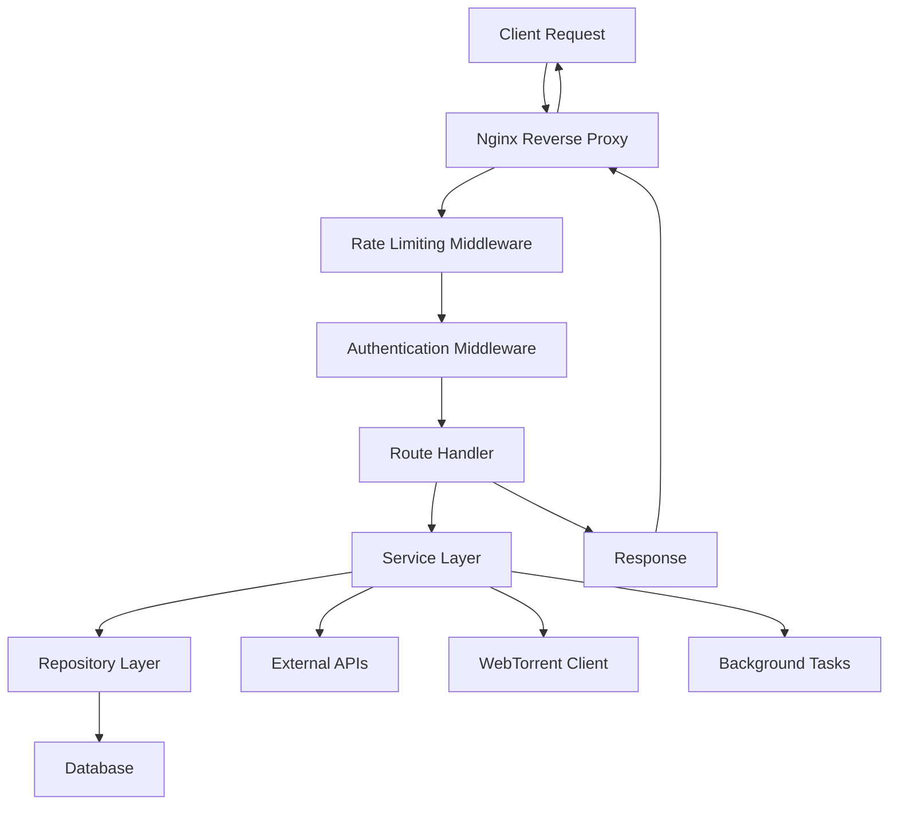
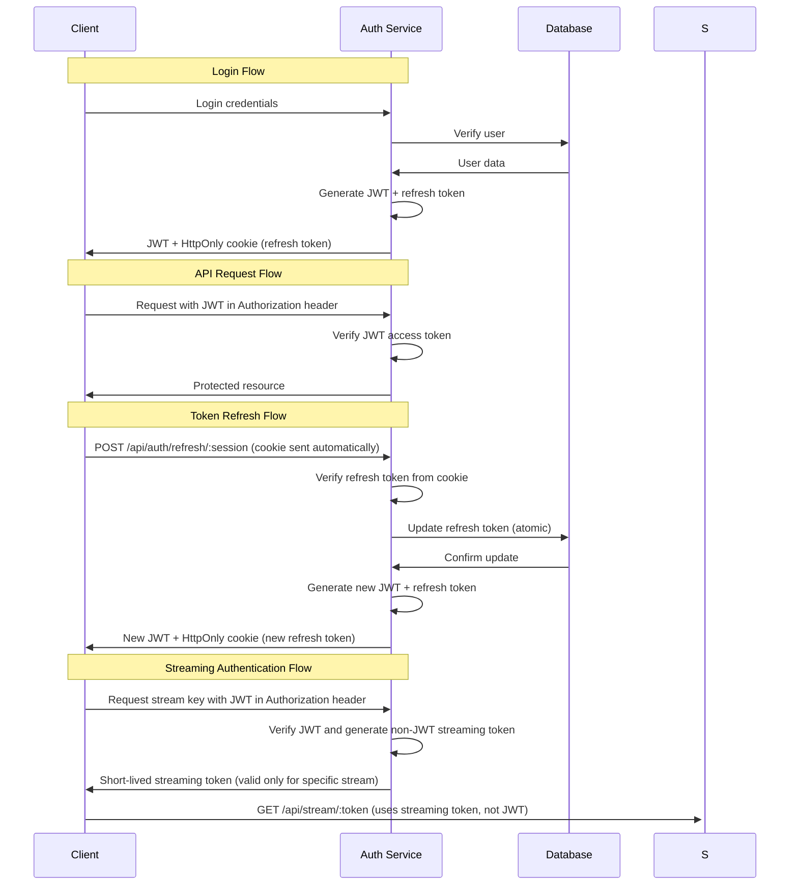
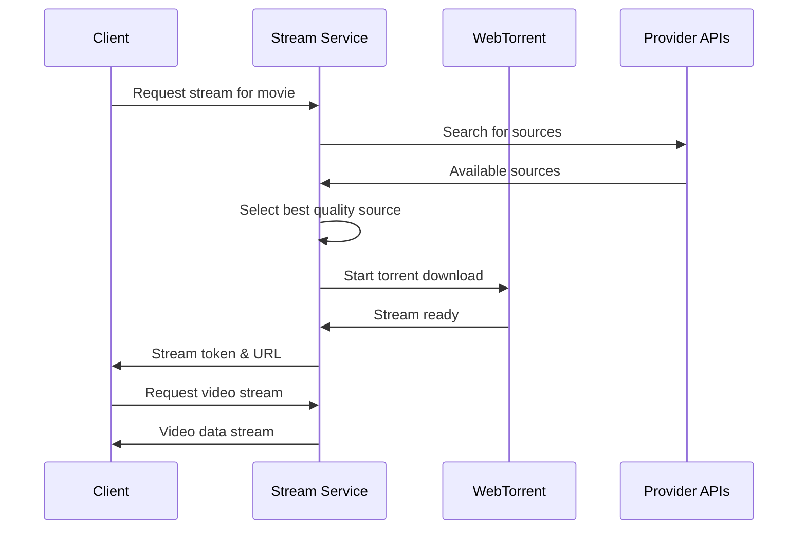

# System Architecture Overview

Miauflix is a production-ready self-hosted streaming platform built with modern web technologies and designed for scalability, security, and performance.

## Technology Stack

| **Layer**          | **Technology**                  | **Purpose**                         | **Key Components**                    |
| ------------------ | ------------------------------- | ----------------------------------- | ------------------------------------- |
| **Frontend**       | React 19 + Vite + Redux Toolkit | Single-page application             | Components, pages, state management   |
| **HTTP API**       | Node.js 22 + Hono Framework     | REST API and static file serving    | Routes, middleware, authentication    |
| **Authentication** | JWT + HttpOnly cookies + bcrypt | User authentication & authorization | JWT API access, refresh token cookies |
| **Database**       | TypeORM + SQLite                | Data persistence with auto-sync     | Entities, repositories, migrations    |
| **Streaming**      | WebTorrent + BitTorrent         | Peer-to-peer media streaming        | Torrent client, source aggregation    |
| **External APIs**  | TMDB, Trakt.tv, NordVPN         | Metadata, lists, VPN integration    | Service integrations, rate limiting   |
| **Deployment**     | Docker + Nginx + Let's Encrypt  | Containerized deployment with SSL   | Reverse proxy, SSL termination        |

## System Components

### Core Services

#### Authentication Service

**Three-Tier Authentication System:**

1. **API Authentication**: JWT access tokens in `Authorization: Bearer` headers (15 minutes expiration)
2. **Token Renewal**: HttpOnly refresh token cookies - used exclusively for `/api/auth/refresh/:session` endpoint (7 days expiration)
3. **Streaming Authentication**: Non-JWT streaming keys for `/api/stream/:token` endpoint (very short-lived, stream-specific)

**Additional Features:**

- **Atomic token rotation** with race condition detection
- **Multi-profile session support** with session-scoped cookies
- **Role-based access control** (admin, user)
- **Secure password hashing** with bcrypt
- **Audit logging** for security events

#### Media Services

- **TMDB Integration** - Movie/TV metadata, posters, ratings
- **Source Discovery** - Multi-provider content aggregation
- **Quality Management** - Automatic quality detection and selection
- **Progress Tracking** - User watch history and resume functionality

#### Streaming Infrastructure

- **WebTorrent Client** - Complete BitTorrent client implementation
- **Source Aggregation** - YTS, THERARBG, and an extensible provider system
- **Quality Selection** - Automatic best quality selection with codec preferences
- **Range Requests** - Full support for video seeking and partial content delivery
- **On-Demand Search** - Real-time source discovery with timeout handling

#### Background Processing

- **Scheduler Service** - Manages 7 background tasks
- **Source Discovery** - Continuous content indexing (every 0.1-5 seconds)
- **VPN-Aware Processing** - Automatic pause/resume based on VPN status
- **Statistics Scraping** - Real-time seeders/leechers data
- **Database Maintenance** - Cleanup and optimization tasks

### Data Layer

#### Database Design

- **SQLite Database** with TypeORM ORM
- **13 Core Entities** - User, Movie, TVShow, Episode, Season, etc.
- **AES-256-GCM Encryption** - Field-level encryption for sensitive data
- **Repository Pattern** - Clean data access abstraction
- **Auto-sync Schema** - Automatic database schema updates

#### Caching Strategy

- **Multi-layer Caching** - In-memory and persistent cache layers
- **Pluggable stores** - cache-manager with Keyv (in-memory/disk) by default; Redis store optional via configuration
- **Smart Cache Invalidation** - Automatic cache updates on data changes
- **API Response Caching** - Reduces external API calls

### Security Architecture

> Note: Use source discovery and streaming features in accordance with local laws and content licenses. Disable or remove providers where required.

#### Data Protection

- **Encryption at Rest** - AES-256-GCM for sensitive database fields
- **HTTPS Everywhere** - SSL/TLS encryption for all communications
- **Secure Headers** - HSTS, CSP, and other security headers
- **Input Validation** - Comprehensive request validation

#### Access Control

- **Rate Limiting** - Per-endpoint and per-user rate limits
- **CORS Configuration** - Proper cross-origin resource sharing
- **Authentication Middleware** - JWT verification and session management
- **Audit Logging** - Security event tracking and monitoring

#### VPN Integration

- **NordVPN Support** - Built-in VPN detection and enforcement
- **Automatic Failover** - Service pause/resume on VPN status changes
- **Privacy Protection** - IP masking for content discovery

## Data Flow Architecture

### Request Lifecycle

### Authentication Flow

### Streaming Flow

## Deployment Architecture

### Docker Services

#### Core Services

- **Backend** - Node.js API server and frontend host
- **Nginx** - Reverse proxy with SSL termination
- **Certbot** - Automatic SSL certificate management

#### Optional Services

- **NordVPN** - VPN container for privacy protection
- **Monitoring** - Health checks and performance monitoring

#### Service Communication

- **Internal Network** - Docker compose networking
- **Volume Mounts** - Persistent data storage
- **Environment Variables** - Configuration management

### Production Deployment

#### Load Balancing

- **Nginx** handles reverse proxy and load balancing
- **SSL Termination** at proxy level
- **Static File Serving** optimized for frontend assets

#### Monitoring and Logging

- **Health Check Endpoints** - `/health` endpoint for monitoring
- **Structured Logging** - JSON-formatted logs with correlation IDs
- **Error Tracking** - Comprehensive error reporting and alerting

#### Backup Strategy

- **Database Backups** - Automated SQLite backups
- **Configuration Backups** - Environment and SSL certificates
- **Media Cache** - Torrent data and metadata backups

## Performance Characteristics

### Scalability Features

- **Horizontal Scaling** - Multiple backend instances support
- **Caching Layers** - Reduced database and API load
- **Background Processing** - Non-blocking task execution
- **Connection Pooling** - Efficient database connections

### Resource Management

- **Memory Usage** - Optimized for typical VPS resources
- **CPU Utilization** - Background task throttling
- **Storage Optimization** - Efficient torrent chunk management
- **Network Optimization** - Bandwidth-aware streaming

## Security Model

### Threat Protection

- **SQL Injection** - Parameterized queries and ORM protection
- **XSS Protection** - Input sanitization and CSP headers
- **CSRF Protection** - Token-based protection
- **Token Security** - HttpOnly refresh token cookies, JWT access tokens

### Data Privacy

- **User Data Encryption** - Sensitive fields encrypted at rest
- **Audit Trail** - Complete user action logging
- **Privacy Controls** - User data export and deletion
- **VPN Integration** - IP address protection

## Extension Points

### Adding New Content Providers

1. Implement `ContentProvider` interface
2. Add provider configuration
3. Register with `SourceService`
4. Configure rate limiting

### Custom Authentication

1. Extend `AuthService` class
2. Implement authentication strategy
3. Update middleware configuration
4. Add provider-specific routes

### Additional Streaming Sources

1. Create provider class extending base provider
2. Implement search and metadata methods
3. Add quality detection logic
4. Register with aggregation service

This architecture provides a solid foundation for a scalable, secure, and maintainable streaming platform while remaining extensible for future enhancements.
