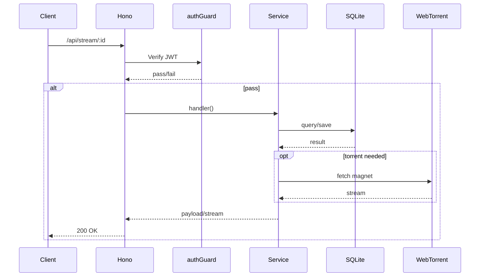

## 🔄 Request Life‑Cycle

```mermaid
sequenceDiagram
    participant Client
    participant Hono
    participant authGuard
    participant Service
    participant SQLite
    participant WebTorrent
    Client->>Hono: /api/stream/:id
    Hono->>authGuard: Verify JWT
    authGuard-->>Hono: pass/fail
    alt pass
        Hono->>Service: handler()
        Service->>SQLite: query/save
        SQLite-->>Service: result
        opt torrent needed
            Service->>WebTorrent: fetch magnet
            WebTorrent-->>Service: stream
        end
        Service-->>Hono: payload/stream
        Hono-->>Client: 200 OK
    end
```
