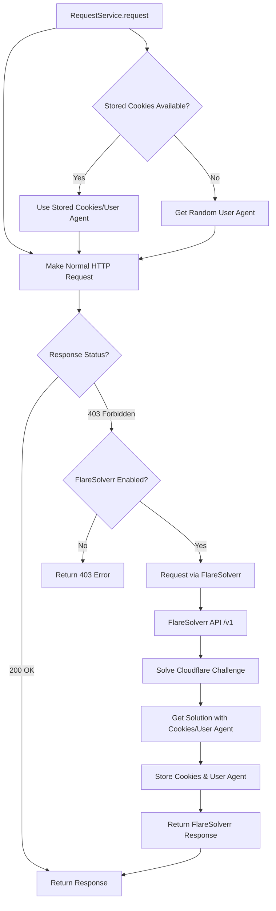
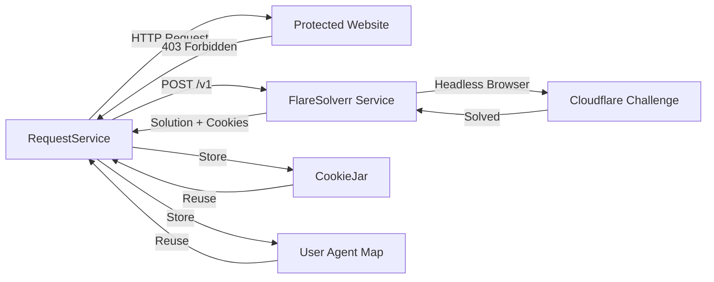

# FlareSolverr Configuration Guide

FlareSolverr is a proxy server that bypasses Cloudflare protection, allowing Miauflix to access content sources that are protected by Cloudflare's anti-bot measures.

## What is FlareSolverr?

FlareSolverr is a lightweight proxy server that uses a headless browser (Puppeteer) to solve Cloudflare challenges. Many content sources use Cloudflare to protect their websites from automated access, which can block normal HTTP requests. FlareSolverr automatically handles these challenges and returns the resolved content.

### Why is it needed?

Some content sources protected by Cloudflare will return `403 Forbidden` responses to direct HTTP requests. FlareSolverr:

- Automatically solves Cloudflare JavaScript challenges
- Handles browser fingerprinting and bot detection
- Returns valid cookies and user agents that can be reused
- Enables seamless access to protected content sources

## How It Works in Miauflix

Miauflix integrates FlareSolverr transparently through the `RequestService`. The integration is automatic and requires no code changes when enabled.

### Automatic 403 Retry

When `RequestService` makes a request and receives a `403 Forbidden` response:

1. If FlareSolverr is enabled, the request is automatically retried through FlareSolverr
2. FlareSolverr solves the Cloudflare challenge and returns the content
3. Cookies and user agent from the FlareSolverr solution are stored for future requests
4. Subsequent requests to the same domain use the stored credentials, avoiding FlareSolverr overhead

### Cookie and User Agent Management

FlareSolverr solutions include:

- **Cookies**: Cloudflare challenge cookies that prove the request is legitimate
- **User Agent**: The browser user agent used by FlareSolverr

These are automatically stored per-domain in Miauflix's `CookieJar` and `userAgentByDomain` maps. This means:

- First request to a protected domain → Goes through FlareSolverr
- Subsequent requests → Use stored cookies/user agent directly (faster)
- Cookies are reused until they expire or become invalid

### Request Flow



## Configuration

### Environment Variables

FlareSolverr is configured through two environment variables:

#### `ENABLE_FLARESOLVERR`

- **Type**: Boolean (`true` or `false`)
- **Default**: `true` (when `FLARESOLVERR_URL` is set)
- **Description**: Enable or disable FlareSolverr integration
- **Example**: `ENABLE_FLARESOLVERR=true`

#### `FLARESOLVERR_URL`

- **Type**: String (URL)
- **Default**: `http://localhost:8191`
- **Description**: Base URL of the FlareSolverr instance
- **Example**: `FLARESOLVERR_URL=http://localhost:8191`
- **Note**: In Docker, use `http://flaresolverr:8191` to reference the service

### Docker Setup

FlareSolverr is included in the Docker Compose configuration and runs automatically when using Docker deployment.

#### Service Configuration

The FlareSolverr service in `docker-compose.yml`:

```yaml
flaresolverr:
  image: ghcr.io/flaresolverr/flaresolverr:latest
  container_name: miauflix-flaresolverr
  depends_on:
    vpn:
      condition: service_healthy
  environment:
    - LOG_LEVEL=info
    - LOG_HTML=false
    - CAPTCHA_SOLVER=none
    - TZ=${TZ:-UTC}
  network_mode: service:vpn # Route traffic through NordVPN
  volumes:
    - /var/lib/flaresolver:/config
  restart: unless-stopped
```

**Key Features:**

- **VPN Integration**: Traffic is routed through the NordVPN service for privacy (`network_mode: service:vpn`)
- **Persistent Storage**: Configuration stored in `/var/lib/flaresolver` volume
- **Auto-restart**: Automatically restarts if the container stops

#### Docker Environment Variables

In the `miauflix` service, FlareSolverr is configured via:

```yaml
environment:
  - FLARESOLVERR_URL=${FLARESOLVERR_URL:-http://localhost:8191}
  - ENABLE_FLARESOLVERR=${ENABLE_FLARESOLVERR:-true}
```

**Note**: When running in Docker, the `FLARESOLVERR_URL` should reference the service name. However, since both services share the VPN network, `localhost` works because they're in the same network namespace.

### Manual Setup

If you're not using Docker, you can run FlareSolverr manually:

#### 1. Install FlareSolverr

```bash
# Using Docker (recommended)
docker run -d \
  --name flaresolverr \
  -p 8191:8191 \
  -e LOG_LEVEL=info \
  -e LOG_HTML=false \
  -e CAPTCHA_SOLVER=none \
  ghcr.io/flaresolverr/flaresolverr:latest
```

#### 2. Configure Miauflix

Add to your `.env` file:

```bash
ENABLE_FLARESOLVERR=true
FLARESOLVERR_URL=http://localhost:8191
```

#### 3. Verify Setup

Check that FlareSolverr is running:

```bash
curl http://localhost:8191/v1
```

You should receive a response indicating the FlareSolverr API is available.

## Architecture

### Component Interaction



### Integration Points

1. **RequestService** (`backend/src/services/request/request.service.ts`)
   - Detects 403 responses
   - Automatically retries through FlareSolverr
   - Stores cookies and user agents from solutions

2. **FlareSolverr Types** (`backend/src/types/flaresolverr.types.ts`)
   - TypeScript definitions for FlareSolverr API
   - Request/response interfaces

3. **CookieJar** (internal to RequestService)
   - Per-domain cookie storage
   - Automatic cookie header generation

4. **User Agent Management** (internal to RequestService)
   - Per-domain user agent storage
   - Random user agent fallback

## Troubleshooting

### Common Issues

#### FlareSolverr Not Responding

**Symptoms**: Requests fail with connection errors or timeouts

**Solutions**:

1. **Check FlareSolverr is running**:

   ```bash
   # Docker
   docker compose ps flaresolverr

   # Manual
   curl http://localhost:8191/v1
   ```

2. **Verify URL configuration**:
   - Check `FLARESOLVERR_URL` in `.env`
   - In Docker, ensure services can communicate (same network)

3. **Check FlareSolverr logs**:
   ```bash
   docker compose logs flaresolverr
   ```

#### Still Getting 403 Errors

**Symptoms**: Requests still return 403 even with FlareSolverr enabled

**Possible Causes**:

1. **FlareSolverr not enabled**: Check `ENABLE_FLARESOLVERR=true` in `.env`
2. **Invalid FlareSolverr URL**: Verify `FLARESOLVERR_URL` is correct
3. **FlareSolverr service down**: Check container status
4. **Cookies expired**: Stored cookies may have expired; FlareSolverr will retry automatically

**Solutions**:

- Verify environment variables are set correctly
- Check FlareSolverr logs for errors
- Restart FlareSolverr service: `docker compose restart flaresolverr`

#### Slow Request Performance

**Symptoms**: Requests take a long time when going through FlareSolverr

**Explanation**: FlareSolverr uses a headless browser, which is slower than direct HTTP requests. However, cookies are cached, so subsequent requests to the same domain should be faster.

**Optimization**:

- Cookies are automatically reused, reducing FlareSolverr calls
- Only 403 responses trigger FlareSolverr; successful requests bypass it
- Consider increasing FlareSolverr timeout if needed (see FlareSolverr documentation)

#### VPN Network Issues

**Symptoms**: FlareSolverr can't connect when using VPN

**Solution**: Ensure FlareSolverr service uses `network_mode: service:vpn` in Docker Compose, which routes traffic through the VPN service.

### Debugging Tips

#### Enable Debug Logging

Add to your `.env`:

```bash
DEBUG=RequestService,FlareSolverr
```

This will log:

- When FlareSolverr is triggered
- Cookie storage operations
- User agent management
- Request/response details

#### Check FlareSolverr Logs

```bash
# View real-time logs
docker compose logs -f flaresolverr

# View last 100 lines
docker compose logs --tail=100 flaresolverr
```

#### Test FlareSolverr Directly

You can test FlareSolverr manually:

```bash
curl -X POST http://localhost:8191/v1 \
  -H "Content-Type: application/json" \
  -d '{
    "cmd": "request.get",
    "url": "https://example.com"
  }'
```

#### Verify Cookie Storage

Check that cookies are being stored by examining RequestService logs when `DEBUG=RequestService` is enabled. You should see messages like:

```
FlareSolverr: Stored 3 cookies in cookie jar for example.com
FlareSolverr: Stored user agent for example.com
```

### Performance Considerations

- **First Request**: Slower (goes through FlareSolverr, ~2-5 seconds)
- **Subsequent Requests**: Faster (uses cached cookies, ~100-500ms)
- **Cookie Expiration**: Cookies may expire; FlareSolverr will automatically retry when needed

### Security Notes

- FlareSolverr runs through VPN for privacy protection
- Cookies are stored in memory only (not persisted to disk)
- User agents are rotated per domain
- All traffic is encrypted when using HTTPS sources

## Related Documentation

- [Environment Variables Reference](environment-variables.md) - Complete environment variable guide
- [Docker Setup Guide](docker-setup.md) - Docker deployment details
- [System Architecture Overview](../architecture/system-overview.md) - Overall system architecture
- [FlareSolverr GitHub](https://github.com/FlareSolverr/FlareSolverr) - Official FlareSolverr documentation

## References

- **FlareSolverr GitHub**: https://github.com/FlareSolverr/FlareSolverr
- **Implementation**: `backend/src/services/request/request.service.ts`
- **Type Definitions**: `backend/src/types/flaresolverr.types.ts`
- **Docker Configuration**: `docker-compose.yml` (flaresolverr service)
