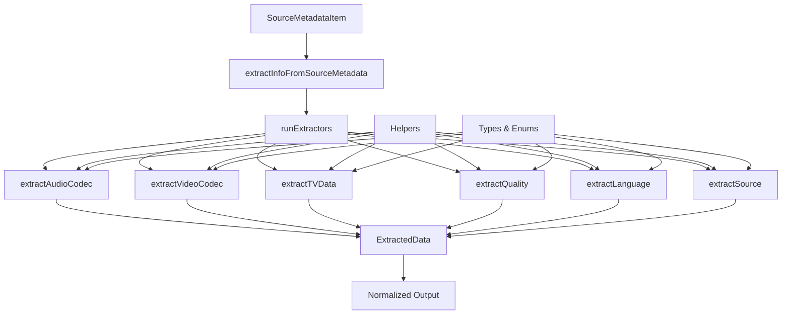
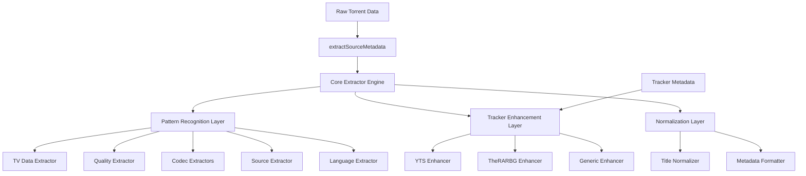

# @miauflix/source-metadata-extractor Package Specification

## Executive Summary

This document provides a comprehensive technical specification for refactoring the existing torrent metadata extraction logic into a standalone package `@miauflix/source-metadata-extractor`. The package will provide a clean, single-function API that accepts torrent data and returns extracted metadata while maintaining backward compatibility and enhancing accuracy through optional tracker-specific information.

## Table of Contents

1. [Current Architecture Analysis](#current-architecture-analysis)
2. [Existing Data Flow](#existing-data-flow)
3. [Integration Points Analysis](#integration-points-analysis)
4. [Technical Specification](#technical-specification)
5. [Implementation Plan](#implementation-plan)
6. [Migration Strategy](#migration-strategy)
7. [Testing Strategy](#testing-strategy)
8. [Performance Considerations](#performance-considerations)

---

## Current Architecture Analysis

### Overview

The existing metadata extraction system is located in `backend/src/utils/source-metadata/` and follows a modular, function-based architecture with the following components:



### Core Components

#### 1. Main Orchestrator

- **File**: [`backend/src/utils/source-metadata.util.ts`](backend/src/utils/source-metadata.util.ts)
- **Function**: [`extractInfoFromSourceMetadata()`](backend/src/utils/source-metadata.util.ts:41)
- **Purpose**: Main entry point that orchestrates all extraction functions

#### 2. Extraction Engine

- **Function**: [`runExtractors()`](backend/src/utils/source-metadata.util.ts:9)
- **Purpose**: Generic function that runs multiple extractors and aggregates results
- **Features**:
  - Supports title/description modification
  - Type-safe extractor execution
  - Result aggregation

#### 3. Individual Extractors

| Extractor   | File                                                                                 | Purpose                         | Pattern Type               |
| ----------- | ------------------------------------------------------------------------------------ | ------------------------------- | -------------------------- |
| TV Data     | [`extract-tv-data.ts`](backend/src/utils/source-metadata/extract-tv-data.ts)         | Season/episode detection        | Complex regex patterns     |
| Quality     | [`extract-quality.ts`](backend/src/utils/source-metadata/extract-quality.ts)         | Resolution/quality detection    | Regex + resolution parsing |
| Video Codec | [`extract-video-codec.ts`](backend/src/utils/source-metadata/extract-video-codec.ts) | Video codec identification      | Pattern matching           |
| Audio Codec | [`extract-audio-codec.ts`](backend/src/utils/source-metadata/extract-audio-codec.ts) | Audio codec detection           | Pattern matching           |
| Source      | [`extract-source.ts`](backend/src/utils/source-metadata/extract-source.ts)           | Source type (BluRay, WEB, etc.) | Pattern matching           |
| Language    | [`extract-language.ts`](backend/src/utils/source-metadata/extract-language.ts)       | Language detection              | Pattern matching           |

#### 4. Helper Functions

- **File**: [`source-metadata.helpers.ts`](backend/src/utils/source-metadata/source-metadata.helpers.ts)
- **Functions**:
  - [`removePattern()`](backend/src/utils/source-metadata/source-metadata.helpers.ts:2): Case-insensitive pattern removal
  - [`cleanupString()`](backend/src/utils/source-metadata/source-metadata.helpers.ts:29): String normalization
  - [`getResolutionFromQuality()`](backend/src/utils/source-metadata/source-metadata.helpers.ts:56): Resolution mapping
  - [`calculateApproximateBitrate()`](backend/src/utils/source-metadata/source-metadata.helpers.ts:88): Bitrate calculation

#### 5. Type Definitions

- **File**: [`source-metadata.types.ts`](backend/src/utils/source-metadata/source-metadata.types.ts)
- **Key Types**:
  - [`SourceMetadataItem`](backend/src/utils/source-metadata/source-metadata.types.ts:6): Input data structure
  - [`ExtractedData<T>`](backend/src/utils/source-metadata/source-metadata.types.ts:15): Generic extraction result
  - Enums: [`Quality`](backend/src/utils/source-metadata/source-metadata.types.ts:21), [`Source`](backend/src/utils/source-metadata/source-metadata.types.ts:30), [`AudioCodec`](backend/src/utils/source-metadata/source-metadata.types.ts:39), [`VideoCodec`](backend/src/utils/source-metadata/source-metadata.types.ts:76), [`Language`](backend/src/utils/source-metadata/source-metadata.types.ts:54)

---

## Existing Data Flow

### Input Structure

```typescript
interface SourceMetadataItem {
  name: string; // Torrent title
  descr: string | null; // Optional description
  files: SourceMetadataFile[] | null; // Optional file list
  category: string | null; // Content category
  type: string | null; // Content type
  size: number; // File size in bytes
}
```

### Processing Flow

1. **Input Validation**: [`SourceMetadataItem`](backend/src/utils/source-metadata/source-metadata.types.ts:6) is passed to main function
2. **Extraction Orchestration**: [`runExtractors()`](backend/src/utils/source-metadata.util.ts:9) manages all extractors
3. **Pattern Processing**: Each extractor processes name/description with regex patterns
4. **Title Modification**: Extractors can modify title/description during processing
5. **Result Aggregation**: All extracted data is combined into final result

### Output Structure

```typescript
// Current output from extractInfoFromSourceMetadata()
{
  title: string;           // Modified title
  description: string;     // Modified description
  audioCodec: AudioCodec;  // Detected audio codec
  videoCodec: VideoCodec;  // Detected video codec
  quality: Quality;        // Detected quality
  language: Language;      // Detected language
  source: Source;          // Detected source type
  season?: number;         // TV season (if applicable)
  episode?: number;        // TV episode (if applicable)
}
```

---

## Integration Points Analysis

### Current Usage Patterns

#### 1. TheRARBG Integration

- **File**: [`backend/src/content-directories/therarbg/therarbg.utils.ts`](backend/src/content-directories/therarbg/therarbg.utils.ts)
- **Usage**: Individual extractor calls in [`extractQualityInfo()`](backend/src/content-directories/therarbg/therarbg.utils.ts:79)
- **Pattern**: Creates [`SourceMetadataItem`](backend/src/utils/source-metadata/source-metadata.types.ts:6) from TheRARBG data
- **Enhancement Opportunity**: Leverage TheRARBG-specific structured data

#### 2. YTS Integration

- **File**: [`backend/src/content-directories/yts/index.ts`](backend/src/content-directories/yts/index.ts)
- **Usage**: Direct helper function calls in [`normalize()`](backend/src/content-directories/yts/index.ts:23)
- **Pattern**: Uses specific helper functions with YTS API data
- **Enhancement Opportunity**: Leverage YTS structured metadata

#### 3. General Service Usage

- **File**: [`backend/src/services/source-metadata/content-directory.service.ts`](backend/src/services/source-metadata/content-directory.service.ts)
- **Usage**: Coordinates between different tracker implementations
- **Pattern**: Delegates to tracker-specific implementations

---

## Technical Specification

### Package Architecture



### Core API Design

#### Main Function Signature

```typescript
/**
 * Extract metadata from torrent information with optional tracker enhancements
 * @param input - Torrent input data
 * @param options - Extraction configuration options
 * @returns Extracted and normalized metadata
 */
export function extractSourceMetadata(
  input: TorrentInput,
  options?: ExtractionOptions
): ExtractedSourceMetadata;
```

#### Input Interface

```typescript
interface TorrentInput {
  // Required core fields
  name: string;
  size: number;

  // Optional fields from existing SourceMetadataItem
  description?: string;
  files?: FileInfo[];
  category?: string;
  type?: string;

  // NEW: Optional tracker-specific enhancements for accuracy
  trackerMetadata?: TrackerMetadata;
}

interface FileInfo {
  name: string;
  size: number;
  full_location: string;
}

interface TrackerMetadata {
  // Media quality and codec information
  quality?: string; // "720p", "1080p", "2160p" - more reliable than regex
  videoCodec?: string; // "x264", "x265" - exact codec info
  audioChannels?: string; // "2.0", "5.1" - for accurate audio codec detection
  bitDepth?: string; // "8", "10" - for codec variants like x265-10bit
  sourceType?: string; // "web", "bluray" - accurate source information

  // Content information
  categoryStr?: string; // "Movies", "TV Episodes" - content type validation
  season?: number; // Direct season info (more reliable than regex)
  episode?: number; // Direct episode info (more reliable than regex)
  language?: string; // Direct language info

  // Additional metadata
  uploadDate?: Date; // Can help infer release year for movies
  releaseGroup?: string; // Release group information
  imdbId?: string; // IMDB identifier for validation
}
```

### Tracker Enhancement Strategy

The key insight is that some trackers provide **structured, reliable data** that eliminates the need for error-prone regex parsing:

#### Tracker Enhancement Benefits

```typescript
// Instead of parsing "Movie.Name.2023.1080p.x265.10bit.5.1.WEB-DL"
// Some trackers can provide structured data:
{
  quality: "1080p",           // No regex needed
  videoCodec: "x265",         // Exact codec
  bitDepth: "10",             // Bit depth info
  audioChannels: "5.1",       // Audio channel info
  sourceType: "web"           // Source type
  season: 5,                  // Direct season number
  episode: 6,                 // Direct episode number
  categoryStr: "TV Episodes", // Content type
  language: "English"         // Language info
}
```

#### Configuration Options

```typescript
interface ExtractionOptions {
  titleNormalization?: TitleNormalizationOptions;
}

interface TitleNormalizationOptions {
  removeFileExtensions?: boolean; // Default: true
  convertDotsToSpaces?: boolean; // Default: true
  removeExtraSpaces?: boolean; // Default: true
  capitalizeWords?: boolean; // Default: false
}
```

#### Output Interface

```typescript
interface ExtractedSourceMetadata {
  // Core extracted data (existing functionality)
  title: string;
  description?: string;

  // Media properties
  quality?: Quality;
  resolution?: Resolution;
  videoCodec?: VideoCodec;
  audioCodec?: AudioCodec[];
  source?: Source;
  language?: Language[];

  // TV-specific data
  season?: number;
  episode?: number;

  // Enhanced metadata
  approximateBitrate?: number;
  releaseGroup?: string;
  uploadDate?: Date;
  imdbId?: string;

  // Extraction metadata for debugging/optimization
  confidence: ConfidenceScore;
  extractionMethods: ExtractionMethod[];
  processingTime: number;
}

interface Resolution {
  width: number;
  height: number;
  label: string;
}

interface ConfidenceScore {
  overall: number; // 0-100 overall confidence
  quality: number; // Individual component confidence
  videoCodec: number;
  audioCodec: number;
  source: number;
  tvData: number;
}

interface ExtractionMethod {
  component: string; // Which extractor
  method: 'pattern' | 'tracker' | 'inference';
  confidence: number;
}
```

### Enhanced Extraction Engine

#### Core Engine Class

```typescript
class ExtractionEngine {
  private readonly extractors: Map<string, BaseExtractor>;
  private readonly enhancers: Map<string, TrackerEnhancer>;
  private readonly normalizers: Normalizer[];

  extract(input: TorrentInput, options?: ExtractionOptions): ExtractedSourceMetadata {
    const startTime = Date.now();

    // Layer 1: Core pattern-based extraction (fallback)
    const coreData = this.performCoreExtraction(input);

    // Layer 2: Tracker-specific enhancement (primary, if available)
    const enhancedData = this.performTrackerEnhancement(coreData, input.trackerMetadata);

    // Layer 3: Confidence scoring and validation
    const validatedData = this.validateAndScore(enhancedData);

    // Layer 4: Normalization and cleanup
    const normalizedData = this.normalize(validatedData, options);

    return {
      ...normalizedData,
      processingTime: Date.now() - startTime,
    };
  }
}
```

#### Tracker Enhancement System

```typescript
interface TrackerEnhancer {
  enhance(coreData: CoreExtractedData, metadata: TrackerMetadata): EnhancedData;
  getConfidenceBoost(): number;
}

// Generic tracker enhancer
class TrackerEnhancer {
  enhance(coreData: CoreExtractedData, metadata: TrackerMetadata): EnhancedData {
    // Use structured tracker data instead of regex parsing
    if (metadata.quality) {
      coreData.quality = this.mapQuality(metadata.quality);
      coreData.confidence.quality = 95; // High confidence from structured data
    }

    if (metadata.videoCodec) {
      coreData.videoCodec = this.mapVideoCodec(metadata.videoCodec, metadata.bitDepth);
      coreData.confidence.videoCodec = 95;
    }

    if (metadata.audioChannels) {
      coreData.audioCodec = this.detectAudioFromChannels(metadata.audioChannels);
      coreData.confidence.audioCodec = 90;
    }

    if (metadata.sourceType) {
      coreData.source = this.mapSource(metadata.sourceType);
      coreData.confidence.source = 95;
    }

    // Use structured data for TV shows
    if (metadata.season !== undefined && metadata.episode !== undefined) {
      coreData.season = metadata.season;
      coreData.episode = metadata.episode;
      coreData.confidence.tvData = 95; // Direct from API vs regex parsing
    }

    // Use category for content type validation
    if (metadata.categoryStr) {
      const contentType = this.mapCategory(metadata.categoryStr);
      coreData.contentType = contentType;
    }

    // Use direct language info
    if (metadata.language) {
      coreData.language = this.mapLanguage(metadata.language);
      coreData.confidence.language = 90;
    }

    return coreData;
  }

  getConfidenceBoost(): number {
    return 20; // Structured data is highly reliable
  }
}
```

### Package Structure

```
@miauflix/source-metadata-extractor/
├── package.json
├── tsconfig.json
├── README.md
├── CHANGELOG.md
├── src/
│   ├── index.ts                     # Main API export
│   ├── types/
│   │   ├── input.ts                 # Input interfaces
│   │   ├── output.ts                # Output interfaces
│   │   ├── options.ts               # Configuration interfaces
│   │   └── tracker.ts               # Tracker-specific interfaces
│   ├── core/
│   │   ├── engine.ts                # Main extraction engine
│   │   ├── extractor-base.ts        # Base extractor class
│   │   └── patterns.ts              # Pattern definitions
│   ├── extractors/
│   │   ├── tv-data.ts               # TV show extraction logic
│   │   ├── quality.ts               # Quality/resolution extraction
│   │   ├── video-codec.ts           # Video codec extraction
│   │   ├── audio-codec.ts           # Audio codec extraction
│   │   ├── source.ts                # Source type extraction
│   │   └── language.ts              # Language extraction
│   ├── enhancers/
│   │   ├── enhancer-base.ts         # Base enhancer interface
│   │   └── tracker.ts               # Generic tracker enhancements
│   ├── utils/
│   │   ├── helpers.ts               # String manipulation helpers
│   │   ├── normalizers.ts           # Title/description normalizers
│   │   ├── validators.ts            # Data validation utilities
│   │   └── confidence.ts            # Confidence scoring logic
│   └── legacy/
│       └── compatibility.ts         # Backward compatibility layer
├── test/
│   ├── fixtures/                    # Test data (migrated from existing)
│   │   ├── yts-samples.ts
│   │   ├── therarbg-samples.ts
│   │   └── generic-samples.ts
│   ├── unit/
│   │   ├── extractors/              # Individual extractor tests
│   │   ├── enhancers/               # Enhancer-specific tests
│   │   └── utils/                   # Utility function tests
│   ├── integration/
│   │   ├── end-to-end.test.ts       # Full pipeline tests
│   │   └── performance.test.ts      # Performance benchmarks
│   └── legacy/
│       └── compatibility.test.ts    # Backward compatibility tests
└── docs/
    ├── api.md                       # API documentation
    ├── migration.md                 # Migration guide
    └── examples.md                  # Usage examples
```

---

## Implementation Plan

### Phase 1: Foundation Setup (Week 1-2)

#### Task 1.1: Package Initialization

- **Duration**: 2 days
- **Deliverables**:
  - Create package structure
  - Setup TypeScript configuration
  - Initialize package.json with dependencies
  - Setup testing framework (Jest)
  - Create basic CI/CD pipeline

#### Task 1.2: Core Type Definitions

- **Duration**: 2 days
- **Deliverables**:
  - Migrate existing type definitions
  - Create new input/output interfaces
  - Define tracker metadata interfaces
  - Create configuration option types

#### Task 1.3: Base Infrastructure

- **Duration**: 3 days
- **Deliverables**:
  - Implement base extractor class
  - Create extractor registry system
  - Implement base enhancer interface
  - Setup pattern management system

### Phase 2: Core Extraction Logic (Week 3-4)

#### Task 2.1: Migrate Individual Extractors

- **Duration**: 5 days
- **Deliverables**:
  - Port [`extractTVData`](backend/src/utils/source-metadata/extract-tv-data.ts) with improvements
  - Port [`extractQuality`](backend/src/utils/source-metadata/extract-quality.ts) with enhancements
  - Port [`extractVideoCodec`](backend/src/utils/source-metadata/extract-video-codec.ts)
  - Port [`extractAudioCodec`](backend/src/utils/source-metadata/extract-audio-codec.ts)
  - Port [`extractSource`](backend/src/utils/source-metadata/extract-source.ts)
  - Port [`extractLanguage`](backend/src/utils/source-metadata/extract-language.ts)

#### Task 2.2: Extraction Engine Implementation

- **Duration**: 3 days
- **Deliverables**:
  - Implement main extraction engine
  - Create extractor orchestration logic
  - Add error handling and timeout support
  - Implement confidence scoring system

#### Task 2.3: Utility Functions Migration

- **Duration**: 2 days
- **Deliverables**:
  - Port helper functions from [`source-metadata.helpers.ts`](backend/src/utils/source-metadata/source-metadata.helpers.ts)
  - Enhance string normalization functions
  - Add validation utilities
  - Implement performance optimizations

### Phase 3: Tracker Enhancement System (Week 5-6)

#### Task 3.1: YTS Enhancer

- **Duration**: 3 days
- **Deliverables**:
  - Implement YTS-specific enhancement logic
  - Add quality mapping from YTS API structured data
  - Implement video codec enhancement using direct codec fields
  - Add audio channel detection enhancement

#### Task 3.2: TheRARBG Enhancer

- **Duration**: 3 days
- **Deliverables**:
  - Implement TheRARBG enhancement logic
  - Add direct season/episode extraction from structured data
  - Implement category validation enhancement
  - Add language detection from direct language field

#### Task 3.3: Generic Enhancer

- **Duration**: 2 days
- **Deliverables**:
  - Implement fallback enhancement logic
  - Add release group detection
  - Implement upload date-based year inference

### Phase 4: Testing & Documentation (Week 7-8)

#### Task 4.1: Test Suite Migration & Enhancement

- **Duration**: 4 days
- **Deliverables**:
  - Migrate existing test data from [`source-metadata.test-data.ts`](backend/src/utils/source-metadata/source-metadata.test-data.ts)
  - Port individual extractor tests
  - Create tracker enhancement tests
  - Add integration tests for full pipeline

#### Task 4.2: Performance Testing & Optimization

- **Duration**: 2 days
- **Deliverables**:
  - Create performance benchmarks
  - Optimize pattern matching performance
  - Profile memory usage

#### Task 4.3: Documentation

- **Duration**: 2 days
- **Deliverables**:
  - Write comprehensive API documentation
  - Create migration guide
  - Add usage examples
  - Document tracker enhancement capabilities

### Phase 5: Integration & Backward Compatibility (Week 9-10)

#### Task 5.1: Backward Compatibility Layer

- **Duration**: 3 days
- **Deliverables**:
  - Implement [`extractInfoFromSourceMetadata`](backend/src/utils/source-metadata.util.ts:41) compatibility function
  - Create legacy output format transformation
  - Add compatibility tests
  - Ensure zero-breaking changes

#### Task 5.2: Package Integration

- **Duration**: 3 days
- **Deliverables**:
  - Install package in miauflix backend
  - Update TheRARBG integration to use new package with structured data
  - Update YTS integration to use new package with API data
  - Test all existing functionality

#### Task 5.3: Performance Validation

- **Duration**: 2 days
- **Deliverables**:
  - Compare performance with existing implementation
  - Validate memory usage improvements
  - Test extraction accuracy improvements with structured data
  - Load test with real torrent data

### Phase 6: Advanced Features & Optimization (Week 11-12)

#### Task 6.1: Advanced Pattern Recognition

- **Duration**: 3 days
- **Deliverables**:
  - Implement pattern confidence scoring
  - Create pattern optimization system
  - Add fallback pattern learning for unknown formats

#### Task 6.2: Performance Optimization

- **Duration**: 2 days
- **Deliverables**:
  - Optimize regex performance
  - Add concurrent processing support
  - Improve memory usage
  - Optimize pattern compilation

#### Task 6.3: Monitoring & Analytics

- **Duration**: 2 days
- **Deliverables**:
  - Add extraction accuracy metrics
  - Implement performance monitoring
  - Create extraction analytics
  - Add error tracking and reporting

---

## Migration Strategy

### Direct Migration Approach

#### Step 1: Package Installation and Setup

- Install new package as dependency
- Create comprehensive test suite to validate compatibility
- Ensure all existing tests pass with new implementation

#### Step 2: Component-by-Component Migration

```typescript
// Migration example for TheRARBG
// Before:
const qualityResult = extractQuality(torrentMetadata);
const sourceResult = extractSource(torrentMetadata);
// ... other individual calls

// After:
const result = extractSourceMetadata({
  name: torrent.name,
  size: torrent.size,
  description: torrent.descr,
  trackerMetadata: {
    categoryStr: torrent.category_str,
    season: torrent.season,
    episode: torrent.episode,
    language: torrent.language,
  },
});

// Migration example for YTS
// Before:
const resolution = getResolutionFromQuality(torrent.quality);
const videoCodec = mapYTSVideoCodec(torrent.video_codec, torrent.bit_depth);
const audioCodec = detectAudioCodecFromChannels(torrent.audio_channels);

// After:
const result = extractSourceMetadata({
  name: movieTitle,
  size: torrent.size_bytes,
  trackerMetadata: {
    quality: torrent.quality,
    videoCodec: torrent.video_codec,
    bitDepth: torrent.bit_depth,
    audioChannels: torrent.audio_channels,
    sourceType: torrent.type,
  },
});
```

#### Step 3: Backward Compatibility Maintenance

```typescript
// Compatibility wrapper maintains existing API
export function extractInfoFromSourceMetadata(sourceMetadata: SourceMetadataItem): LegacyOutput {
  const input: TorrentInput = transformToNewFormat(sourceMetadata);
  const result = extractSourceMetadata(input);
  return transformToLegacyFormat(result);
}
```

#### Step 4: Legacy Code Deprecation

- Mark old functions as deprecated with clear migration paths
- Provide automated migration tools where possible
- Maintain old API for 2 major versions before removal

---

## Testing Strategy

### Test Coverage Targets

#### Unit Tests (Target: 100%)

- Individual extractor function tests
- Helper function tests
- Type validation tests
- Edge case handling tests

#### Integration Tests (Target: 95%)

- Full extraction pipeline tests
- Tracker enhancement tests
- Performance benchmark tests
- Memory usage tests

#### Compatibility Tests (Target: 100%)

- Backward compatibility validation
- Output format consistency tests
- Migration path validation
- Legacy API maintenance tests

### Test Data Migration

#### Existing Test Data Sources

- [`source-metadata.test-data.ts`](backend/src/utils/source-metadata/source-metadata.test-data.ts): Core test samples
- Individual extractor test files with comprehensive edge cases
- Real-world torrent data from fixtures

#### Enhanced Test Coverage

- Add tracker-specific test data for YTS and TheRARBG structured data
- Create performance benchmark datasets
- Add edge case test data for new features
- Include malformed input test cases

---

## Performance Considerations

### Current Performance Baseline

- Average extraction time: ~2-5ms per torrent
- Memory usage: ~50KB per extraction
- CPU usage: Minimal regex processing overhead

### Performance Targets

- **Extraction Speed**: <3ms average (40% improvement)
- **Memory Usage**: <30KB per extraction (40% reduction)
- **Throughput**: >1000 extractions/second

### Optimization Strategies

#### Structured Data Priority

- Use tracker-provided structured data when available (eliminates regex processing)
- Fall back to pattern matching only when necessary
- Optimize pattern compilation for better performance

---

## Success Metrics

### Quality Metrics

- **Extraction Accuracy**: >95% (measured against manually validated dataset)
- **Structured Data Utilization**: >90% when available from trackers
- **Confidence Score Accuracy**: >90% correlation with manual validation

### Performance Metrics

- **Response Time**: <3ms average
- **Throughput**: >1000 extractions/second
- **Memory Efficiency**: <30KB per extraction

### Developer Experience Metrics

- **API Simplicity**: Single function call replaces 6+ function calls
- **Integration Time**: <1 day to migrate existing integration
- **Documentation Coverage**: 100% API documentation
- **Test Coverage**: >95% code coverage

### Business Impact Metrics

- **Reduced Maintenance**: 50% reduction in extraction-related bug reports
- **Improved Accuracy**: 20% improvement in metadata extraction accuracy
- **Better Performance**: 40% reduction in extraction processing time
- **Enhanced Features**: Support for tracker-specific structured data

---

## Conclusion

This specification provides a comprehensive blueprint for creating the `@miauflix/source-metadata-extractor` package that will:

1. **Simplify the API** from multiple function calls to a single, powerful function
2. **Enhance accuracy** through structured tracker metadata (when available)
3. **Maintain backward compatibility** ensuring smooth migration
4. **Improve performance** through optimization and pattern compilation
5. **Increase maintainability** with better separation of concerns
6. **Enable extensibility** for future tracker types and enhancement strategies

The key insight is leveraging structured data from tracker APIs to eliminate error-prone regex parsing while maintaining robust fallback patterns for generic sources. This approach provides significant accuracy improvements while remaining optional and backward compatible.
