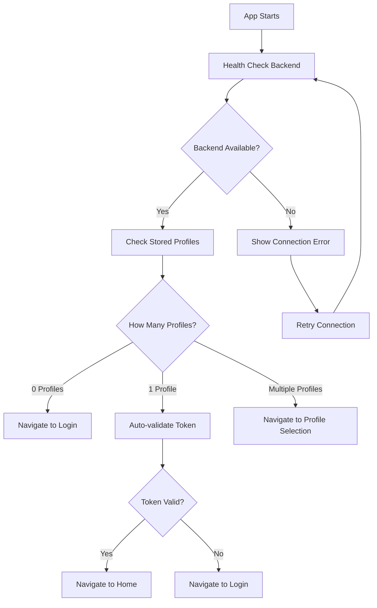
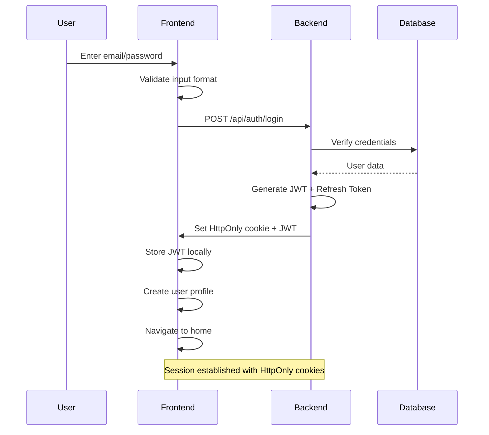
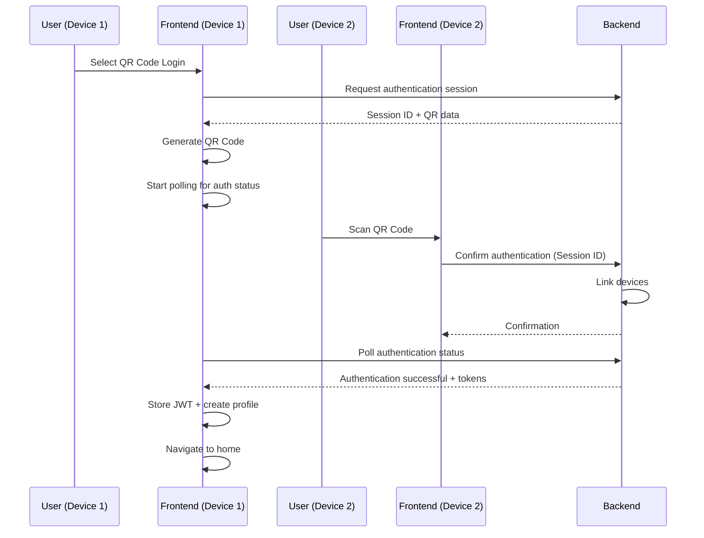
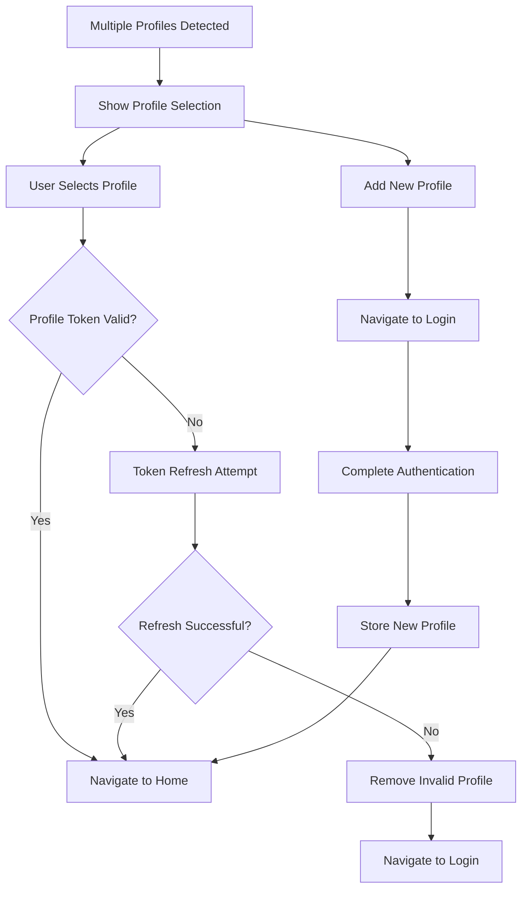
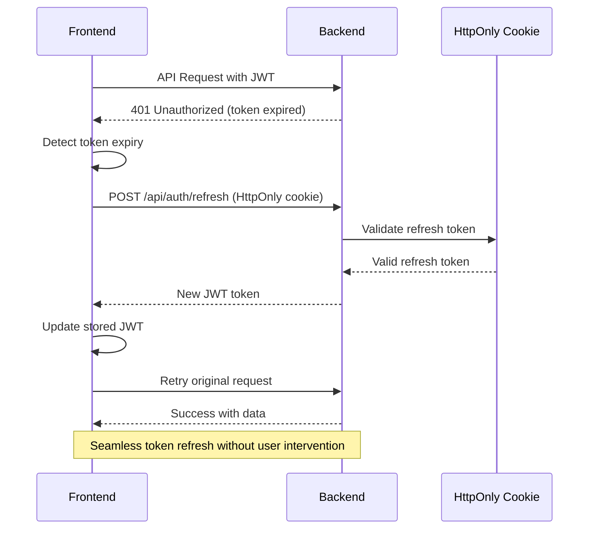
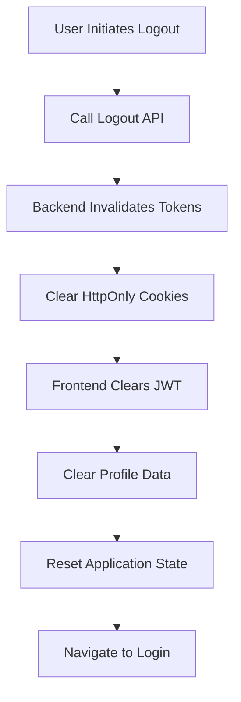
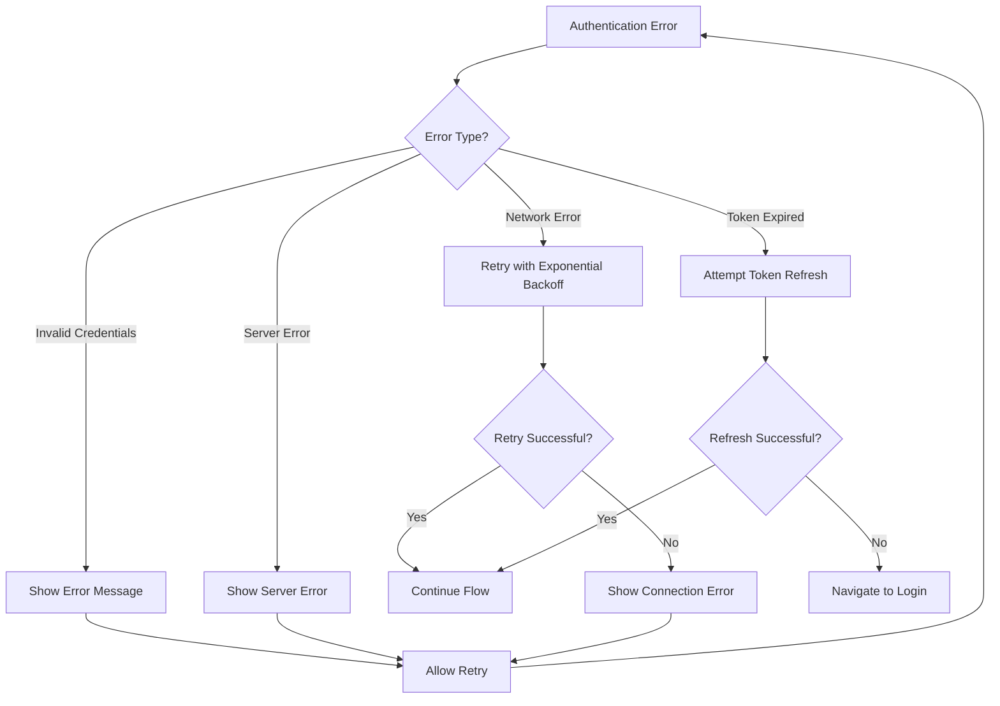

# Authentication User Flows

## Overview

Miauflix implements a sophisticated multi-profile authentication system with session-based security using HttpOnly cookies. The authentication flow supports both traditional email/password login and modern QR code authentication for seamless device pairing.

## 1. App Initialization Flow

The application startup sequence determines user navigation based on stored authentication profiles.

**Key Components:**
- **Health Check**: `frontend/src/hooks/useAppInitialization.ts`
- **Profile Detection**: Stored in local storage with encryption
- **Token Validation**: Automatic refresh token mechanism

## 2. Email/Password Authentication Flow

Traditional email and password login with secure session establishment.

**Implementation Details:**
- **Component**: `frontend/src/app/pages/login/components/LoginWithEmail.tsx`
- **API**: `frontend/src/store/api/auth.ts`
- **Security**: HttpOnly cookies for refresh tokens, JWT for API access
- **Error Handling**: Input validation, network errors, invalid credentials

## 3. QR Code Authentication Flow

Modern device-to-device authentication using QR codes for seamless login experience.

**Implementation Details:**
- **QR Component**: `frontend/src/app/pages/login/components/QRDisplay.tsx`
- **QR Login**: `frontend/src/app/pages/login/components/LoginWithQR.tsx`
- **Polling**: Continuous status checking until authentication complete
- **Cross-Device**: Secure session linking between devices

## 4. Profile Management Flow

Multi-user support with secure profile storage and switching capabilities.

**Key Features:**
- **Component**: `frontend/src/app/pages/welcome/`
- **Storage**: Encrypted profile data in local storage
- **Security**: Individual JWT tokens per profile
- **Management**: Add/remove profiles, automatic cleanup of expired profiles

## 5. Session Management & Token Refresh

Automatic token management ensuring continuous authenticated sessions.

**Implementation Details:**
- **Automatic Refresh**: Triggered on 401 responses
- **Security**: Refresh tokens stored as HttpOnly cookies
- **Fallback**: Redirect to login if refresh fails
- **State Management**: Redux store maintains authentication state

## 6. Logout Flow

Secure session termination with complete cleanup.

**Security Measures:**
- **Server-side**: Token invalidation and session cleanup
- **Client-side**: Complete local storage cleanup
- **State Reset**: Redux store reset to initial state
- **Cookie Cleanup**: HttpOnly refresh tokens removed

## 7. Error Handling & Recovery

Comprehensive error handling for various authentication scenarios.

## Technical Implementation

### State Management
- **Redux Store**: `frontend/src/store/slices/app.ts`
- **Authentication State**: User data, JWT tokens, profile management
- **UI State**: Loading states, error messages, navigation state

### API Integration
- **Auth API**: `frontend/src/store/api/auth.ts`
- **RTK Query**: Centralized API state management
- **Error Handling**: Automatic retry logic and error boundaries

### Security Features
- **Session-based**: HttpOnly cookies for refresh tokens
- **JWT Access Tokens**: Short-lived tokens for API access
- **Profile Encryption**: Local profile data encryption
- **CSRF Protection**: Built into session cookie implementation

## User Experience Considerations

### Performance
- **Fast Profile Detection**: Immediate routing based on stored profiles
- **Background Refresh**: Token renewal without user interruption
- **Optimistic Updates**: UI updates before server confirmation

### Accessibility
- **Keyboard Navigation**: Full keyboard support for login forms
- **Screen Readers**: Proper ARIA labels and announcements
- **Error Messages**: Clear, actionable error descriptions

### Multi-Platform Support
- **Responsive Design**: Works across desktop, mobile, and TV platforms
- **TV Navigation**: Remote control support for TV interfaces
- **Cross-Device**: QR code authentication for device pairing