# Content Discovery & Streaming User Flows

## Overview

Miauflix provides a comprehensive content discovery and streaming experience with category-based browsing, advanced search capabilities, and full-featured video playback. The system integrates with TMDB for metadata and uses WebTorrent for peer-to-peer streaming.

## 1. Home Screen & Content Discovery Flow

The main content discovery interface organized by categories with horizontal scrolling.

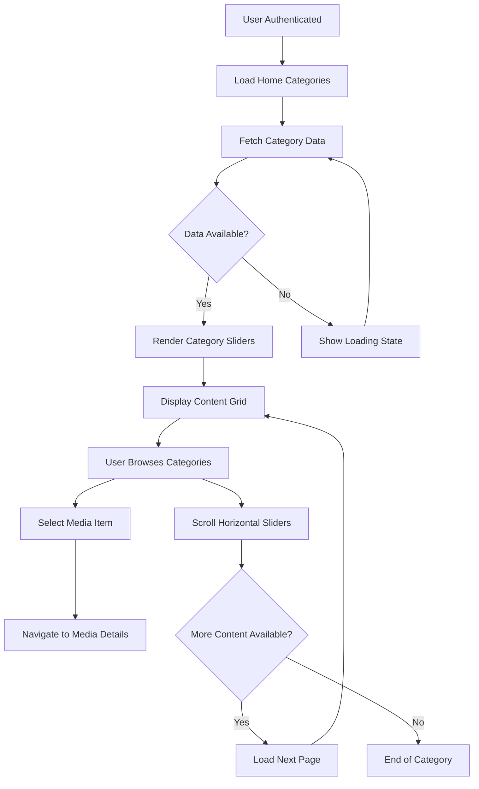

**Key Components:**
- **Home Controller**: `frontend/src/app/pages/home/`
- **Category Sliders**: `frontend/src/app/pages/home/components/categorySlider.tsx`
- **Media Boxes**: `frontend/src/app/pages/home/components/mediaBox.tsx`
- **API Integration**: `frontend/src/store/api/lists.ts`

## 2. Content Categories & Organization

Multiple content categories provide organized browsing experience.

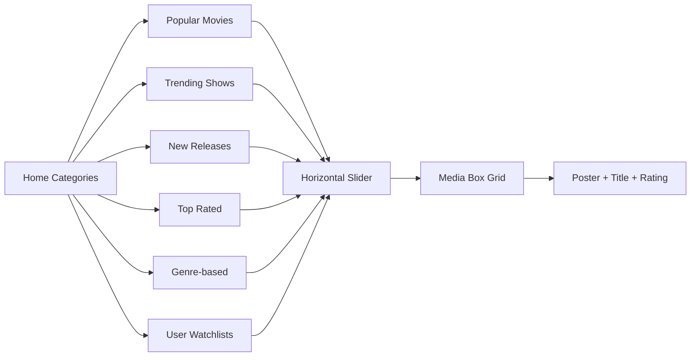

## 3. Media Detail View Flow

Comprehensive media information display with streaming preparation.

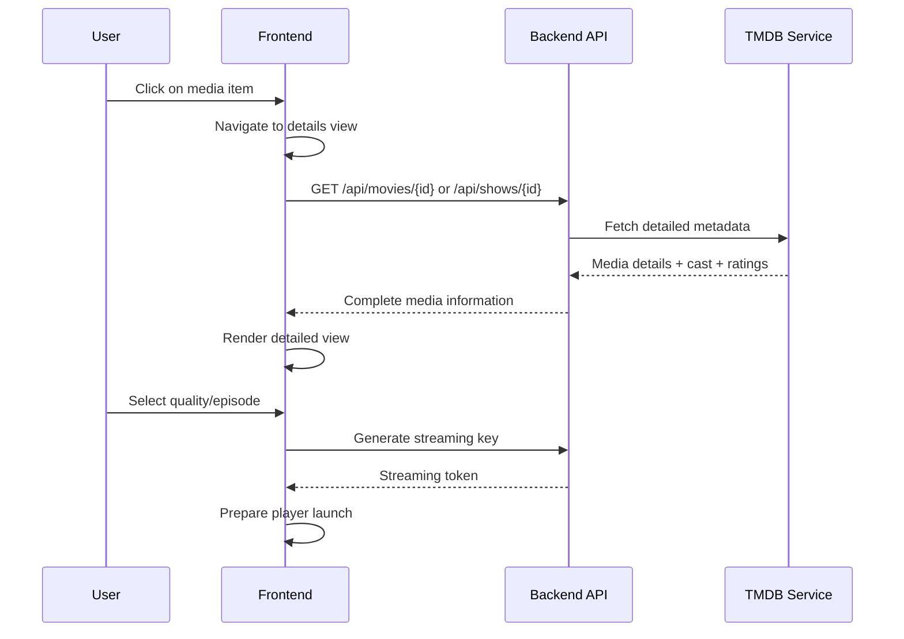

**Implementation Details:**
- **Movie Details**: `frontend/src/app/pages/home/components/moviePage.tsx`
- **TV Show Details**: `frontend/src/app/pages/home/components/tvShowPage.tsx`
- **Media Details**: `frontend/src/app/pages/home/components/mediaDetails.tsx`
- **Season Selection**: `frontend/src/app/pages/home/components/seasonSelector.tsx`

## 4. Search & Discovery Flow

Advanced search capabilities with real-time results.

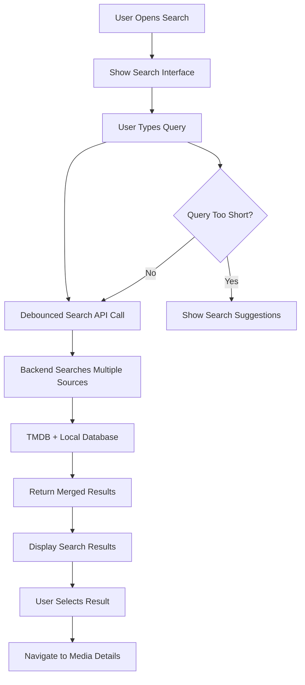

**Search Features:**
- **Real-time Search**: Debounced input with instant results
- **Multi-source**: TMDB integration + local database
- **Search Interface**: `frontend/src/app/pages/home/components/sidebar.tsx`
- **Spatial Navigation**: TV remote control support

## 5. TV Shows & Episode Selection Flow

Specialized flow for TV show content with season and episode management.

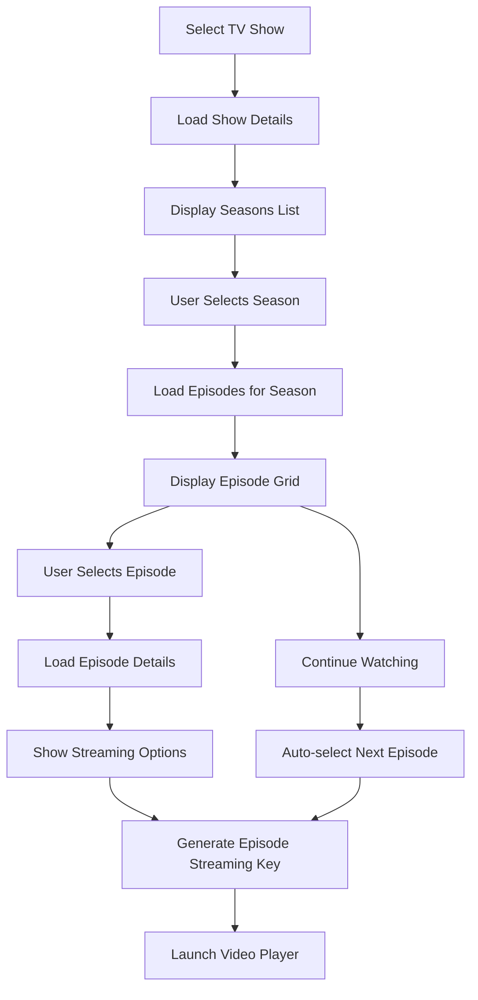

**TV Show Specific Components:**
- **Season Selector**: Episode navigation interface
- **Episode Streaming**: `frontend/src/app/pages/home/hooks/useEpisodeStreaming.tsx`
- **Progress Tracking**: Resume watching from last position
- **Auto-play**: Next episode functionality

## 6. Quality Selection & Streaming Preparation

Advanced quality selection with codec preferences.

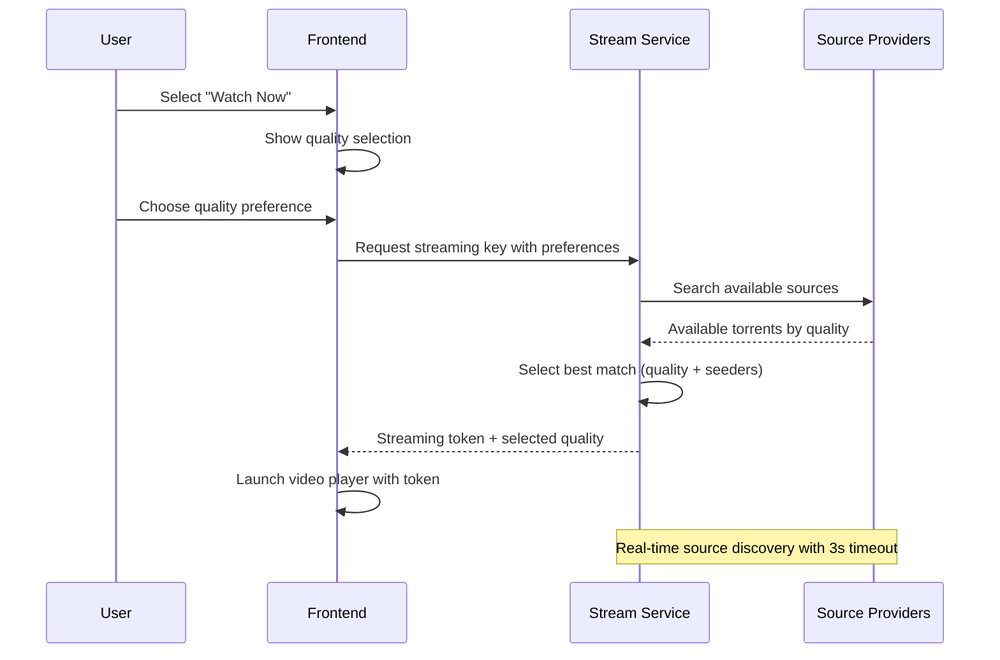

**Quality Options:**
- **Resolutions**: 720p, 1080p, 4K support
- **Codecs**: H.264, HEVC (x265) with preferences
- **Source Selection**: Automatic best source based on seeders/quality
- **Fallback Logic**: Quality degradation if preferred not available

## 7. Video Streaming Flow

Full-featured video player with progress tracking and controls.

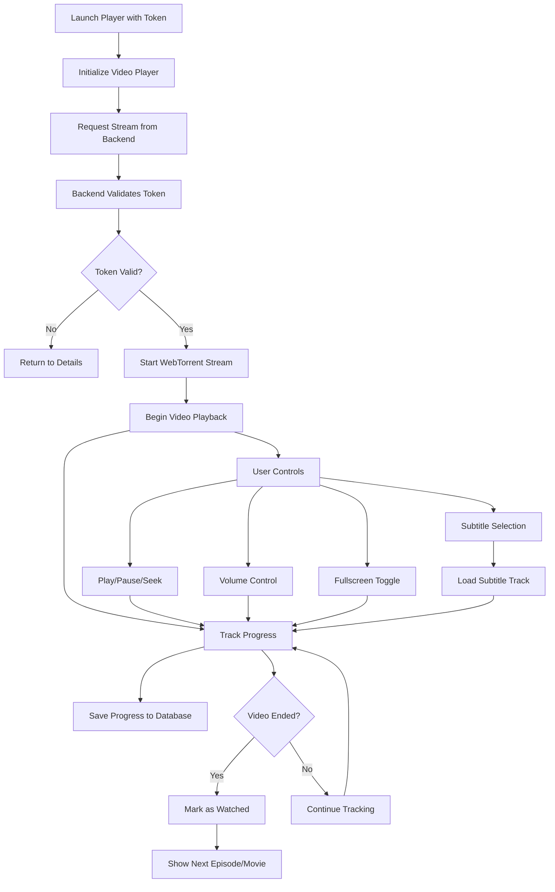

**Player Features:**
- **Multi-Platform**: Web and Tizen TV support
- **Progress Tracking**: `frontend/src/app/pages/player/hooks/useTrackProgress.tsx`
- **Subtitle Support**: `frontend/src/app/pages/player/components/playerSubtitles.tsx`
- **Controls**: `frontend/src/app/pages/player/components/playerInterface.tsx`

## 8. Streaming Architecture & Backend Integration

Technical flow showing streaming infrastructure.

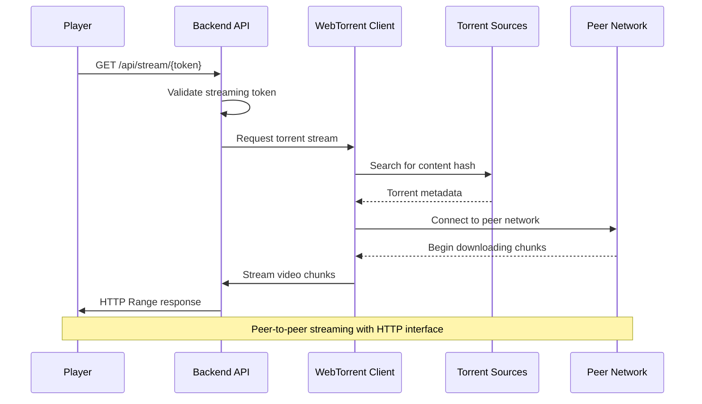

**Backend Streaming Service:**
- **Stream Endpoint**: `/api/stream/:token` with range request support
- **WebTorrent Integration**: Real-time peer-to-peer streaming
- **Quality Selection**: Automatic source optimization
- **Security**: Time-limited streaming tokens with validation

## 9. Progress Tracking & Resume Watching

Sophisticated watch progress management across devices.

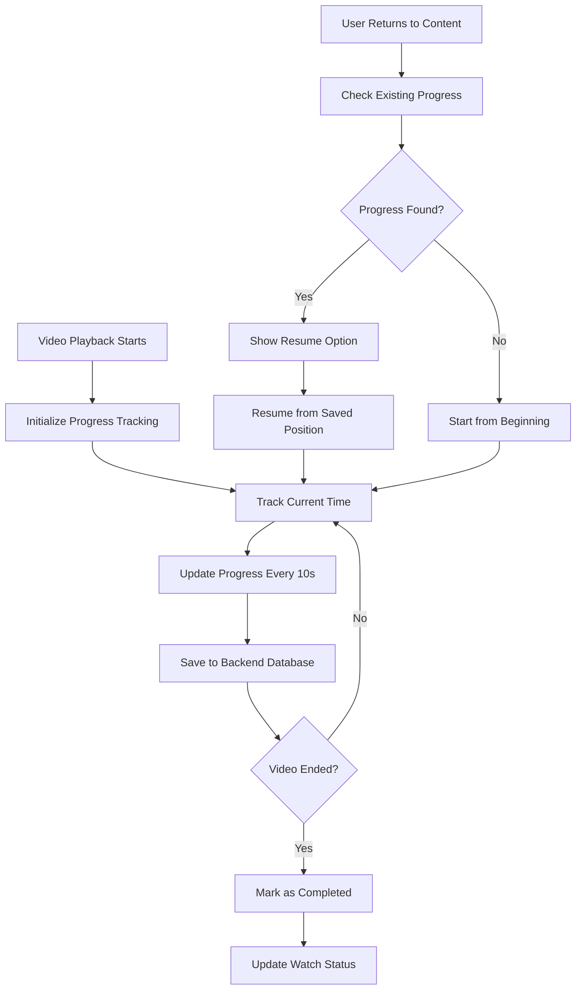

**Progress Features:**
- **Auto-Save**: Progress saved every 10 seconds during playback
- **Resume Watching**: Automatic resume from last position
- **Cross-Device**: Progress synced across all user devices
- **Watch Status**: Completed/In Progress/Not Started tracking

## 10. Content Preloading & Performance

Optimized content loading for smooth user experience.

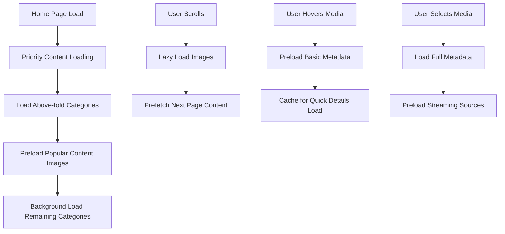

**Performance Features:**
- **Image Preloading**: `frontend/src/app/pages/home/hooks/usePreloadHomeImages.ts`
- **Lazy Loading**: Content loaded as user scrolls
- **Caching Strategy**: RTK Query automatic caching
- **Prefetching**: Next page content loaded in background

## 11. Spatial Navigation (TV/Remote Control)

Specialized navigation system for TV interfaces.

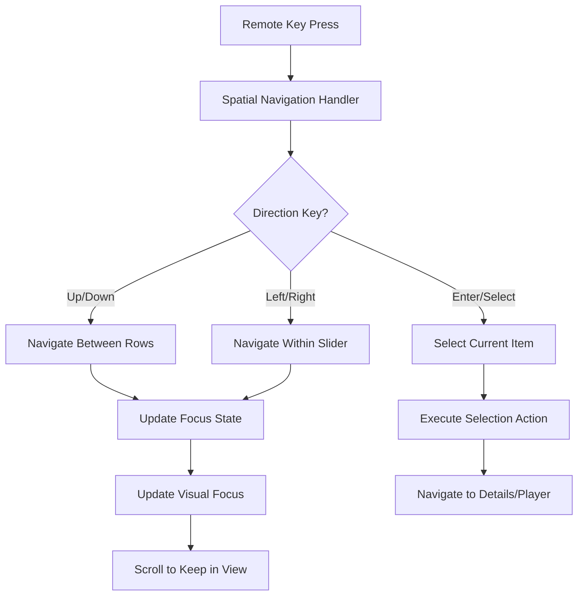

**TV Navigation Features:**
- **Focus Management**: Visual focus indicators
- **Smooth Scrolling**: Automatic scrolling to keep focused items visible
- **Remote Control**: Full support for TV remote controls
- **Platform Support**: Tizen TV optimized interface

## Technical Implementation

### State Management
- **Home State**: `frontend/src/store/slices/home.ts`
- **Stream State**: `frontend/src/store/slices/stream.ts`
- **UI State**: Loading, error, and navigation states

### API Integration
- **Content APIs**: Movies, shows, lists, and media APIs
- **Streaming API**: Token generation and validation
- **Progress API**: Watch progress tracking

### Real-time Features
- **Live Source Discovery**: Real-time torrent source searching
- **Dynamic Quality Selection**: Automatic best source selection
- **Progress Synchronization**: Real-time progress updates

## User Experience Considerations

### Performance
- **Fast Category Loading**: Optimized API calls and caching
- **Smooth Scrolling**: Hardware-accelerated animations
- **Instant Search**: Debounced search with real-time results

### Accessibility
- **Keyboard Navigation**: Full keyboard support
- **Screen Reader**: ARIA labels and semantic markup
- **High Contrast**: Support for accessibility themes

### Mobile/TV Optimization
- **Responsive Design**: Adaptive UI for all screen sizes
- **Touch Gestures**: Swipe navigation on mobile
- **Remote Control**: Complete TV remote support