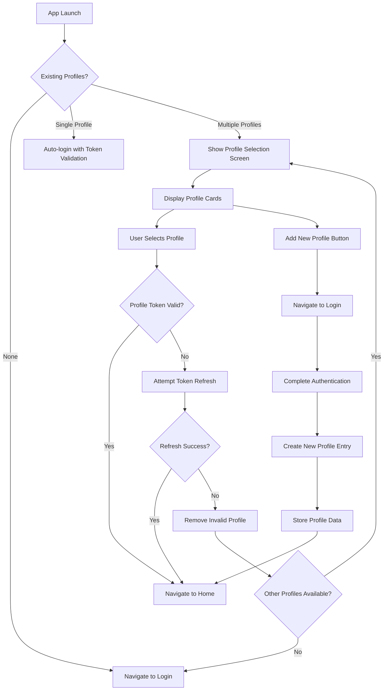
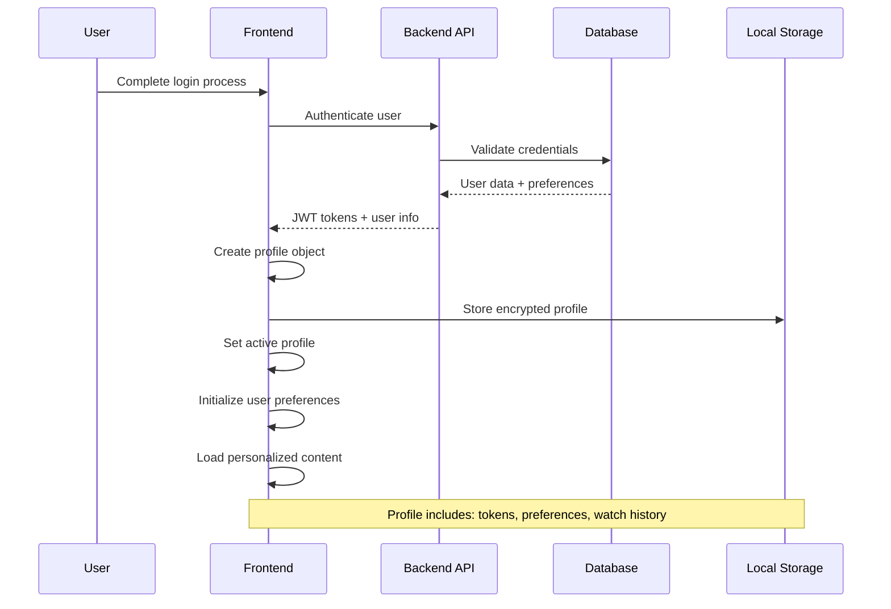
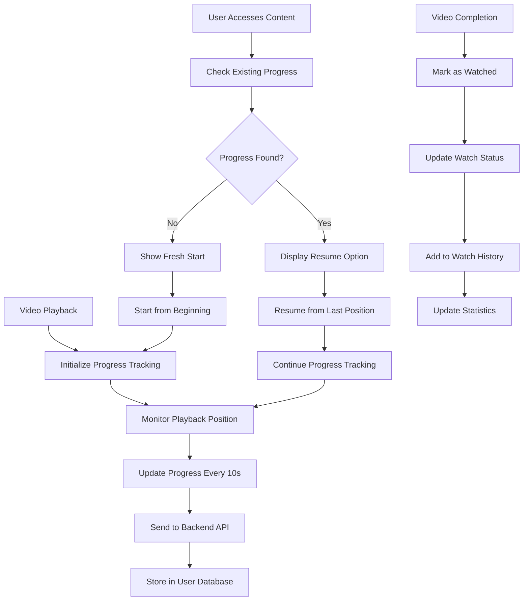
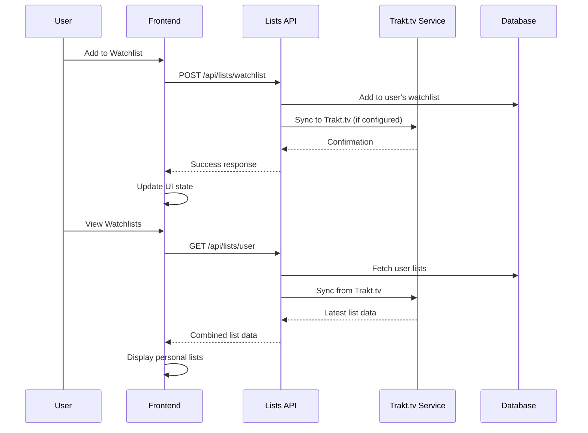
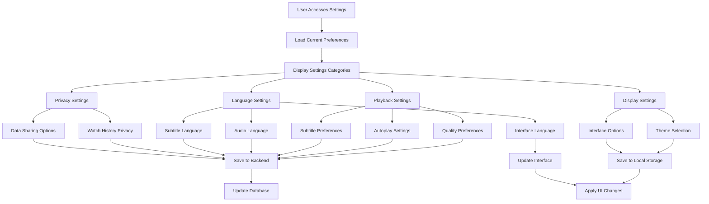
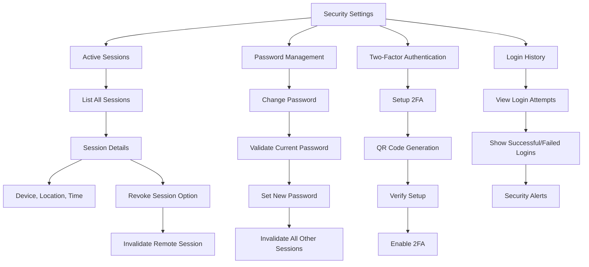
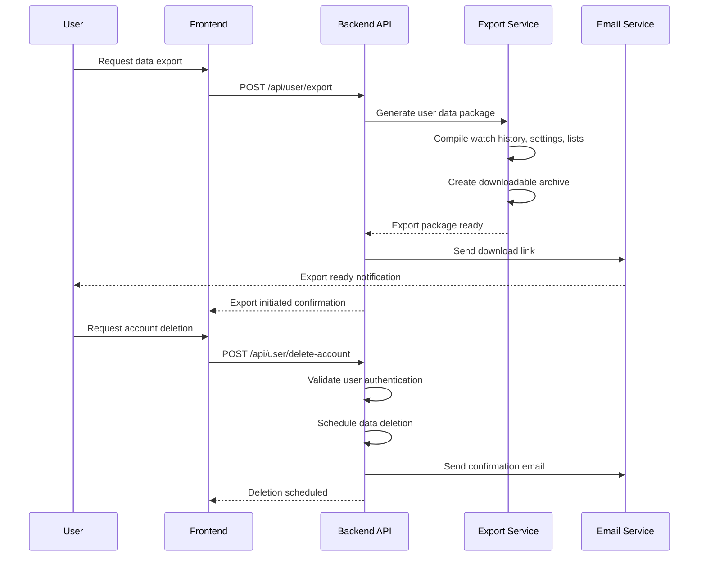
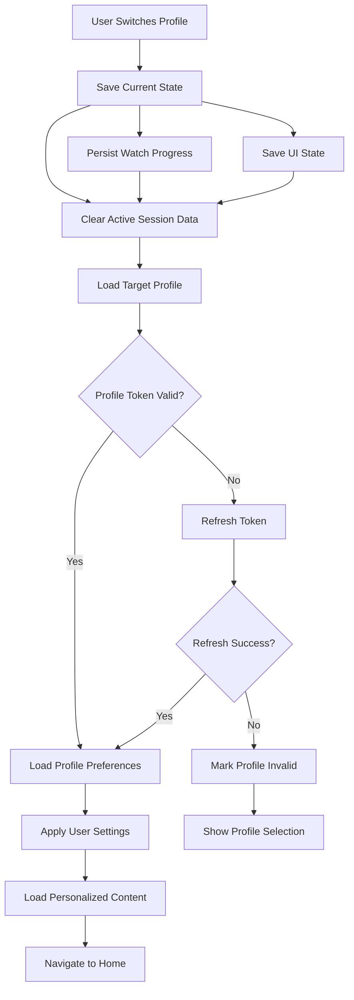
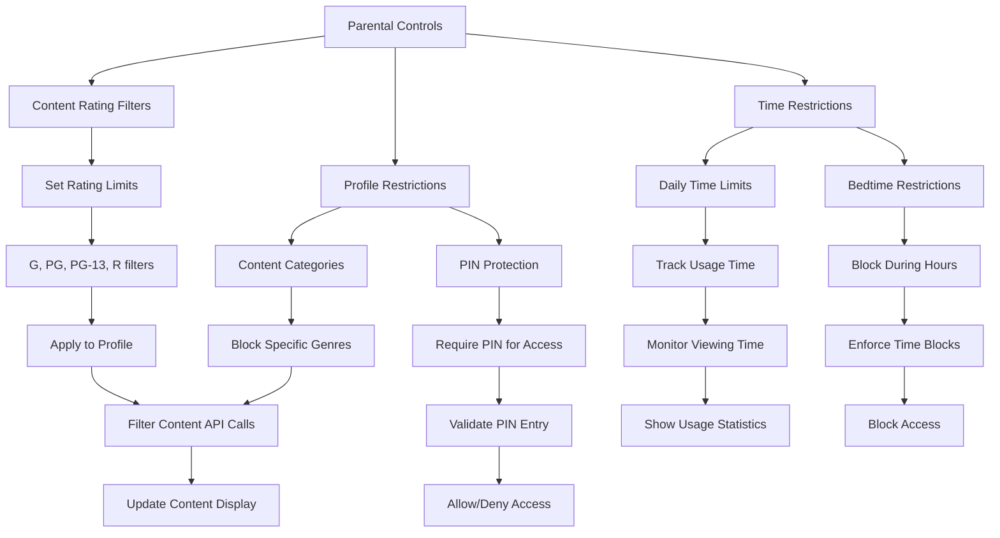
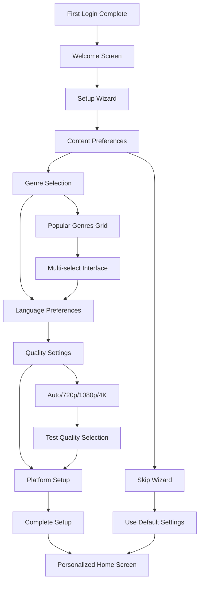

# User Management & Settings User Flows

## Overview

Miauflix implements comprehensive user management with multi-profile support, personalized settings, watch progress tracking, and administrative controls. The system supports individual user preferences while maintaining secure session management.

## 1. Multi-Profile Management Flow

Support for multiple user profiles on a single device with secure profile switching.

**Key Components:**
- **Profile Selection**: `frontend/src/app/pages/welcome/`
- **Profile Storage**: Encrypted local storage with individual JWT tokens
- **Profile Management**: Add/remove profiles with secure cleanup

## 2. User Profile Creation & Management

Individual profile setup with personalized preferences.

**Profile Data Structure:**
- **Authentication**: JWT access token, refresh token metadata
- **User Info**: Username, email, profile picture, preferences
- **Viewing History**: Watch progress, favorites, watchlists
- **Settings**: Language, quality preferences, subtitle settings

## 3. Watch Progress & History Management

Comprehensive tracking of user viewing activity across devices.

**Progress Features:**
- **Cross-Device Sync**: Progress available on all user devices
- **Resume Watching**: Automatic resume from last viewed position
- **Watch Statistics**: Total watch time, completion rates
- **History Management**: View and manage watch history

## 4. Watchlist & Favorites Management

Personal content curation with list management capabilities.

**List Management Features:**
- **Personal Watchlists**: Custom content lists
- **Favorites**: Quick access to preferred content
- **Trakt.tv Integration**: Sync with external service
- **List Sharing**: Share lists with other users (if implemented)

## 5. User Preferences & Settings

Comprehensive settings management for personalized experience.

**Settings Categories:**

### Playback Preferences
- **Default Quality**: Auto, 720p, 1080p, 4K preferences
- **Codec Preference**: H.264 vs HEVC (x265) selection
- **Autoplay**: Next episode, continuous playback
- **Skip Intros**: Automatic intro skipping

### Display & Interface
- **Theme**: Light, dark, system preference
- **Language**: Interface language selection
- **Navigation**: Spatial navigation sensitivity for TV
- **Accessibility**: High contrast, font size options

### Audio & Subtitles
- **Default Audio Language**: Preferred audio track language
- **Default Subtitle Language**: Preferred subtitle language
- **Subtitle Settings**: Font size, color, background
- **Audio Settings**: Volume normalization, surround sound

## 6. Account Security & Session Management

Security controls and session management for user accounts.

**Security Features:**
- **Session Management**: View and revoke active sessions
- **Password Security**: Strong password requirements and validation
- **Login Monitoring**: Track login attempts and locations
- **Account Recovery**: Secure account recovery process

## 7. Data Export & Privacy Controls

User data management and privacy compliance features.

**Privacy Features:**
- **Data Export**: Complete user data download
- **Account Deletion**: Secure account removal with data cleanup
- **Privacy Settings**: Control data sharing and analytics
- **GDPR Compliance**: European data protection compliance

## 8. Profile Switching & Session Isolation

Secure profile switching without authentication disruption.

**Profile Isolation Features:**
- **Secure Switching**: Complete session isolation between profiles
- **State Persistence**: Individual watch progress and settings
- **Token Management**: Separate JWT tokens per profile
- **Data Separation**: No cross-profile data leakage

## 9. Parental Controls & Content Filtering

Content filtering and parental control systems (if implemented).

## 10. User Onboarding & First-Time Setup

Guided setup process for new users.

**Onboarding Features:**
- **Content Preferences**: Genre and content type selection
- **Quality Setup**: Bandwidth and quality preference testing
- **Platform Optimization**: TV, mobile, desktop specific setup
- **Skip Options**: Allow experienced users to skip setup

## Technical Implementation

### State Management
- **User State**: `frontend/src/store/slices/app.ts` - User data and authentication
- **Profile State**: `frontend/src/store/slices/profileSelection.ts` - Profile management
- **Settings State**: User preferences and application settings

### Local Storage Architecture
- **Encrypted Profiles**: Secure profile data storage
- **Settings Cache**: Local caching of user preferences
- **Session Management**: JWT token storage and management

### API Integration
- **User API**: Profile management and user data
- **Progress API**: `frontend/src/store/api/progress.ts` - Watch progress tracking
- **Lists API**: `frontend/src/store/api/lists.ts` - Watchlists and favorites

### Security Measures
- **Token Isolation**: Separate tokens per profile
- **Data Encryption**: Sensitive data encryption in local storage
- **Session Validation**: Regular token validation and refresh
- **Secure Cleanup**: Complete data removal on logout/profile deletion

## User Experience Considerations

### Performance
- **Fast Profile Switching**: Instant profile changes with cached data
- **Efficient Sync**: Minimal API calls for settings updates
- **Background Updates**: Progress sync without UI blocking

### Accessibility
- **Settings Navigation**: Full keyboard and screen reader support
- **Visual Preferences**: Font size and contrast options
- **Clear Labels**: Descriptive labels for all settings

### Cross-Platform Consistency
- **Synchronized Settings**: Settings sync across all devices
- **Platform Adaptation**: Interface adaptation for TV, mobile, desktop
- **Universal Access**: Consistent experience across platforms