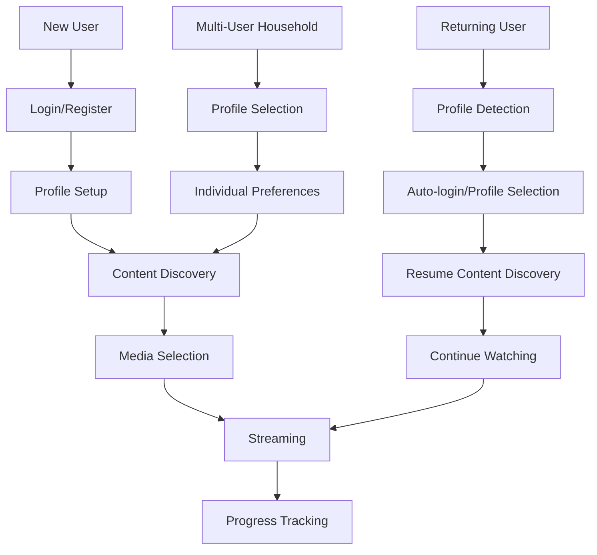

# Miauflix User Flows Documentation

## Overview

This directory contains comprehensive user flow documentation for the Miauflix streaming platform, written from a product manager's perspective. Each document provides detailed analysis of user journeys, technical implementation details, and UX considerations.

## User Flow Categories

### 1. [Authentication Flows](./01-authentication-flows.md)
Complete authentication system covering all login methods and session management:

- **App Initialization Flow** - Startup sequence and profile detection
- **Email/Password Authentication** - Traditional login with secure session establishment
- **QR Code Authentication** - Modern device-to-device authentication
- **Profile Management** - Multi-user support with secure profile switching
- **Session Management & Token Refresh** - Automatic token management
- **Logout Flow** - Secure session termination
- **Error Handling & Recovery** - Comprehensive error scenarios

**Key Features:**
- Session-based authentication with HttpOnly cookies
- Multi-profile support on single devices
- Cross-device QR code authentication
- Automatic token refresh without user interruption
- Complete security audit trail

### 2. [Content Discovery & Streaming](./02-content-discovery-streaming.md)
Comprehensive content browsing and video streaming experience:

- **Home Screen & Content Discovery** - Category-based browsing interface
- **Content Categories & Organization** - Structured content presentation
- **Media Detail View** - Rich content information display
- **Search & Discovery** - Advanced search with real-time results
- **TV Shows & Episode Selection** - Specialized TV show navigation
- **Quality Selection & Streaming Preparation** - Advanced quality options
- **Video Streaming** - Full-featured video player
- **Progress Tracking & Resume Watching** - Cross-device progress sync
- **Spatial Navigation** - TV/remote control support

**Key Features:**
- WebTorrent peer-to-peer streaming
- Real-time source discovery and quality selection
- Multi-platform video player (web, mobile, TV)
- Automatic progress tracking and resume functionality
- Advanced search with TMDB integration

### 3. [User Management & Settings](./03-user-management-settings.md)
User profile management and personalization features:

- **Multi-Profile Management** - Secure profile switching
- **User Profile Creation & Management** - Individual profile setup
- **Watch Progress & History** - Comprehensive viewing activity tracking
- **Watchlist & Favorites** - Personal content curation
- **User Preferences & Settings** - Comprehensive settings management
- **Account Security & Session Management** - Security controls
- **Data Export & Privacy Controls** - Privacy compliance features
- **Profile Switching & Session Isolation** - Secure profile isolation
- **User Onboarding** - First-time setup wizard

**Key Features:**
- Multi-user support with individual preferences
- Cross-device progress synchronization
- Trakt.tv integration for list management
- Comprehensive privacy controls
- GDPR compliance features

## Product Architecture Overview

### Technology Stack
- **Frontend**: React with TypeScript, Redux Toolkit, Vite
- **Backend**: Node.js with Hono framework, TypeScript
- **Database**: TypeORM with SQLite, AES-256-GCM encryption
- **Streaming**: WebTorrent for P2P content delivery
- **Authentication**: JWT with HttpOnly refresh cookies
- **External APIs**: TMDB (metadata), Trakt.tv (lists)

### Key User Journey Patterns

### Critical User Flow Intersections

1. **Authentication ↔ Content Discovery**
   - Seamless transition from login to personalized content
   - Profile-specific content recommendations
   - Cross-device session continuity

2. **Content Discovery ↔ Streaming**
   - One-click streaming from any content view
   - Quality selection integrated into discovery flow
   - Progress tracking starts before video player loads

3. **User Management ↔ All Flows**
   - Profile switching affects all user interactions
   - Settings impact streaming quality and interface
   - Progress tracking spans all content interactions

## Implementation Status

### ✅ Fully Implemented Features
- **Complete Authentication System** - All login methods, session management
- **Content Discovery** - Full browsing, search, and detail views
- **Video Streaming** - WebTorrent integration with multi-platform player
- **Progress Tracking** - Cross-device sync and resume watching
- **Multi-Profile Support** - Secure profile management
- **Settings Management** - Comprehensive user preferences

### 🔄 Integration Points
- **TMDB Integration** - Complete metadata fetching
- **Trakt.tv Integration** - List synchronization
- **WebTorrent Streaming** - P2P streaming infrastructure
- **Session-based Auth** - HttpOnly cookies with JWT tokens

## User Experience Principles

### Performance
- **Fast Loading** - Optimized API calls and content preloading
- **Smooth Navigation** - Hardware-accelerated animations
- **Instant Feedback** - Real-time UI updates and state management

### Accessibility
- **Keyboard Navigation** - Full keyboard and remote control support
- **Screen Reader Support** - ARIA labels and semantic markup
- **Multi-Platform** - Responsive design for desktop, mobile, and TV

### Security
- **Session Security** - HttpOnly cookies and JWT token management
- **Profile Isolation** - Complete data separation between users
- **Privacy Controls** - GDPR compliance and data export features

## Development Guidelines

### Adding New User Flows
1. **Analyze Existing Patterns** - Review similar flows in existing documentation
2. **Map User Journey** - Create mermaid diagrams showing user steps
3. **Document Technical Implementation** - Include component references and API endpoints
4. **Consider Cross-Flow Impact** - How new flow affects existing user journeys
5. **Test Multi-Platform** - Ensure flow works across web, mobile, and TV

### Flow Documentation Standards
- **Use Mermaid Diagrams** - Visual representation of user flows
- **Include File References** - Specific component and service file paths
- **Cover Error Cases** - Document error handling and recovery flows
- **UX Considerations** - Performance, accessibility, and platform optimization
- **Technical Details** - API endpoints, state management, and security measures

## Related Documentation

- **[Architecture Overview](../architecture/system-overview.md)** - System architecture and technical design
- **[Development Guide](../ai/development-guide.md)** - Development patterns and workflows
- **[Authentication System](../backend/docs/authentication.md)** - Backend authentication implementation
- **[Streaming Services](../backend/docs/streaming-services.md)** - Streaming infrastructure details

---

*This documentation provides a complete product manager's view of all user flows in the Miauflix platform. Each flow document includes detailed diagrams, technical implementation references, and user experience considerations to support both product planning and development efforts.*