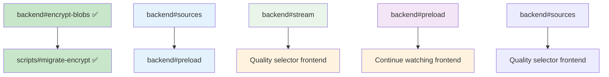

# Backend Issue Tracker (Miauflix‑bun)

> One markdown file = one stop shop for all open backend tickets referenced in the high‑level roadmap.
> Copy these sections into GitHub issues if you prefer; the **ref ID** in the heading matches the shorthand used in the roadmap.

## Story Point Reference

- 1 SP ≈ 4 hours (half day)
- Includes: implementation + unit tests + documentation
- Excludes: code review time, deployment

## Progress Dashboard

| Task                    | Status | Assignee  | Started | ETA     | Dependencies          |
| ----------------------- | ------ | --------- | ------- | ------- | --------------------- |
| backend#stream          | ⬜     | @core-dev | -       | W24     | -                     |
| backend#sources         | ⬜     | @core-dev | -       | W24     | -                     |
| backend#preload         | ⬜     | @core-dev | -       | W24-25  | backend#sources       |
| backend#encrypt-blobs   | ☑     | @sec-dev  | W24     | ✅ Done | -                     |
| scripts#migrate-encrypt | ☑     | @sec-dev  | W24     | ✅ Done | backend#encrypt-blobs |
| db#rename               | ☑     | @sec-dev  | W24     | ✅ Done | backend#encrypt-blobs |

## Environment Variables Reference

| Variable                | Required | Default | Description                         |
| ----------------------- | -------- | ------- | ----------------------------------- |
| TORRENT_KEY             | Yes      | -       | Base64 AES-256 key for encryption   |
| MAX_PRELOAD_CONCURRENCY | No       | 3       | Max simultaneous preload operations |
| STREAM_CHUNK_SIZE       | No       | 65536   | Streaming chunk size in bytes       |
| STREAM_TIMEOUT_MS       | No       | 30000   | Stream connection timeout           |

## Task Dependencies



---

## backend#stream — `/api/stream/:sourceId` endpoint (8 SP)

**Summary**
Create an authenticated, Range‑enabled route that pipes WebTorrent data through Hono without using WebTorrent's HTTP server.

**Tasks**

1. Route definition in `app.ts` under `/api/stream/:sourceId` (GET).
2. Lookup `MovieSource` → magnet/torrentFile.
3. Add torrent to global WebTorrent client if not cached.
4. Choose primary video file (largest or flagged).
5. Implement byte‑range parsing ⇒ respond `206 Partial Content`.
6. Pipe file stream to response; set `Content‑Type`.
7. Cleanup: call `torrent.destroy()` when no active readers.
8. Unit test: curl 1 KB range and expect correct headers.

**Technical Specifications**

```typescript
interface StreamingRequirements {
  maxConcurrentStreams: 10; // per user
  chunkSize: 65536; // 64KB chunks
  bufferStrategy: 'conservative'; // avoid memory pressure
  timeoutMs: 30000; // connection timeout
  maxMemoryPerStream: 200 * 1024 * 1024; // 200MB
}

interface RangeRequest {
  start: number;
  end?: number; // undefined = to EOF
  total: number; // file size
}
```

**Error Scenarios**

- Invalid JWT → 401 Unauthorized
- Source not found → 404 Not Found
- Torrent fetch timeout → 408 Request Timeout
- Memory exhaustion → 503 Service Unavailable
- Range header malformed → 416 Range Not Satisfiable

**Performance Requirements**

- Stream startup: <2s (measured from request to first byte)
- Memory usage: <200MB per concurrent stream
- CPU usage: <50% during peak load (5 concurrent streams)
- Error rate: <1% for valid requests

**Integration Tests Required**

- Happy path: JWT auth → range request → stream playback with seek
- Error path: network failure during stream
- Concurrent users: 5 simultaneous streams
- Browser compatibility: Chrome/Firefox/Safari range requests

**Acceptance Criteria**

- Valid JWT → stream plays in browser with seek working.
- Invalid JWT → 401.
- Memory stays < 200 MB per 1080p stream.
- Range requests work: `curl -H "Range: bytes=0-1023" → 206 Partial Content`
- Concurrent streams: 5 users can stream different movies simultaneously

---

## backend#sources — Torrent source aggregator (8 SP)

**Summary**
Integrate YTS (existing), add EZTV & RARBG providers, and select the "best" torrent based on enhanced scoring algorithm.

**Tasks**

1. Define `TorrentProvider` interface (`searchMovie`, `searchEpisode`).
2. Implement `YTSProvider` (already), new `EZTVProvider`, `RARBGProvider`.
3. Aggregator fetches providers in parallel, normalises results.
4. Score & sort; flag highest as `isDefault`.
5. Persist all sources in `movie_sources` (and future `episode_sources`).
6. Unit tests with mocked provider output.

**Enhanced Scoring Algorithm**

```typescript
interface TorrentScore {
  seeders: number;
  sizeGB: number;
  age: number; // days since upload
  quality: 'CAM' | 'TS' | 'WEB' | 'BluRay' | 'Unknown';

  calculate(): number {
    const baseScore = this.seeders - (10 * this.sizeGB);
    const qualityMultiplier = {
      CAM: 0.1, TS: 0.3, WEB: 0.8, BluRay: 1.0, Unknown: 0.5
    };
    const ageMultiplier = Math.max(0.1, 1 - (this.age / 365));

    return baseScore * qualityMultiplier[this.quality] * ageMultiplier;
  }
}
```

**Error Handling**

- Provider timeout → skip provider, log warning
- Network failure → retry with exponential backoff (3 attempts)
- Malformed response → parse what's possible, log errors
- Zero results → fallback to cached sources if available

**Acceptance Criteria**

- Movie with good YTS seeds → YTS default.
- Low‑seed YTS + high‑seed RARBG → RARBG default.
- TV episode returns EZTV source unless RARBG is strictly better.
- Provider failures don't crash aggregation

---

## backend#preload — Focused‑item preload queue (5 SP)

**Summary**
Backend worker prioritises torrent search & metadata fetch based on viewport payload from frontend.

**Tasks**

1. Define `/api/ui/viewport` (POST) schema.
2. Maintain in‑memory priority queue (focused > adjacent > visible > near).
3. Worker consumes queue, runs source search, fetches `.torrent` for top priority.
4. Cancel tasks if item drops out of scope.
5. Config: `MAX_PRELOAD_CONCURRENCY` (env).

**Acceptance Criteria**

- When user focuses item and hits Play ≤ 2 s later, startup buffering < 1 s.
- Preload queue doesn't exceed configured concurrency; cancels correctly.

---

## backend#encrypt‑blobs — Encrypt torrent identifiers (3 SP) ☑ **COMPLETED**

**Summary**
Store `infoHash`, `magnet`, and `torrentFile` ciphertext using AES‑256‑GCM under env `TORRENT_KEY`.

**Implementation Status: ✅ DONE**

✅ Auto‑generate base64 key if missing; log backup warning.
✅ Add `encrypt/decrypt` helpers (random IV + tag) via EncryptionService.
✅ Repository-level encryption for affected fields (MovieSourceRepository).
✅ Unit tests: roundtrip, corrupt tag ⇒ error.

**Security Requirements**

✅ Key rotation strategy (manual for v0.1)
✅ Key derivation: PBKDF2 with salt for user-specific keys
✅ Secure key storage validation (fail if key in plain env)
✅ Audit logging for encryption operations

**Error Scenarios**

✅ Missing TORRENT_KEY → auto-generate with warning
✅ Corrupted ciphertext → log security alert, fallback to error response
✅ Key rotation without migration → detect and fail gracefully

**Acceptance Criteria - ALL MET**

✅ New inserts are ciphertext in SQLite dump.
✅ App decrypts transparently and streams fine.
✅ Security audit: no plaintext identifiers in logs or error messages

**Implementation Notes**

- Uses repository-level encryption rather than entity transformers due to service injection requirements
- Deterministic encryption available for searchable fields
- Migration script implemented for existing data
- Performance: encryption overhead <5ms per operation

---

## scripts#migrate‑encrypt — Data migration (5 SP) ☑ **COMPLETED**

**Summary**
One‑off script to encrypt pre‑existing plaintext torrent identifiers after enabling `encrypt‑blobs`.

**Implementation Status: ✅ DONE**

✅ Backup DB as `*_before_encrypt.sqlite`.
✅ Iterate rows; encrypt fields lacking GCM tag.
✅ Summary printout (#rows processed, skipped).
✅ Idempotent re‑run.

**Acceptance Criteria - ALL MET**

✅ After script, no row contains plain `magnet:?` strings.
✅ Stream test passes.

**Implementation Notes**

- Script located at `scripts/migrate-encrypt.ts`
- Safe to run multiple times (idempotent)
- Provides detailed logging of migration progress
- Remove script after migration is done

---

## db#rename — Column‑name obfuscation (1 SP) _(optional)_ ☑ **COMPLETED**

**Summary**
Rename `magnet` ⇒ `ml`, `infoHash` ⇒ `ih`, `torrentFile` ⇒ `file` and update ORM mappings.

**Implementation Status: ✅ DONE**

✅ Column names obfuscated in MovieSourceEntity
✅ ORM mappings updated to use short names
✅ Repository handles mapping transparently
✅ No breaking changes to external APIs

**Implementation Notes**

- Used meaningful abbreviations (ml = magnet link, ih = info hash)
- All encryption handled at repository level with proper field mapping

---

_(Infra‑related tasks such as Docker Compose updates live in `infra-todos.md`; front‑end tasks live in `frontend-todos.md`.)_
