# Backend Development Tasks (Miauflix)

> One markdown file = one stop shop for all open backend tickets.  
> Copy these sections into GitHub issues if you prefer; the **ref ID** in the heading matches the shorthand used in the roadmap.

**Current status:** Comprehensive codebase analysis reveals the following:

- ✅ **Authentication System**: Fully implemented (AuthService: 228 lines, 18 methods)
- ✅ **Source Aggregation**: Production-ready (SourceService: 719 lines, YTS+THERARBG)
- ✅ **WebTorrent System**: Complete (DownloadService: 179 lines)
- ✅ **Database & Encryption**: All entities implemented with AES-256-GCM
- ✅ **Background Processing**: 7 scheduled tasks running continuously

**ONLY 2 ACTUAL MISSING COMPONENTS:**

1. Stream endpoint (`/api/stream/:sourceId`) - blocks video playback
2. Viewport preload (`/api/ui/viewport`) - performance optimization

## Story Point Reference

- 1 SP ≈ 4 hours (half day)
- Includes: implementation + unit tests + documentation
- Excludes: code review time, deployment

## Priority Overview

| Priority       | Focus Area               | Tasks                  | Status |
| -------------- | ------------------------ | ---------------------- | ------ |
| **Priority 1** | **ENABLE STREAMING**     | **1 critical missing** | 🚨     |
| **Priority 2** | Performance Optimization | 1 endpoint missing     | ⬜     |
| **Priority 3** | TV Show Episodes         | 6 planned              | ⬜     |
| **Priority 4** | Nice-to-Have Features    | 4 planned              | ⬜     |
| **Priority 5** | Anime Support            | 6 planned              | ⬜     |
| **Priority 6** | More content providers   | 5 planned              | ⬜     |
| **Priority 7** | Prowlarr/Jackett         | 5 planned              | ⬜     |

## Environment Variables Reference

| Variable                | Required | Default | Description                         |
| ----------------------- | -------- | ------- | ----------------------------------- |
| SOURCE_SECURITY_KEY     | Yes      | -       | Base64 AES-256 key for encryption   |
| MAX_PRELOAD_CONCURRENCY | No       | 3       | Max simultaneous preload operations |
| STREAM_CHUNK_SIZE       | No       | 65536   | Streaming chunk size in bytes       |
| STREAM_TIMEOUT_MS       | No       | 30000   | Stream connection timeout           |
| PEER_NETWORK_ANNOUNCE   | No       | -       | Peer discovery URL for E2E tests    |

---

# Priority 1: Core Movie Playback

Essential streaming functionality that enables basic movie playback with security.

**Implemented Components:**

- ✅ **AuthService** - Complete implementation (228 lines, 18 methods)
  - JWT generation, verification, refresh token logic
  - bcrypt password hashing, user management
  - Role-based access control with admin/user roles
  - Refresh token database persistence and cleanup
- ✅ **Auth Routes** - All endpoints implemented: `/auth/login`, `/auth/refresh`, `/auth/logout`, `/auth/users`
- ✅ **Auth Middleware** - Bearer token extraction, verification, role guards
- ✅ **Database Integration** - User and RefreshToken entities with repositories
- ✅ **Security Features** - Audit logging, token expiration, secure password storage

**Protected Routes:** `/lists`, `/list/:slug`, all `/trakt/*`, `/movies/*` routes require authentication.

**Note:** Frontend integration missing - see `frontend#login-auth` task.

## Progress Dashboard

| Task                    | Status | Assignee  | Dependencies          |
| ----------------------- | ------ | --------- | --------------------- |
| backend#stream          | ⬜     | @core-dev | -                     |
| backend#stream-e2e      | ⬜     | @qa-dev   | backend#stream        |
| backend#sources         | ✅     | @core-dev | -                     |
| backend#preload         | ⬜     | @core-dev | backend#sources       |
| backend#encrypt-blobs   | ☑     | @sec-dev  | -                     |
| scripts#migrate-encrypt | ☑     | @sec-dev  | backend#encrypt-blobs |
| db#rename               | ☑     | @sec-dev  | backend#encrypt-blobs |

## backend#stream — `/api/stream/:sourceId` endpoint (8 SP)

**Summary**
Create an authenticated, Range‑enabled route that pipes WebTorrent data through Hono without using WebTorrent's HTTP server.

**Tasks**

1. Route definition in `app.ts` under `/api/stream/:sourceId` (GET).
2. Lookup `MovieSource` → magnet/sourceFile.
3. Add source to global streaming client if not cached.
4. Choose primary video file (largest or flagged).
5. Implement byte‑range parsing ⇒ respond `206 Partial Content`.
6. Pipe file stream to response; set `Content‑Type`.
7. Cleanup: call `source.destroy()` when no active readers.
8. Unit test: curl 1 KB range and expect correct headers.

**Technical Specifications**

```typescript
interface StreamingRequirements {
  maxConcurrentStreams: 10; // per user
  chunkSize: 65536; // 64KB chunks
  bufferStrategy: 'conservative'; // avoid memory pressure
  timeoutMs: 30000; // connection timeout
  maxMemoryPerStream: 200 * 1024 * 1024; // 200MB
}

interface RangeRequest {
  start: number;
  end?: number; // undefined = to EOF
  total: number; // file size
}
```

**Error Scenarios**

- Invalid JWT → 401 Unauthorized
- Source not found → 404 Not Found
- Source fetch timeout → 408 Request Timeout
- Memory exhaustion → 503 Service Unavailable
- Range header malformed → 416 Range Not Satisfiable

**Performance Requirements**

- Stream startup: <2s (measured from request to first byte)
- Memory usage: <200MB per concurrent stream
- CPU usage: <50% during peak load (5 concurrent streams)
- Error rate: <1% for valid requests

**Acceptance Criteria**

- Valid JWT → stream plays in browser with seek working.
- Invalid JWT → 401.
- Memory stays < 200 MB per 1080p stream.
- Range requests work: `curl -H "Range: bytes=0-1023" → 206 Partial Content`
- Concurrent streams: 5 users can stream different movies simultaneously

---

## backend#stream-e2e — E2E Testing for Media Streaming (12 SP)

**Summary**
Implement comprehensive E2E testing infrastructure for media streaming functionality using a multi-container mock ecosystem that validates actual peer-to-peer protocol behavior in production-like Docker environment.

**Dependencies**

- Requires `backend#stream` (streaming endpoint implementation)
- Based on research: `docs/e2e-torrent-streaming-research.md`

**Tasks**

### Phase 1: Core Infrastructure (4 SP)

1. **Streaming Endpoint Extension** - Enhance `/api/stream/:sourceId` with comprehensive error handling
2. **HTTP Range Request Validation** - Implement robust range parsing with proper 206/416 responses
3. **Torrent Metadata Management** - Add torrent info caching and validation

### Phase 2: Test Environment Setup (4 SP)

4. **BitTorrent Tracker Container** - Configure `quoorex/bittorrent-tracker` in test environment
5. **Torrent Seeder Container** - Build custom Node.js seeder with WebTorrent and health endpoints
6. **Test Video Generation** - Create deterministic FFmpeg-generated test content (720p, 1080p, 4K)
7. **Docker Compose Integration** - Update `docker-compose.test.yml` with new services

### Phase 3: E2E Test Implementation (4 SP)

8. **Core Streaming Tests** - Full video streams, range requests, seeking simulation
9. **Error Condition Testing** - 404s, timeouts, malformed requests, unauthorized access
10. **Performance Testing** - Concurrent streams, memory usage, response time validation
11. **Integration Testing** - Source creation → streaming workflow, torrent lifecycle management

**Technical Architecture**

```
┌─────────────────┐    ┌─────────────────┐    ┌─────────────────┐
│   Miauflix      │    │  BitTorrent     │    │   Torrent       │
│   Backend       │───▶│   Tracker       │◀───│   Seeder        │
│   (Test)        │    │                 │    │                 │
└─────────────────┘    └─────────────────┘    └─────────────────┘
         │                       │                       │
         ▼                       ▼                       ▼
┌─────────────────┐    ┌─────────────────┐    ┌─────────────────┐
│   E2E Tests     │    │   HTTP Range    │    │   Test Videos   │
│   (Jest/TS)     │    │   Server        │    │   (Synthetic)   │
└─────────────────┘    └─────────────────┘    └─────────────────┘
```

**Implementation Files**

```
backend-e2e/
├── docker/
│   ├── torrent-seeder.Dockerfile
│   ├── range-server.Dockerfile
│   └── docker-compose.test.yml (updated)
├── mock-content/
│   ├── generate-test-videos.sh
│   ├── seed-torrents.js
│   └── range-server.js
└── src/tests/
    ├── streaming.test.ts
    ├── torrent-lifecycle.test.ts
    ├── range-requests.test.ts
    ├── performance.test.ts
    └── utils/torrent-utils.ts
```

**Container Specifications**

1. **BitTorrent Tracker** (`quoorex/bittorrent-tracker`)
   - Protocols: HTTP, UDP, WebSocket
   - Health endpoint: `/stats`
   - Resource usage: <50MB RAM

2. **Torrent Seeder** (Custom Node.js)
   - Base: `node:18-alpine`
   - WebTorrent client with predetermined test content
   - Health endpoint: `/health` with torrent inventory
   - API endpoint: `/torrents` for hash lookup

3. **Test Content** (FFmpeg-generated)
   - `test-small-720p.mp4` (1MB, 10s duration)
   - `test-medium-1080p.mp4` (5MB, 30s duration)
   - `test-large-4k.mp4` (20MB, 60s duration)

**Environment Variables**

```bash
# E2E Testing Configuration
TORRENT_TRACKER_ANNOUNCE=ws://bittorrent-tracker:8000
DISABLE_DISCOVERY=false  # Enable for BitTorrent testing
DEBUG=webtorrent:*,miauflix:stream
```

**Test Coverage Requirements**

- **Functional Coverage**: 95% of streaming endpoint scenarios
- **Range Request Testing**: All HTTP range patterns (start-end, -suffix, start-)
- **Error Handling**: 100% of error conditions (404, 401, 408, 416, 503)
- **Performance**: Baseline metrics for latency (<5s first byte) and throughput
- **Concurrency**: 5+ simultaneous streams without degradation

**Acceptance Criteria**

### Core Functionality

- ✅ Stream small video content successfully (200 response, proper headers)
- ✅ Handle HTTP range requests correctly (206 responses, content-range headers)
- ✅ Support multiple range patterns for video seeking
- ✅ Validate authentication before streaming (401 for invalid JWT)
- ✅ Handle concurrent streams without memory leaks

### Error Scenarios

- ✅ Return 404 for non-existent torrent hashes
- ✅ Return 416 for malformed range requests
- ✅ Return 408 for torrent timeout scenarios
- ✅ Graceful degradation under memory pressure

### Performance & Integration

- ✅ First byte response time <5 seconds for cached content
- ✅ Memory usage <200MB per concurrent stream
- ✅ End-to-end workflow: create source → stream video
- ✅ Torrent lifecycle management with cleanup

**Success Metrics**

- **Test Execution Time**: <2 minutes for full streaming test suite
- **Container Startup**: All services healthy within 30 seconds
- **Test Reliability**: 100% pass rate on clean environment
- **Performance Baseline**: Documented metrics for future optimization

**Risk Mitigation**

- **Resource Usage**: Monitor container memory/CPU during test execution
- **Test Isolation**: Each test uses separate torrent hashes
- **Cleanup Strategy**: Automatic torrent removal after test completion
- **Fallback Testing**: HTTP range server for non-BitTorrent validation

---

## backend#sources — Media source aggregator (8 SP) ✅ **COMPLETED**

**Summary**
✅ **COMPLETE** - Sophisticated multi-provider media source aggregation with YTS + THERARBG providers, enhanced scoring, and comprehensive background processing.

✅ **SourceService** - Complete implementation (719 lines) with all core functionality  
✅ **Multi-Provider Architecture** - YTS and THERARBG content directories fully implemented  
✅ **Background Source Discovery** - Automated search every 0.1 seconds via scheduler  
✅ **VPN-Aware Processing** - Automatic pause/resume based on VPN connectivity  
✅ **Enhanced Scoring Algorithm** - Quality, seeders, age-based scoring with persistence  
✅ **Rate Limiting** - Per-provider rate limiters (YTS: 30 req/min, others: 12 req/min)  
✅ **On-Demand Search** - Real-time source discovery with 1.2s timeout for immediate requests  
✅ **Database Integration** - Complete source persistence with AES-256-GCM encryption  
✅ **Error Handling** - Comprehensive error handling, exponential backoff, provider fallbacks

**Key Files Implemented:**

- `source.service.ts` - Complete source aggregation service (719 lines, 24 methods)
- `content-directories/yts/` - Full YTS provider with metadata extraction
- `content-directories/therarbg/` - Full THERARBG provider with quality detection
- `movie-source.repository.ts` - Complete repository with field encryption
- `scheduler.ts` - Background task integration with 7 active tasks

**Production Features:**

- **Parallel Provider Search** - Fetches from multiple providers simultaneously
- **Quality Detection** - Automatic resolution, codec, and metadata extraction
- **Background Processing** - Continuous source discovery running every 0.1 seconds
- **Source Validation** - Dead link detection and automatic removal
- **Statistics Updates** - Real-time seeders/leechers via tracker scraping (2s intervals)
- **Memory Management** - Proper cleanup and resource management
- **Torrent File Processing** - Background download of .torrent files (0.2s intervals)

**API Integration:**

- `/movies/:id?includeSources=true` - Provides sources for streaming
- On-demand search with 1.2-second timeout for immediate user requests
- Background population for all movies in database

---

## backend#preload — Focused‑item preload queue (5 SP)

**Summary**
Backend worker prioritises torrent search & metadata fetch based on viewport payload from frontend.

**Tasks**

1. Define `/api/ui/viewport` (POST) schema.
2. Maintain in‑memory priority queue (focused > adjacent > visible > near).
3. Worker consumes queue, runs source search, fetches `.torrent` for top priority.
4. Cancel tasks if item drops out of scope.
5. Config: `MAX_PRELOAD_CONCURRENCY` (env).

**Acceptance Criteria**

- When user focuses item and hits Play ≤ 2 s later, startup buffering < 1 s.
- Preload queue doesn't exceed configured concurrency; cancels correctly.

---

## backend#encrypt‑blobs — Encrypt torrent identifiers (3 SP) ☑ **COMPLETED**

**Summary**
Store `infoHash`, `magnet`, and `torrentFile` ciphertext using AES‑256‑GCM under env `SOURCE_SECURITY_KEY`.

**Implementation Status: ✅ DONE**

✅ Auto‑generate base64 key if missing; log backup warning.
✅ Add `encrypt/decrypt` helpers (random IV + tag) via EncryptionService.
✅ Repository-level encryption for affected fields (MovieSourceRepository).
✅ Unit tests: roundtrip, corrupt tag ⇒ error.

---

## scripts#migrate‑encrypt — Data migration (5 SP) ☑ **COMPLETED**

**Summary**
One‑off script to encrypt pre‑existing plaintext torrent identifiers after enabling `encrypt‑blobs`.

**Implementation Status: ✅ DONE**

✅ Backup DB as `*_before_encrypt.sqlite`.
✅ Iterate rows; encrypt fields lacking GCM tag.
✅ Summary printout (#rows processed, skipped).
✅ Idempotent re‑run.

---

## db#rename — Column‑name obfuscation (1 SP) ☑ **COMPLETED**

**Summary**
Rename `magnet` ⇒ `ml`, `infoHash` ⇒ `ih`, `torrentFile` ⇒ `file` and update ORM mappings.

**Implementation Status: ✅ DONE**

✅ Column names obfuscated in MovieSourceEntity
✅ ORM mappings updated to use short names

---

# Priority 2: TV Show Episodes

Episode streaming and navigation functionality for TV show support.

## backend#eztv-provider — EZTV torrent provider (5 SP)

**Summary**
Implement EZTV integration for TV show episode torrents with proper season/episode matching.

**Tasks**

1. Create `EZTVProvider` class implementing `TorrentProvider` interface
2. Parse EZTV RSS/API feeds for episode information
3. Extract season/episode numbers from torrent names
4. Map to TMDB episode IDs for consistency
5. Handle quality detection (720p, 1080p, etc.)
6. Implement search by series name and episode criteria

**Acceptance Criteria**

- Can find episodes for popular TV shows
- Correctly parses S01E01 format variations
- Returns structured episode data matching schema

---

## backend#episode-entities — Episode data models (5 SP)

**Summary**
Create database entities and repositories for TV show episodes and seasons.

**Tasks**

1. Define `TVShow`, `Season`, `Episode` entities
2. Create relationships with existing `Movie` entity structure
3. Implement `EpisodeSource` entity for torrent sources
4. Add TMDB episode metadata sync
5. Create episode-specific repositories
6. Migration scripts for new tables

**Acceptance Criteria**

- Database supports full TV show hierarchy
- Episode metadata syncs from TMDB
- Proper foreign key relationships established

---

## backend#episode-stream — Episode streaming endpoint (3 SP)

**Summary**
Extend streaming functionality to support episode-specific sources.

**Tasks**

1. Add `/api/stream/episode/:episodeSourceId` endpoint
2. Lookup episode sources with same security as movies
3. Reuse existing streaming infrastructure
4. Handle episode-specific metadata in headers

**Acceptance Criteria**

- Episodes stream with same performance as movies
- Proper episode metadata in response headers
- Security encryption applies to episode sources

---

## backend#tv-metadata — TV show metadata sync (3 SP)

**Summary**
Sync TV show and episode metadata from TMDB with proper scheduling.

**Tasks**

1. Extend existing TMDB sync to include TV shows
2. Handle season/episode metadata updates
3. Manage air date tracking for new episodes
4. Implement incremental sync for episodes

**Acceptance Criteria**

- TV shows sync with full season/episode data
- New episodes detected and added automatically
- Metadata stays current with TMDB

---

## backend#tv-navigation — TV show navigation API (2 SP)

**Summary**
API endpoints for TV show browsing and episode selection.

**Tasks**

1. `/api/shows/:showId/seasons` endpoint
2. `/api/seasons/:seasonId/episodes` endpoint
3. Next/previous episode logic
4. Season overview with episode counts

**Acceptance Criteria**

- Frontend can navigate show hierarchy
- Next episode functionality works correctly
- Season metadata includes proper episode counts

---

## backend#storage-management — Storage Management System (8 SP)

**Summary**
Comprehensive storage management system for automatic cleanup, space monitoring, and content lifecycle management.

**Technical Approach**
Implement a multi-tiered storage management system with configurable policies for content retention and cleanup.

**Tasks**

1. **Storage Monitor Service**
   - Real-time disk space monitoring
   - Configurable thresholds for warnings and actions
   - Integration with existing logging system

2. **Content Lifecycle Management**
   - Track content access patterns and popularity
   - Implement LRU (Least Recently Used) cleanup strategy
   - Priority-based retention (preserve high-quality, popular content)

3. **Automatic Cleanup System**
   - Scheduled cleanup tasks based on disk usage
   - Safe removal of incomplete/corrupted downloads
   - Cleanup of old cache files and temporary data

4. **Storage Configuration API**
   - RESTful endpoints for storage policy management
   - Runtime configuration updates without restarts
   - Storage statistics and reporting

5. **Database Integration**
   - Track storage usage per content item
   - Metadata for cleanup decisions
   - Audit logging for storage operations

**Sub-tasks**

- Storage monitoring service (2 SP)
- Content lifecycle tracking (2 SP)
- Cleanup automation (2 SP)
- Configuration management (1 SP)
- Database integration (1 SP)

**Implementation Strategy**

```typescript
interface StoragePolicy {
  maxDiskUsage: number; // percentage
  retentionDays: number;
  minFreeSpace: number; // GB
  cleanupStrategy: 'lru' | 'fifo' | 'priority';
  protectedContent: string[]; // content types to never delete
}

interface StorageStats {
  totalSpace: number;
  usedSpace: number;
  freeSpace: number;
  contentCount: number;
  lastCleanup: Date;
}
```

**Acceptance Criteria**

- System automatically manages disk space within configured limits
- Popular content preserved during cleanup operations
- Storage statistics available via API
- Configurable cleanup policies work correctly
- No data corruption during cleanup operations

---

# Priority 3: Nice-to-Have Features

Enhanced user experience features for tracking and quality of life improvements.

## backend#subtitles — Subtitle integration (3 SP)

**Summary**
Integrate OpenSubtitles API for subtitle fetching and serving.

**Tasks**

1. OpenSubtitles API client implementation
2. Subtitle search by movie/episode hash
3. Multiple language support
4. Subtitle caching and serving
5. SRT/VTT format handling

**Acceptance Criteria**

- Subtitles available for most popular content
- Multiple languages supported
- Fast subtitle loading (<1s)

---

## backend#progress-tracking — Progress tracking system (4 SP)

**Summary**
Track user viewing progress for resume functionality.

**Tasks**

1. `UserProgress` entity for tracking playback
2. `/api/progress` endpoint for updates
3. Resume position calculation
4. Continue watching logic
5. Progress sync across devices

**Acceptance Criteria**

- Users can resume from exact position
- Progress syncs in real-time
- Continue watching list updates automatically

---

## backend#notifications — Notification System (6 SP)

**Summary**
Real-time notification system for download completion, system events, and user alerts with multiple delivery channels.

**Technical Approach**
WebSocket-based real-time notifications with optional email/push integrations and persistent notification storage.

**Tasks**

1. **WebSocket Notification Service**
   - Real-time notification delivery to connected clients
   - User-specific notification channels
   - Connection management and reconnection handling

2. **Notification Types & Templates**
   - Download completion notifications
   - System maintenance alerts
   - Storage warnings and cleanup notifications
   - New content availability alerts

3. **Delivery Channels**
   - WebSocket for real-time in-app notifications
   - Email notifications for important events
   - Optional push notification support
   - SMS integration for critical alerts

4. **Notification Persistence**
   - Database storage for notification history
   - Read/unread status tracking
   - Notification preferences per user
   - Cleanup of old notifications

5. **Configuration Management**
   - User notification preferences
   - Admin notification settings
   - Delivery channel configuration
   - Rate limiting and batching

**Sub-tasks**

- WebSocket service implementation (2 SP)
- Notification templates and types (1 SP)
- Multiple delivery channels (2 SP)
- Persistence and history (1 SP)

**Implementation Strategy**

```typescript
interface NotificationConfig {
  channels: ('websocket' | 'email' | 'push' | 'sms')[];
  types: {
    downloadComplete: boolean;
    systemAlert: boolean;
    storageWarning: boolean;
    newContent: boolean;
  };
  preferences: {
    batchDelay: number; // minutes
    quietHours: { start: string; end: string };
    maxPerHour: number;
  };
}

interface Notification {
  id: string;
  userId: string;
  type: NotificationType;
  title: string;
  message: string;
  data?: any;
  channels: string[];
  status: 'pending' | 'sent' | 'failed';
  createdAt: Date;
  readAt?: Date;
}
```

**Acceptance Criteria**

- Real-time notifications delivered instantly via WebSocket
- Email notifications work for critical events
- Users can configure notification preferences
- Notification history accessible via API
- Rate limiting prevents notification spam

---

# Priority 4: Anime Support

Anime-specific features and specialized tracker integration.

## backend#nyaa-tracker — Nyaa.si anime tracker (5 SP)

**Summary**
Integrate Nyaa.si for anime torrent discovery with fansub group support.

**Tasks**

1. `NyaaProvider` implementation
2. Anime-specific metadata parsing
3. Fansub group detection and preferences
4. Quality assessment for anime releases
5. Batch/season pack handling

**Acceptance Criteria**

- Finds anime torrents from major fansub groups
- Respects user fansub preferences
- Handles seasonal releases properly

---

## backend#anime-metadata — Anime metadata integration (8 SP)

**Summary**
Integrate AniList/MAL APIs for anime-specific metadata and tracking.

**Tasks**

1. AniList API client
2. MyAnimeList API integration
3. Anime-specific metadata fields
4. Episode mapping for irregular numbering
5. Season/cour handling
6. User list sync capabilities

**Acceptance Criteria**

- Rich anime metadata from multiple sources
- Handles complex episode numbering
- User tracking integration works

---

## backend#fansub-groups — Fansub group management (3 SP)

**Summary**
User preferences for anime fansub groups and release priorities.

**Tasks**

1. Fansub group entity and detection
2. User preference system
3. Group quality scoring
4. Release priority logic
5. Batch vs weekly preferences

**Acceptance Criteria**

- Users can set preferred fansub groups
- System respects preferences in selection
- Quality scoring includes group reputation

---

## backend#anime-scoring — Enhanced anime scoring (2 SP)

**Summary**
Anime-specific torrent scoring that considers fansub groups and release types.

**Tasks**

1. Anime-aware scoring algorithm
2. Fansub group reputation weighting
3. Batch vs individual episode preferences
4. Raw vs subbed priority handling

**Acceptance Criteria**

- Scoring favors preferred fansub groups
- Batch releases scored appropriately
- User preferences affect scoring

---

## backend#auto-download — Auto-Download Features (12 SP)

**Summary**
Automated content discovery and download system with intelligent scheduling, bandwidth management, and user preferences.

**Technical Approach**
Event-driven architecture with configurable automation rules, smart scheduling, and comprehensive monitoring.

**Tasks**

1. **Content Discovery Engine**
   - Monitor new releases from multiple sources
   - IMDB/TMDB watchlist integration
   - Seasonal anime tracking
   - Follow-up episode detection

2. **Download Scheduler**
   - Priority-based queue management
   - Bandwidth-aware scheduling
   - Time-based download windows
   - Retry logic with exponential backoff

3. **User Preference System**
   - Quality preferences (resolution, size limits)
   - Genre and content type filters
   - Automatic vs manual approval modes
   - Blacklist and whitelist management

4. **Smart Automation Rules**
   - TV show season tracking
   - Movie sequel/franchise following
   - Director/actor following
   - Custom user-defined rules

5. **Bandwidth Management**
   - Dynamic bandwidth allocation
   - QoS integration with streaming
   - Schedule-based bandwidth limits
   - Multiple connection management

6. **Monitoring & Analytics**
   - Download success/failure tracking
   - Storage impact analysis
   - User engagement metrics
   - Performance optimization suggestions

**Sub-tasks**

- Content discovery service (3 SP)
- Download scheduler (3 SP)
- User preferences system (2 SP)
- Automation rules engine (2 SP)
- Bandwidth management (1 SP)
- Monitoring and analytics (1 SP)

**Implementation Strategy**

```typescript
interface AutoDownloadRule {
  id: string;
  userId: string;
  name: string;
  enabled: boolean;
  conditions: {
    contentType: 'movie' | 'tv' | 'anime';
    genres?: string[];
    minRating?: number;
    maxSize?: number; // GB
    quality?: string[];
  };
  actions: {
    autoDownload: boolean;
    notify: boolean;
    priority: 'low' | 'normal' | 'high';
  };
  schedule?: {
    allowedHours: string[];
    maxBandwidth: number; // Mbps
    maxConcurrent: number;
  };
}

interface DownloadTask {
  id: string;
  contentId: string;
  sourceId: string;
  priority: number;
  status: 'queued' | 'downloading' | 'completed' | 'failed';
  progress: number;
  downloadSpeed: number;
  eta: number;
  createdBy: 'user' | 'automation';
  ruleId?: string;
}
```

**Acceptance Criteria**

- Automatic detection and download of new episodes
- User preferences respected in all automation
- Bandwidth limits maintained during downloads
- Failed downloads retry with smart backoff
- Complete monitoring and control interface
- Integration with existing torrent infrastructure

---

# Priority 5: More Trackers

Additional torrent source integration for expanded content availability.

## backend#rarbg-provider — RARBG torrent provider (5 SP)

**Summary**
Integrate RARBG API for movies and TV shows with enhanced metadata.

**Tasks**

1. RARBG API client implementation
2. Movie and TV show search endpoints
3. Quality and release group detection
4. IMDB ID mapping for accuracy
5. Rate limiting and error handling

**Acceptance Criteria**

- RARBG sources available for search
- Proper quality detection
- Integrates with existing scoring system

---

## backend#1337x-provider — 1337x provider integration (5 SP)

**Summary**
Add 1337x as additional torrent source with web scraping fallback.

**Tasks**

1. 1337x search implementation
2. HTML parsing for torrent data
3. Proxy/mirror rotation
4. Anti-detection measures
5. Result normalization

**Acceptance Criteria**

- 1337x content searchable
- Resilient to site changes
- Normalized data format

---

## backend#multi-tracker-scoring — Enhanced multi-tracker scoring (3 SP)

**Summary**
Improved scoring algorithm considering multiple tracker characteristics.

**Tasks**

1. Per-tracker reliability weighting
2. Source diversity bonus
3. Tracker-specific quality indicators
4. Historical performance tracking
5. Fallback priority ordering

**Acceptance Criteria**

- Best sources selected across trackers
- Tracker reliability affects scoring
- Graceful fallback behavior

---

## backend#provider-health — Provider health monitoring (3 SP)

**Summary**
Monitor tracker availability and performance for intelligent routing.

**Tasks**

1. Health check system for providers
2. Response time tracking
3. Success rate monitoring
4. Automatic failover logic
5. Admin dashboard integration

**Acceptance Criteria**

- Failing providers detected quickly
- Automatic failover prevents disruption
- Health metrics visible to admins

---

## backend#quality-verification — Torrent quality verification (4 SP)

**Summary**
Verify torrent quality and filter out fakes/low-quality releases.

**Tasks**

1. File analysis for quality detection
2. Fake torrent detection patterns
3. Size-based quality estimation
4. Community rating integration
5. Automatic quality flagging

**Acceptance Criteria**

- Fake torrents filtered out
- Quality ratings accurate
- Community feedback integrated

---

# Priority 6: Prowlarr/Jackett Integration

Professional indexer management and private tracker support.

## backend#prowlarr-integration — Prowlarr API integration (8 SP)

**Summary**
Full Prowlarr integration for professional indexer management.

**Tasks**

1. Prowlarr API client
2. Indexer discovery and configuration
3. Search request proxying
4. Result aggregation and normalization
5. Statistics and monitoring
6. Category mapping

**Acceptance Criteria**

- All Prowlarr indexers available
- Search works across configured indexers
- Statistics and monitoring functional

---

## backend#jackett-integration — Jackett fallback support (5 SP)

**Summary**
Jackett integration as fallback for Prowlarr functionality.

**Tasks**

1. Jackett API client
2. Indexer enumeration
3. Search functionality
4. Result processing
5. Configuration management

**Acceptance Criteria**

- Jackett indexers usable
- Seamless fallback from Prowlarr
- Configuration syncing works

---

## backend#private-trackers — Private tracker authentication (5 SP)

**Summary**
Support for private tracker authentication and session management.

**Tasks**

1. Cookie-based authentication
2. Session management
3. Rate limiting respect
4. User credential storage
5. Multi-account support

**Acceptance Criteria**

- Private trackers accessible
- Sessions maintained properly
- Rate limits respected

---

## backend#advanced-search — Advanced search capabilities (4 SP)

**Summary**
Enhanced search with filters, categories, and advanced options.

**Tasks**

1. Category-based filtering
2. Quality filters (resolution, codec)
3. Size range filtering
4. Date range searching
5. Advanced query syntax

**Acceptance Criteria**

- Complex searches possible
- Filters work across all providers
- Results properly categorized

---

# Task Dependencies

```mermaid
graph TD
    %% Priority 1 Dependencies
    A[backend#encrypt-blobs ✅] --> B[scripts#migrate-encrypt ✅]
    C[backend#sources] --> D[backend#preload]
    E[backend#stream]

    %% Priority 2 Dependencies
    F[backend#episode-entities] --> G[backend#episode-stream]
    H[backend#eztv-provider] --> I[backend#tv-metadata]

    %% Priority 3 Dependencies
    D --> J[backend#progress-tracking]

    %% Priority 4 Dependencies
    K[backend#nyaa-tracker] --> L[backend#anime-scoring]
    M[backend#anime-metadata] --> N[backend#fansub-groups]

    %% Priority 5 Dependencies
    O[backend#rarbg-provider] --> P[backend#multi-tracker-scoring]
    Q[backend#1337x-provider] --> P
    P --> R[backend#provider-health]

    %% Priority 6 Dependencies
    S[backend#prowlarr-integration] --> T[backend#advanced-search]
    U[backend#jackett-integration] --> T
    V[backend#private-trackers] --> T

    style A fill:#c8e6c9
    style B fill:#c8e6c9
    style C fill:#e3f2fd
    style D fill:#e3f2fd
    style E fill:#e8f5e8
```



---

_(Infrastructure tasks live in [`infra-todos.md`](infra-todos.md); front‑end tasks live in [`frontend-todos.md`](frontend-todos.md).)_
