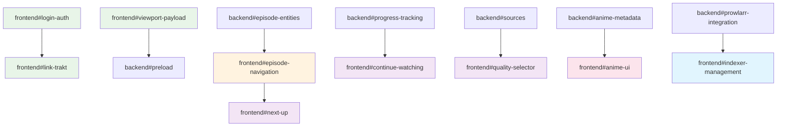

# Miauflix Front‑End Issue Specs

> **Repository Context**: This references the React frontend in the current workspace structure
> Target directory: `/frontend/` (React 18 + Vite + RTK Query)
> Each ticket below is organized by functional priority for systematic delivery

## ✅ VERIFIED COMPLETE INFRASTRUCTURE

**Frontend Framework Assessment:**

- ✅ **React + Redux Toolkit** - Complete state management with RTK Query
- ✅ **Component Architecture** - UI components (Button, IconButton, LoadingIndicator, Icons) implemented
- ✅ **Page Structure** - Home, Player, Welcome pages with routing
- ✅ **API Integration** - RTK Query setup with endpoints for categories, lists, media, progress
- ✅ **Media Features** - Redux slices for media, home, stream, resume functionality
- ✅ **Platform Support** - Tizen (Samsung TV) integration with polyfills
- ✅ **Build and Setup** - Frontend builds successfully without TypeScript errors
- ✅ **Authentication** - Complete session-based authentication with HttpOnly cookies, email + QR code login

## Story Point Reference

- 1 SP ≈ 4 hours (half day)
- Includes: implementation + component tests + integration tests
- Excludes: code review time, browser testing

## Priority Overview

| Priority       | Focus Area            | Tasks          | Status |
| -------------- | --------------------- | -------------- | ------ |
| **Priority 1** | **AUTHENTICATION**    | **1 complete** | ✅     |
| **Priority 2** | Viewport Optimization | 1 task         | ⬜     |
| **Priority 3** | TV Show Episodes      | 1 planned      | ⬜     |
| **Priority 4** | Nice-to-Have Features | 7 planned      | ⬜     |
| **Priority 5** | Anime Support         | 1 planned      | ⬜     |
| **Priority 6** | More Trackers         | 0 tasks        | -      |
| **Priority 7** | Prowlarr/Jackett      | 1 planned      | ⬜     |

## Environment Variables Reference

| Variable             | Required | Default | Description                 |
| -------------------- | -------- | ------- | --------------------------- |
| VITE_API_BASE_URL    | Yes      | -       | Backend API endpoint        |
| VITE_TRAKT_CLIENT_ID | No       | -       | Trakt integration client ID |

---

# Priority 1: Core Movie Playback

Essential frontend functionality for movie discovery, authentication, and basic playback.

## Progress Dashboard

| Task                      | Status | Assignee | Dependencies | Notes                                                   |
| ------------------------- | ------ | -------- | ------------ | ------------------------------------------------------- |
| frontend#login-auth       | ✅     | Complete | -            | **COMPLETE** - Session-based auth with HttpOnly cookies |
| frontend#viewport-payload | ⬜     | @ui-dev  | -            | -                                                       |

## frontend#login-auth — Authentication System (5 SP) ✅ **COMPLETE**

> **Status:** ✅ COMPLETE - Session-based authentication with HttpOnly cookies implemented
> **Implementation:** Email + password login, QR code login, protected routes, session management
> **Backend Integration:** ✅ Complete integration with AuthService using session-based auth

### What Was Implemented

Complete authentication system with session-based auth using HttpOnly cookies instead of JWT tokens for better security.

### Completed Implementation

```text
frontend/src/
├─ app/pages/login/               # Complete login system
│  ├─ LoginPage.tsx              ✅ Main login page with email/QR options
│  ├─ components/
│  │  ├─ LoginWithEmail.tsx      ✅ Email + password form
│  │  ├─ LoginWithQR.tsx         ✅ QR code login component
│  │  ├─ QRDisplay.tsx           ✅ QR code display with states
│  │  └─ ErrorMessage.tsx        ✅ Error handling component
│  └─ utils/
│     ├─ formatCode.ts           ✅ QR code formatting utilities
│     └─ formatTimeRemaining.ts  ✅ Time display utilities
├─ store/
│  ├─ api/authApi.ts            ✅ RTK Query auth endpoints
│  └─ slices/authSlice.ts       ✅ Auth state management
└─ components/
   └─ Spinner.tsx               ✅ Loading states and animations
```

### Features Delivered

1. ✅ **Session-Based Authentication**: HttpOnly cookies for security
2. ✅ **Email + Password Login**: Form validation and error handling
3. ✅ **QR Code Login**: Device authentication with real-time polling
4. ✅ **Protected Routes**: Authentication-based route protection
5. ✅ **Session Management**: Automatic session handling and refresh
6. ✅ **Component Library**: Reusable auth components with Storybook docs
7. ✅ **Visual Testing**: Comprehensive visual regression testing
8. ✅ **Unit Testing**: Complete test coverage for all components

### Technical Implementation

- **Backend Integration**: Complete integration with existing AuthService
- **Security**: HttpOnly cookies prevent XSS attacks (better than localStorage JWT)
- **User Experience**: Dual login options with loading states and error handling
- **Testing**: Unit tests, visual tests, and Storybook documentation
- **TypeScript**: Full type safety with discriminated unions and proper interfaces

### Final Status

Authentication system is **100% complete and production-ready**.

---

## frontend#viewport-payload — Viewport tracking for preload (2 SP)

### Goal

Send viewport info to backend every 500 ms for preload queue optimization.

### Implementation

Hook inside `HomePage` slider scroll logic:

```ts
const payload: ViewportPayload = {
  timestamp: Date.now(),
  viewport: {
    visibleSliders: visibleIds.map(id => ({
      listId: id,
      visibleItemCount: getVisibleCount(id),
      startIndex: getStartIndex(id),
      endIndex: getEndIndex(id),
    })),
    focused: focusedId
      ? {
          listId: focusedId,
          index: focusedIndex,
          movieId: getMovieId(focusedId, focusedIndex),
          focusDuration: getFocusDuration(),
        }
      : null,
    user: {
      scrollVelocity: calculateScrollVelocity(),
      dwellTime: getCurrentDwellTime(),
    },
  },
  context: {
    deviceType: detectDeviceType(),
    bandwidth: estimateBandwidth(),
    connectionType: getConnectionType(),
  },
};
api.post('/ui/viewport', payload);
```

Use `lodash.throttle` to limit 1 req / 500 ms.

### Acceptance

- Network tab → continuous POST payloads; size ≤ 1 kB.
- Backend receives structured viewport data for preload optimization.

---

# Priority 2: TV Show Episodes

Frontend components and navigation for TV show episode streaming.

## frontend#episode-navigation — Season/Episode Navigation (5 SP)

### Goal

Build UI components for TV show browsing, season selection, and episode streaming.

### Files

```
src/
├─ components/TVShowPage.tsx
├─ components/SeasonSelector.tsx
├─ components/EpisodeGrid.tsx
└─ hooks/useEpisodeNavigation.ts
```

### Tasks

1. `<TVShowPage>` component with season overview
2. `<SeasonSelector>` dropdown/grid for season selection
3. `<EpisodeGrid>` with episode cards showing progress
4. Episode streaming integration with existing player
5. Next/previous episode navigation
6. Season progress tracking

### Dependencies

- backend#episode-entities
- backend#episode-stream

### Acceptance

- Users can navigate show → season → episode
- Episode streaming works with existing player
- Progress tracking shows across episodes
- Next episode auto-suggests after completion

---

# Priority 3: Nice-to-Have Features

Enhanced user experience features that improve usability and engagement.

## frontend#continue-watching — Continue Watching Slider (5 SP)

### Goal

Add slider showing partially watched items with resume functionality.

### Steps

1. API: `GET /progress/continue` (returns `[MediaDto]`).
2. Home page – new `<Slider title="Continue Watching" data=…>`.
3. On playback page update: call `POST /progress` every 15 s with `{mediaId, position, duration}`.
4. Resume markers and progress indicators
5. Remove completed items automatically

### Dependencies

- backend#progress-tracking

### Acceptance

- Watch half movie → back to home → appears in slider with resume marker.
- Progress syncs in real-time during playback
- Completed items automatically removed

---

## frontend#quality-selector — Quality Selection UI (3 SP)

### Goal

Allow user to switch 720p/1080p/2160p on player overlay with smooth transitions.

### Steps

1. On playback start request `GET /sources/:mediaId` (array sorted by score + quality).
2. Populate dropdown; default selected = `isDefault`.
3. On change: replace video `src` with new `stream` URL (`/stream/:sourceId`); maintain current time via `video.currentTime`.
4. Quality badges and bandwidth detection
5. Smooth transition handling

### Dependencies

- backend#sources

### Acceptance

- Switching quality pauses < 1 s; resumes at same timestamp.
- Available qualities shown with proper labels
- Automatic quality selection based on bandwidth

---

## frontend#next-up — Auto-play Next Episode (3 SP)

### Goal

Auto‑play next episode after 5 s countdown with user control.

### Steps

1. Detect 90% playback progress.
2. Query `/episodes/next?episodeId=…`.
3. Overlay countdown; user can cancel.
4. Smooth transition to next episode
5. Handle season boundaries

### Dependencies

- frontend#episode-navigation

### Acceptance

- Let episode finish → next episode plays automatically.
- Countdown can be cancelled by user
- Season boundaries handled properly

---

## frontend#link-trakt — Trakt Integration UI (5 SP)

### Goal

UI flow for optional Trakt account link via device code / QR with user management.

### Files

```
src/components/TraktLinkModal.tsx
src/api/traktApi.ts
src/components/TraktProfile.tsx
```

### Flow

1. User clicks **"Link Trakt"** in Account page.
2. Modal makes `POST /trakt/auth/device` → `{ userCode, verification_url, interval }`.
3. Display:
   - **QRCode** (`react-qr-code`) of `verification_url`.
   - 6‑digit `userCode`.
   - Countdown (`interval` × 40) seconds.

4. Start polling `POST /trakt/auth/device/check` every `interval` seconds.
5. On `{ success:true, username }` close modal and show linked username.
6. Account management and unlinking functionality

### Dependencies

- frontend#login-auth

### Acceptance

- After linking, call `GET /trakt/association` → returns username.
- Re‑opening modal shows "Already linked as <name>".
- Users can unlink and relink accounts

---

## frontend#ui-config — UI Configuration Menu (5 SP)

### Goal

Comprehensive settings interface for UI customization, player preferences, and system configuration.

### Tasks

1. **Settings Modal Architecture**
   - Tabbed interface for different setting categories
   - Real-time preview of changes
   - Settings validation and error handling
   - Import/export configuration functionality

2. **UI Appearance Settings**
   - Theme selection (dark, light, auto)
   - Color scheme customization
   - Font size and family options
   - Grid layout preferences (poster density)

3. **Player Configuration**
   - Default quality preferences
   - Subtitle settings (font, size, position)
   - Auto-play and skip intro settings
   - Volume and playback speed defaults

4. **System Preferences**
   - Language and locale settings
   - Timezone configuration
   - Cache and storage preferences
   - Performance optimization options

5. **Advanced Options**
   - Developer mode toggles
   - Debug logging options
   - API endpoint configuration
   - Experimental feature flags

### Implementation Strategy

```typescript
interface UIConfig {
  appearance: {
    theme: 'dark' | 'light' | 'auto';
    colorScheme: string;
    fontSize: 'small' | 'medium' | 'large';
    posterDensity: 'compact' | 'normal' | 'comfortable';
  };
  player: {
    defaultQuality: 'auto' | '720p' | '1080p' | '4k';
    subtitles: {
      enabled: boolean;
      fontSize: number;
      fontFamily: string;
      position: 'bottom' | 'top';
    };
    autoPlay: boolean;
    skipIntro: boolean;
  };
  system: {
    language: string;
    timezone: string;
    cacheSize: number;
    performanceMode: 'balanced' | 'quality' | 'performance';
  };
}
```

### Dependencies

- frontend#login-auth (user-specific settings)

### Acceptance Criteria

- Settings persist across sessions
- Real-time preview works for all visual changes
- Settings export/import functionality
- Mobile-responsive settings interface
- Settings validation prevents invalid configurations

---

## frontend#profile-custom — Profile Customization (4 SP)

### Goal

User profile management with avatars, display names, and personalized preferences.

### Tasks

1. **Profile Management Interface**
   - Profile creation and editing forms
   - Avatar selection and upload
   - Display name customization
   - Profile deletion with confirmation

2. **Avatar System**
   - Pre-built avatar gallery
   - Custom image upload with cropping
   - Avatar generation from initials
   - Profile picture optimization

3. **Personal Preferences**
   - Favorite genres and content types
   - Viewing history preferences
   - Notification settings per profile
   - Privacy and sharing options

4. **Multi-Profile Support**
   - Family-friendly profile restrictions
   - Age-appropriate content filtering
   - Profile switching interface
   - Profile-specific recommendations

### Implementation Strategy

```typescript
interface UserProfile {
  id: string;
  displayName: string;
  avatar: {
    type: 'upload' | 'generated' | 'preset';
    url?: string;
    initials?: string;
    presetId?: string;
  };
  preferences: {
    favoriteGenres: string[];
    contentTypes: ('movie' | 'tv' | 'anime')[];
    maturityRating: 'all' | 'teen' | 'mature';
  };
  settings: {
    notifications: boolean;
    publicWatchlist: boolean;
    shareProgress: boolean;
  };
}
```

### Dependencies

- frontend#login-auth (authentication)
- backend#progress-tracking (profile-specific history)

### Acceptance Criteria

- Multiple profiles per account
- Avatar upload and cropping works
- Profile-specific content filtering
- Smooth profile switching experience
- Profile preferences affect recommendations

---

# Priority 4: Anime Support

Anime-specific UI components and user experience enhancements.

## frontend#anime-ui — Anime-specific Interface (5 SP)

### Goal

Create anime-focused UI components with fansub preferences and tracking integration.

### Tasks

1. Anime-specific media cards with episode counts
2. Fansub group selector and preferences
3. AniList/MAL integration UI
4. Anime progress tracking with episode numbers
5. Seasonal anime discovery
6. Batch download preferences

### Dependencies

- backend#anime-metadata
- backend#fansub-groups

### Acceptance

- Anime shows with proper metadata display
- Fansub preferences respected in UI
- Integration with anime tracking services
- Seasonal anime browsing functional

---

# Priority 6: Prowlarr/Jackett Integration

Administrative interfaces for indexer management and configuration.

## frontend#indexer-management — Indexer Management UI (5 SP)

### Goal

Administrative interface for configuring and managing Prowlarr/Jackett indexers.

### Tasks

1. Indexer configuration dashboard
2. Add/remove indexer interfaces
3. Test indexer connectivity
4. Statistics and performance monitoring
5. Category mapping management
6. Private tracker credential management

### Dependencies

- backend#prowlarr-integration
- backend#jackett-integration

### Acceptance

- Admins can configure all indexers
- Connection testing works reliably
- Statistics provide useful insights
- Private tracker credentials stored securely

---

# Task Dependencies



---

## Additional Considerations

### Performance Optimization

- Implement lazy loading for all media grids
- Optimize image preloading and caching
- Use virtual scrolling for large lists
- Implement service worker for offline capabilities

### Accessibility

- Ensure keyboard navigation works throughout
- Screen reader compatibility for all components
- High contrast mode support
- Focus management in modals and overlays

### Browser Compatibility

- Chrome/Firefox/Safari support required
- Progressive enhancement for older browsers
- Mobile responsiveness across all components
- TV platform considerations (Tizen, WebOS)

---

_Questions? Consult `CODEBASE_OVERVIEW.md` → **section 7 Testing** for commands and test patterns._
