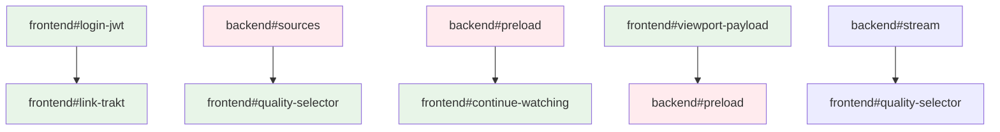

# Miauflix Front‑End Issue Specs

> **Repository Context**: This references the React frontend in the current workspace structure
> Target directory: `/frontend/` (React 18 + Vite + RTK Query)
> Each ticket below is intentionally self‑contained

## Story Point Reference

- 1 SP ≈ 4 hours (half day)
- Includes: implementation + component tests + integration tests
- Excludes: code review time, browser testing

## Progress Dashboard

| Task                       | Status | Assignee | Started | ETA    | Dependencies       |
| -------------------------- | ------ | -------- | ------- | ------ | ------------------ |
| frontend#login-jwt         | ⬜     | @ui-dev  | -       | W23-24 | -                  |
| frontend#link-trakt        | ⬜     | @ui-dev  | -       | W24    | frontend#login-jwt |
| frontend#viewport-payload  | ⬜     | @ui-dev  | -       | W24    | -                  |
| frontend#quality-selector  | ⬜     | @ui-dev  | -       | W24-25 | backend#sources    |
| frontend#continue-watching | ⬜     | @ui-dev  | -       | W25    | backend#preload    |

## Environment Variables Reference

| Variable             | Required | Default | Description                 |
| -------------------- | -------- | ------- | --------------------------- | ---------------------------- |
| VITE_API_BASE_URL    | Yes      | -       | Backend API endpoint        |
| VITE_TRAKT_CLIENT_ID | No       | -       | Trakt integration client ID | auflix Front‑End Issue Specs |

> Target codebase: **maury91/miauflix/apps/frontend** (React 18 + Vite + RTK Query).
> Each ticket below is intentionally self‑contained—clone the repo, follow the steps, and PR.

---

## Table of Contents

- [frontend#login-jwt](#frontendlogin-jwt)
- [frontend#link-trakt](#frontendlink-trakt)
- [frontend#viewport-payload](#frontendviewport-payload)
- [frontend#continue-watching](#frontendcontinue-watching)
- [frontend#quality-selector](#frontendquality-selector)
- [frontend#next-up](#frontendnext-up)

> **Ran tests** with `npm test`. Lint/format via `npm run lint && npm run prettier`.

---

## frontend#login-jwt (5 SP)

### Goal

Replace legacy device‑code login with email + password form; store JWT + refresh; auto‑refresh on 401.

### Files

```
apps/frontend/
└─ src/
   ├─ pages/LoginPage.tsx      # new
   ├─ api/authApi.ts           # RTK Query endpoints
   └─ store/authSlice.ts       # token state
```

### Tasks

1. **Route** `/login` in `src/router.tsx`.
2. Build `<LoginPage>` – two inputs + submit; HTML5 validation (required, type email).
3. RTK Query mutation:

   ```ts
   login: builder.mutation<
     { accessToken: string; refreshToken: string },
     { email: string; password: string }
   >({
     query: body => ({ url: '/auth/login', method: 'POST', body }),
   });
   ```

4. On success: dispatch `authSlice.setTokens`. Persist in `localStorage`.
5. Add `axios` (or fetch wrapper) interceptor: attach `Authorization: Bearer`. On 401 attempt `/auth/refresh`; if that fails, clear tokens and redirect `/login`.
6. Navbar: show user email + **Logout** button (clears tokens + optional `/auth/logout`).

### Edge‑Cases

- Multiple tabs: use `storage` event to sync logout.
- Access `/` while unauthenticated → redirect `/login`.

### Acceptance

- Form login succeeds; protected call (`/lists`) returns data without manual header.
- Refresh token silently renews after 15 min (simulate by tampering `accessToken` in localStorage → first request triggers refresh).
- Logout removes both tokens and hits `/login`.

---

## frontend#link-trakt (5 SP)

### Goal

UI flow for optional Trakt account link via device code / QR.

### Files

```
src/components/TraktLinkModal.tsx
src/api/traktApi.ts
```

### Flow

1. User clicks **“Link Trakt”** in Account page.
2. Modal makes `POST /trakt/auth/device` → `{ userCode, verification_url, interval }`.
3. Display:

   - **QRCode** (`react-qr-code`) of `verification_url`.
   - 6‑digit `userCode`.
   - Countdown (`interval` × 40) seconds.

4. Start polling `POST /trakt/auth/device/check` every `interval` seconds.
5. On `{ success:true, username }` close modal and show linked username.

### Edge‑Cases

- Timeout after 10 min → show retry.
- Backend returns 409 (Trakt already linked) → toast error.

### Acceptance

- After linking, call `GET /trakt/association` → returns username.
- Re‑opening modal shows “Already linked as <name>”.

---

## frontend#viewport-payload (2 SP) 🔄 sub‑task of preload

### Goal

Send viewport info to backend every 500 ms for preload queue.

### Implementation

Hook inside `HomePage` slider scroll logic:

```ts
const payload: ViewportPayload = {
  timestamp: Date.now(),
  viewport: {
    visibleSliders: visibleIds.map(id => ({
      listId: id,
      visibleItemCount: getVisibleCount(id),
      startIndex: getStartIndex(id),
      endIndex: getEndIndex(id),
    })),
    focused: focusedId
      ? {
          listId: focusedId,
          index: focusedIndex,
          movieId: getMovieId(focusedId, focusedIndex),
          focusDuration: getFocusDuration(),
        }
      : null,
    user: {
      scrollVelocity: calculateScrollVelocity(),
      dwellTime: getCurrentDwellTime(),
    },
  },
  context: {
    deviceType: detectDeviceType(),
    bandwidth: estimateBandwidth(),
    connectionType: getConnectionType(),
  },
};
api.post('/ui/viewport', payload);
```

Use `lodash.throttle` to limit 1 req / 500 ms.

### Acceptance

- Network tab → continuous POST payloads; size ≤ 1 kB.

---

## frontend#continue-watching (5 SP)

### Goal

Add slider showing partially watched items.

### Steps

1. API: `GET /progress/continue` (returns `[MediaDto]`).
2. Home page – new `<Slider title="Continue Watching" data=…>`.
3. On playback page update: call `POST /progress` every 15 s with `{mediaId, position, duration}`.

### Edge‑Cases

- Item finished → backend removes from list.

### Acceptance

- Watch half movie → back to home → appears in slider with resume marker.

---

## frontend#quality-selector (3 SP)

### Goal

Allow user to switch 720p/1080p/2160p on player overlay.

### Steps

1. On playback start request `GET /sources/:mediaId` (array sorted by score + quality).
2. Populate dropdown; default selected = `isDefault`.
3. On change: replace video `src` with new `stream` URL (`/stream/:sourceId`); maintain current time via `video.currentTime`.

### Acceptance

- Switching quality pauses < 1 s; resumes at same timestamp.

---

## frontend#next-up (3 SP)

### Goal

Auto‑play next episode after 5 s countdown.

### Steps

1. Detect 90 % playback progress.
2. Query `/episodes/next?episodeId=…`.
3. Overlay countdown; user can cancel.

### Acceptance

- Let episode finish → next episode plays automatically.

---

## Task Dependencies



---

_Questions? Consult `CODEBASE_OVERVIEW.md` → **section 7 Testing** for commands and test patterns._
