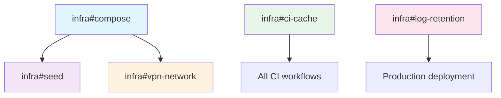

# Miauflix · Infrastructure Issue Specs

> Scope: **docker-compose**, deployment scripts, CI pipeline, seed scripts, logging/storage hygiene.

## Story Point Reference

- 1 SP ≈ 4 hours (half day)
- Includes: implementation + testing + documentation
- Excludes: cloud deployment, DNS setup

## Progress Dashboard

| Task                | Status | Assignee   | Started | ETA | Dependencies  |
| ------------------- | ------ | ---------- | ------- | --- | ------------- |
| infra#compose       | ⬜     | @infra-dev | -       | W23 | -             |
| infra#seed          | ⬜     | @infra-dev | -       | W23 | infra#compose |
| infra#vpn-network   | ⬜     | @infra-dev | -       | W24 | infra#compose |
| infra#ci-cache      | ⬜     | @infra-dev | -       | W24 | -             |
| infra#log-retention | ⬜     | @infra-dev | -       | W24 | -             |

## Environment Variables Reference

| Variable            | Required | Default | Description                      |
| ------------------- | -------- | ------- | -------------------------------- |
| NORDVPN_PRIVATE_KEY | No       | -       | NordVPN WireGuard private key    |
| COMPOSE_PROFILES    | No       | -       | Docker compose profile selection |
| LOG_RETENTION_DAYS  | No       | 7       | Days to keep application logs    |

---

## Table of Contents

- [infra#compose](#infracompose)
- [infra#seed](#infraseed)
- [infra#vpn-network](#infravpn-network)
- [infra#ci-cache](#infraci-cache)
- [infra#log-retention](#infralog-retention)

---

## infra#compose  (2 SP)  **Milestone v0.1**

### Goal

Expose backend on port 4000, mount DB & torrents, ensure VPN container routes P2P traffic, add missing env vars.

### Steps

1. **Update `docker-compose.yaml`**

   ```yaml
   services:
     backend:
       build: ./backend
       ports:
         - '4000:4000' # Hono API + stream
       volumes:
         - ./backend/data:/app/data # SQLite, encrypted blobs
       env_file: .env
       environment:
         - TMDB_API_ACCESS_TOKEN=${TMDB_API_ACCESS_TOKEN}
         - JWT_SECRET=${JWT_SECRET}
         - REFRESH_TOKEN_SECRET=${REFRESH_TOKEN_SECRET}
       networks:
         - vpn

     nordvpn:
       image: maury/nordlynx
       cap_add: [NET_ADMIN]
       environment:
         - NORDVPN_PRIVATE_KEY=${NORDVPN_PRIVATE_KEY}
       networks: [vpn]

   networks:
     vpn:
       driver: bridge
   ```

2. **Make backend depend on `nordvpn`** (`depends_on`).
3. **Healthcheck**: backend `CMD curl -f http://localhost:4000/health || exit 1` every 30 s.
4. **Docs**: update root `README.md` > _Quick Start_.

### Acceptance

- `docker compose up` → backend reachable at `localhost:4000/health` (200).
- `docker network inspect` shows backend + nordvpn only.
- `curl /stream/:sourceId` inside container works; outside host sees nothing on 6881 ports.

---

## infra#seed  (3 SP)  **Milestone v0.1**

### Goal

One-off CLI + optional container startup hook that seeds DB with TMDB Popular / Top‑Rated lists.

### Files

`scripts/seed-popular.ts`

### Steps

1. Bootstrap TypeORM DataSource.
2. Call TMDB API (`/movie/popular`, `/movie/top_rated`) – limit 200 items.
3. Insert `Movie` & `List` entities (`@@tmdb_movies_popular`, `@@tmdb_movies_top_rated`).
4. Add npm script:

   ```json
   "seed:popular": "ts-node ./scripts/seed-popular.ts"
   ```

5. **Docker** – run at container first‑boot via:

   ```yaml
   command: ['sh', '-c', 'npm run seed:popular && node dist/app.js']
   ```

### Acceptance

- Fresh DB → run `npm run seed:popular` → `/lists` returns ≥ 2 lists with ≥ 100 items each.
- Subsequent runs are idempotent (no duplicates).

---

## infra#vpn-network  (2 SP)  **Milestone v0.2**

### Goal

Ensure **all torrent traffic** exits only via NordVPN container.

### Steps

1. Add firewall rule inside backend container: `iptables -A OUTPUT ! -o eth0 -p tcp --dport 6881:6889 -j DROP` (eth0 is Docker bridge to vpn net).
2. Verify with `lsof -i` during stream – only nordvpn container has peer connections.

### Acceptance

- Disable VPN container → playback stalls, proving traffic is blocked.

---

## infra#ci-cache  (1 SP)

### Goal

Speed up GitHub Actions by caching `node_modules` & Docker layers.

### Steps

1. Add `actions/cache@v3` for `~/.npm` based on `package-lock.json` hash.
2. Use `docker/build-push-action` target cache.

### Acceptance

- Subsequent CI runs shave ≥ 30 % off install / build time.

---

## infra#log-retention  (1 SP)

### Goal

Mount logs on tmpfs and rotate 3 archives to reduce “dangerous” artefacts.

### Steps

1. Update `backend.Dockerfile`:

   ```dockerfile
   RUN mkdir -p /var/log/miauflix && mount -t tmpfs -o size=64m tmpfs /var/log/miauflix
   ```

2. Add `logrotate.conf` in image:

   ```
   /var/log/miauflix/*.log {
     rotate 3
     size 5M
     missingok
     notifempty
     copytruncate
   }
   ```

### Acceptance

- Container restart wipes previous session logs.
- During soak test, log dir ≤ 15 MB.

---

## Task Dependencies



---

_For any infra ticket consult `CODEBASE_OVERVIEW.md` > Run & Debug for env vars and docker entrypoints._
