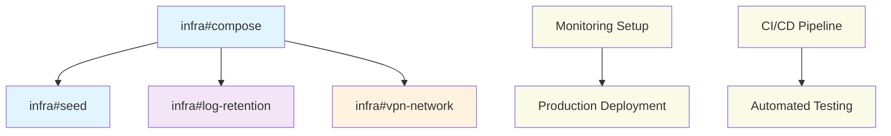

# Miauflix · Infrastructure Issue Specs — Priority-Based Structure

> Scope: **docker-compose**, deployment scripts, CI pipeline, seed scripts, logging/storage hygiene.  
> All infrastructure tasks organized by functional priority to support feature delivery.

## ✅ VERIFIED COMPLETE INFRASTRUCTURE

**Current Infrastructure Status:**

- ✅ **Docker Configuration** - Multi-stage builds with proper optimization
- ✅ **Build Caching** - Turborepo + Docker BuildKit cache mounts implemented (50-80% faster rebuilds)
- ✅ **Development Environment** - Complete E2E testing infrastructure with mock services
- ✅ **Package Management** - npm workspaces properly configured
- ✅ **Build System** - Cross-package dependencies working with Turborepo
- ✅ **E2E Testing** - Sophisticated Docker-based test environment (TMDB, YTS, Trakt mocks)
- ⚠️ **Production Deployment** - Development setup complete, production needs SSL completion

## Story Point Reference

- 1 SP ≈ 4 hours (half day)
- Includes: implementation + testing + documentation
- Excludes: cloud deployment, DNS setup

## Priority Overview

| Priority       | Focus Area               | Tasks      | Status |
| -------------- | ------------------------ | ---------- | ------ |
| **Priority 1** | **Production Readiness** | 3 critical | 🚨     |
| **Priority 2** | Operations & Monitoring  | 2 tasks    | ⬜     |
| **Priority 3** | Core Movie Playback      | 2 active   | 🔄     |
| **Priority 4** | Nice-to-Have Features    | 1 planned  | ⬜     |
| **Priority 5** | More Content Directories | 1 planned  | ⬜     |
| **Priority 6** | Stretch Goals            | 2 planned  | ⬜     |

## Environment Variables Reference

| Variable            | Required | Default | Description                      |
| ------------------- | -------- | ------- | -------------------------------- |
| NORDVPN_PRIVATE_KEY | No       | -       | NordVPN WireGuard private key    |
| COMPOSE_PROFILES    | No       | -       | Docker compose profile selection |
| LOG_RETENTION_DAYS  | No       | 7       | Days to keep application logs    |

---

# Priority 1: Core Movie Playbook

Essential infrastructure to support basic movie streaming functionality.

## Progress Dashboard

| Task             | Status | Assignee   | Dependencies  |
| ---------------- | ------ | ---------- | ------------- |
| infra#compose    | ⬜     | @infra-dev | -             |
| infra#seed       | ⬜     | @infra-dev | infra#compose |
| infra#nginx-ui   | ⬜     | @infra-dev | infra#compose |
| infra#e2e-stream | ⬜     | @qa-dev    | infra#compose |

## infra#compose — Docker Compose Infrastructure (2 SP)

### Goal

Expose backend on port 4000, mount DB & torrents, ensure VPN container routes P2P traffic, add missing env vars.

### Steps

1. **Update `docker-compose.yaml`**

   ```yaml
   services:
     backend:
       build: ./backend
       ports:
         - '4000:4000' # Hono API + stream
       volumes:
         - ./backend/data:/app/data # SQLite, encrypted blobs
       env_file: .env
       environment:
         - TMDB_API_ACCESS_TOKEN=${TMDB_API_ACCESS_TOKEN}
         - JWT_SECRET=${JWT_SECRET}
         - REFRESH_TOKEN_SECRET=${REFRESH_TOKEN_SECRET}
         - SOURCE_SECURITY_KEY=${SOURCE_SECURITY_KEY}
       networks:
         - vpn
       depends_on:
         - nordvpn

     nordvpn:
       image: maury/nordlynx
       cap_add: [NET_ADMIN]
       environment:
         - NORDVPN_PRIVATE_KEY=${NORDVPN_PRIVATE_KEY}
       networks: [vpn]

   networks:
     vpn:
       driver: bridge
   ```

2. **Healthcheck**: backend `CMD curl -f http://localhost:4000/health || exit 1` every 30 s.
3. **Volume management**: Ensure data persistence and proper permissions
4. **Docs**: update root `README.md` > _Quick Start_.

### Acceptance

- `docker compose up` → backend reachable at `localhost:4000/health` (200).
- `docker network inspect` shows backend + nordvpn in same network.
- `curl /stream/:sourceId` inside container works; torrent traffic routed through VPN.
- Data persistence works across container restarts.

---

## infra#seed — Database Seeding System (3 SP)

### Goal

One-off CLI + optional container startup hook that seeds DB with TMDB Popular / Top‑Rated lists.

### Files

```
scripts/
├─ seed-popular.ts
├─ seed-tv-shows.ts
└─ utils/tmdb-client.ts
```

### Steps

1. Bootstrap TypeORM DataSource with proper configuration.
2. Call TMDB API (`/movie/popular`, `/movie/top_rated`) – limit 200 items each.
3. Insert `Movie` & `List` entities (`@@tmdb_movies_popular`, `@@tmdb_movies_top_rated`).
4. Add npm script:

   ```json
   {
     "scripts": {
       "seed:popular": "ts-node ./scripts/seed-popular.ts",
       "seed:all": "npm run seed:popular"
     }
   }
   ```

5. **Docker integration** – run at container first‑boot via:

   ```yaml
   command: ['sh', '-c', 'npm run seed:popular && node dist/app.js']
   ```

6. Idempotent design to prevent duplicates
7. Progress logging and error handling

### Dependencies

- infra#compose (requires working database setup)

### Acceptance

- Fresh DB → run `npm run seed:popular` → `/lists` returns ≥ 2 lists with ≥ 100 items each.
- Subsequent runs are idempotent (no duplicates).
- Container startup includes seeding automatically.
- Seeding completes within 2 minutes.

---

## infra#nginx-ui — Nginx/Backend UI Serving (3 SP)

### Goal

Configure Nginx as reverse proxy to serve both the React frontend and backend API through a single domain with proper routing and caching.

### Technical Approach

Single-port deployment where Nginx handles static assets and proxies API requests to the backend, improving performance and simplifying deployment.

### Tasks

1. **Nginx Configuration**
   - Frontend static file serving with optimized caching
   - API proxy configuration for `/api/*` routes
   - Gzip compression for all text assets
   - Security headers and CORS configuration

2. **Docker Integration**
   - Multi-stage build for frontend compilation
   - Nginx container with custom configuration
   - Volume mounting for assets and logs
   - Health checks for both frontend and backend

3. **Routing & Caching**
   - React Router SPA support (catch-all to index.html)
   - API request proxying with WebSocket support
   - Static asset caching with proper ETags
   - Cache busting for app updates

4. **Performance Optimization**
   - Asset compression and minification
   - HTTP/2 support configuration
   - Connection keep-alive optimization
   - Load balancing preparation

### Implementation Strategy

```nginx
server {
    listen 80;
    server_name localhost;

    # Frontend static files
    location / {
        root /usr/share/nginx/html;
        index index.html;
        try_files $uri $uri/ /index.html;

        # Cache static assets
        location ~* \.(js|css|png|jpg|jpeg|gif|ico|svg|woff|woff2)$ {
            expires 1y;
            add_header Cache-Control "public, immutable";
        }
    }

    # API proxy
    location /api/ {
        proxy_pass http://backend:4000;
        proxy_set_header Host $host;
        proxy_set_header X-Real-IP $remote_addr;
        proxy_set_header X-Forwarded-For $proxy_add_x_forwarded_for;
        proxy_set_header X-Forwarded-Proto $scheme;

        # WebSocket support for streaming
        proxy_http_version 1.1;
        proxy_set_header Upgrade $http_upgrade;
        proxy_set_header Connection "upgrade";
    }
}
```

### Docker Compose Updates

```yaml
services:
  nginx:
    image: nginx:alpine
    ports:
      - '80:80'
      - '443:443'
    volumes:
      - ./nginx/nginx.conf:/etc/nginx/nginx.conf
      - ./frontend/dist:/usr/share/nginx/html
    depends_on:
      - backend
    networks:
      - app-network

  backend:
    # Remove port exposure, only accessible via nginx
    networks:
      - app-network
      - vpn
```

### Acceptance Criteria

- Single domain serves both frontend and API
- Frontend loads properly with client-side routing
- API requests proxy correctly to backend
- WebSocket connections work for streaming
- Static assets cached with proper headers
- HTTPS configuration ready for production
- Performance improved vs direct backend serving

---

## infra#e2e-stream — E2E Testing Infrastructure for Torrent Streaming (6 SP)

### Goal

Set up multi-container Docker Compose infrastructure to support comprehensive E2E testing of torrent streaming functionality with isolated BitTorrent network and deterministic test content.

### Background

Implements research findings from `docs/e2e-torrent-streaming-research.md` to create a production-like testing environment that validates actual BitTorrent protocol behavior without external dependencies.

### Tasks

#### Container Infrastructure (3 SP)

1. **BitTorrent Tracker Setup**
   - Deploy `quoorex/bittorrent-tracker` container
   - Configure HTTP, UDP, WebSocket support
   - Health checks and stats endpoint integration
   - Network isolation within test environment

2. **Torrent Seeder Container**
   - Build custom Node.js container with WebTorrent
   - Health endpoint with torrent inventory (`/health`, `/torrents`)
   - Predetermined test content seeding
   - Automatic torrent announcement to tracker

3. **HTTP Range Request Server**
   - Standalone container for range request validation
   - Independent streaming endpoint testing
   - Comparison baseline for BitTorrent streaming

#### Test Content Generation (2 SP)

4. **Synthetic Video Creation**
   - FFmpeg-based deterministic video generation
   - Multiple resolutions: 720p (1MB), 1080p (5MB), 4K (20MB)
   - Known characteristics for predictable testing
   - Consistent hashes across environments

5. **Content Seeding Pipeline**
   - Automated torrent creation from test videos
   - Hash inventory management for test lookup
   - Seeder initialization and health validation

#### Docker Integration (1 SP)

6. **Test Environment Configuration**
   - Update `backend-e2e/docker/docker-compose.test.yml`
   - Network configuration for container communication
   - Environment variable integration
   - Service dependency management and health checks

### Technical Implementation

#### New Container Services

```yaml
# BitTorrent Tracker
bittorrent-tracker:
  image: quoorex/bittorrent-tracker:latest
  environment:
    - HTTP=true
    - UDP=true
    - WEBSOCKET=true
    - STATS=true
  networks: [test-network]
  healthcheck:
    test: ['CMD', 'wget', '--spider', 'http://localhost:8000/stats']

# Torrent Seeder
torrent-seeder:
  build:
    context: .
    dockerfile: torrent-seeder.Dockerfile
  networks: [test-network]
  healthcheck:
    test: ['CMD', 'wget', '--spider', 'http://localhost:3001/health']
  depends_on:
    bittorrent-tracker: { condition: service_healthy }

# Range Request Server
range-server:
  build:
    context: .
    dockerfile: range-server.Dockerfile
  networks: [test-network]
  healthcheck:
    test: ['CMD', 'wget', '--spider', 'http://localhost:3002/test-small-720p.mp4']
```

#### Directory Structure

```
backend-e2e/
├── docker/
│   ├── torrent-seeder.Dockerfile
│   ├── range-server.Dockerfile
│   └── docker-compose.test.yml (updated)
├── mock-content/
│   ├── generate-test-videos.sh
│   ├── seed-torrents.js
│   ├── range-server.js
│   └── test-videos/ (generated)
└── scripts/
    ├── setup-e2e-environment.sh
    └── cleanup-test-content.sh
```

### Environment Variables

| Variable                 | Value                         | Description                   |
| ------------------------ | ----------------------------- | ----------------------------- |
| TORRENT_TRACKER_ANNOUNCE | ws://bittorrent-tracker:8000  | WebSocket tracker URL         |
| DISABLE_DISCOVERY        | false                         | Enable BitTorrent for testing |
| DEBUG                    | webtorrent:\*,miauflix:stream | Debug logging configuration   |

### Performance Requirements

- **Container Startup**: All services healthy within 30 seconds
- **Resource Usage**: Total additional ~300MB RAM for test infrastructure
- **Test Isolation**: Each test run uses separate content/hashes
- **Cleanup**: Automatic cleanup of torrents and temporary files

### Dependencies

- infra#compose (requires base Docker Compose setup)
- Coordination with backend#stream-e2e task

### Acceptance Criteria

#### Infrastructure Validation

- ✅ All containers start successfully and report healthy status
- ✅ BitTorrent tracker accessible and returns stats
- ✅ Torrent seeder serves predetermined content with known hashes
- ✅ Range server handles HTTP range requests correctly
- ✅ Network communication between all services functional

#### Content Generation

- ✅ Test videos generate consistently with same hashes
- ✅ Seeder automatically announces torrents to tracker
- ✅ Test content inventory accessible via API endpoints
- ✅ Content cleanup after test execution

#### Integration Testing

- ✅ Backend can connect to test tracker and download content
- ✅ Streaming endpoint works with seeded test torrents
- ✅ E2E test suite can run against infrastructure
- ✅ Performance baselines established for streaming tests

### Risk Mitigation

- **Container Dependencies**: Robust health checks and retry logic
- **Resource Management**: Memory/CPU monitoring during test execution
- **Test Isolation**: Separate Docker networks and content namespacing
- **Cleanup Procedures**: Automated cleanup of test torrents and temp files

---

# Priority 3: Nice-to-Have Features

Infrastructure improvements that enhance the overall system quality and observability.

## infra#log-retention — Log Management System (1 SP)

### Goal

Mount logs on tmpfs and rotate archives to reduce storage and improve security.

### Steps

1. Update `Dockerfile`:

   ```dockerfile
   RUN mkdir -p /var/log/miauflix
   VOLUME ["/var/log/miauflix"]
   ```

2. Add `logrotate.conf` in image:

   ```
   /var/log/miauflix/*.log {
     rotate 3
     daily
     size 5M
     missingok
     notifempty
     copytruncate
     compress
     delaycompress
   }
   ```

3. Configure application logging to use structured format
4. Add log cleanup cron job
5. Docker compose volume management for logs

### Tasks

1. Structured logging configuration
2. Log rotation setup
3. Cleanup automation
4. Performance monitoring integration
5. Error log alerting

### Dependencies

- infra#compose (requires container infrastructure)

### Acceptance

- Container restart maintains log rotation schedule.
- During soak test, log dir ≤ 15 MB total.
- Logs are structured and easily searchable.
- Old logs automatically compressed and cleaned.

---

# Priority 5: More Trackers

Infrastructure to support multiple torrent providers with reliability monitoring.

## infra#vpn-network — Enhanced VPN Network Security (2 SP)

### Goal

Ensure **all torrent traffic** exits only via NordVPN container with proper network isolation.

### Steps

1. **Network isolation**: Create dedicated VPN network for torrent traffic
2. **Firewall rules**: Block non-VPN torrent traffic at container level:
   ```bash
   iptables -A OUTPUT ! -o vpn0 -p tcp --dport 6881:6889 -j DROP
   iptables -A OUTPUT ! -o vpn0 -p udp --dport 6881:6889 -j DROP
   ```
3. **Kill switch**: Automatic traffic blocking if VPN fails
4. **DNS leak prevention**: Force DNS through VPN
5. **Health monitoring**: VPN connection status checks

### Tasks

1. VPN-only network configuration
2. Traffic routing rules
3. Kill switch implementation
4. DNS configuration
5. Health check integration
6. Fallback handling

### Dependencies

- infra#compose (requires VPN container setup)

### Acceptance

- Disable VPN container → torrent traffic completely blocked.
- Verify with `lsof -i` during stream – only VPN routes visible.
- DNS queries go through VPN tunnel.
- Automatic recovery when VPN reconnects.

---

# Future Infrastructure Considerations

## Monitoring & Observability

- Prometheus metrics collection
- Grafana dashboards
- Application performance monitoring
- Error tracking and alerting
- Resource usage monitoring

## Scalability

- Multi-instance deployment
- Load balancer configuration
- Database scaling strategies
- CDN integration for static assets
- Caching layer improvements

## Security Enhancements

- SSL/TLS certificate automation
- Security scanning integration
- Vulnerability assessment
- Intrusion detection
- Rate limiting improvements

## CI/CD Pipeline

- Automated testing integration
- Deployment automation
- Blue-green deployment
- Rollback strategies
- Environment management

---

# Task Dependencies



---

## Infrastructure Best Practices

### Container Management

- Use multi-stage builds for smaller images
- Implement proper health checks
- Configure resource limits
- Use non-root users where possible
- Regular security updates

### Data Management

- Regular database backups
- Data encryption at rest
- Proper volume management
- Backup restoration testing
- Data retention policies

### Network Security

- Network segmentation
- Traffic encryption
- Access control lists
- VPN configuration validation
- Regular security audits

### Operational Excellence

- Infrastructure as code
- Automated deployments
- Monitoring and alerting
- Disaster recovery planning
- Documentation maintenance

---

# Stretch Goals: Future Infrastructure

Publication and distribution infrastructure for broader platform support.

## infra#docker-publish — Docker Image Publication (4 SP)

### Goal

Automated Docker image building and publication to container registries with multi-architecture support.

### Tasks

1. **Multi-Architecture Builds**
   - AMD64 and ARM64 support for cross-platform deployment
   - Buildx configuration for multi-platform images
   - Architecture-specific optimizations
   - Testing on different platforms

2. **Registry Publication**
   - Docker Hub automated publishing
   - GitHub Container Registry integration
   - Private registry support option
   - Image signing and security scanning

3. **CI/CD Integration**
   - Automated builds on release tags
   - Version management and tagging strategy
   - ✅ **Build artifact caching for faster builds** - Completed: Docker BuildKit cache mounts + Turborepo caching
   - Pull request preview builds

4. **Image Optimization**
   - Multi-stage builds for minimal image size
   - Security hardening and best practices
   - Health check integration
   - Resource limit recommendations

### Implementation Strategy

```yaml
# GitHub Actions workflow
name: Docker Build and Push
on:
  push:
    tags: ['v*']
  pull_request:
    branches: [main]

jobs:
  docker:
    runs-on: ubuntu-latest
    steps:
      - name: Set up Docker Buildx
        uses: docker/setup-buildx-action@v2

      - name: Build and push
        uses: docker/build-push-action@v4
        with:
          platforms: linux/amd64,linux/arm64
          push: ${{ github.event_name != 'pull_request' }}
          tags: |
            miauflix/app:latest
            miauflix/app:${{ github.ref_name }}
```

### Acceptance Criteria

- Images published to multiple registries automatically
- Multi-architecture support verified on different platforms
- Image size optimized below 500MB
- Security scanning passes with no critical vulnerabilities
- Documentation includes deployment instructions

---

## infra#tizen-publish — Tizen App Publication (8 SP)

### Goal

Package and publish Miauflix as a Tizen application for Samsung Smart TVs with TV-optimized interface.

### Tasks

1. **Tizen Application Structure**
   - Tizen web application manifest and configuration
   - TV-specific UI adaptations and navigation
   - Remote control input handling
   - Screen size and resolution optimizations

2. **Build Pipeline**
   - Tizen Studio integration for packaging
   - Code signing with Samsung certificates
   - Application validation and testing
   - Automated packaging from CI/CD

3. **TV-Specific Features**
   - D-pad navigation implementation
   - Voice control integration
   - Samsung Smart TV API utilization
   - Performance optimization for TV hardware

4. **Store Submission**
   - Samsung App Store submission process
   - Application review compliance
   - Content rating and certification
   - Update distribution mechanism

### Implementation Strategy

```javascript
// Tizen-specific navigation handling
const TizenApp = {
  init() {
    // Register remote control key handlers
    document.addEventListener('keydown', this.handleKeyDown);

    // Optimize for TV display
    this.setupTVInterface();
  },

  handleKeyDown(event) {
    switch (event.keyCode) {
      case 37: // Left arrow
        this.navigateLeft();
        break;
      case 39: // Right arrow
        this.navigateRight();
        break;
      case 13: // Enter/OK
        this.selectItem();
        break;
    }
  },
};
```

### Tizen Configuration

```xml
<!-- config.xml for Tizen app -->
<widget xmlns="http://www.w3.org/ns/widgets"
        xmlns:tizen="http://tizen.org/ns/widgets"
        id="com.miauflix.tv"
        version="1.0.0">
    <tizen:application id="miauflix.tv"
                       package="miauflix"
                       required_version="6.0"/>
    <content src="index.html"/>
    <feature name="http://tizen.org/feature/screen.size.all"/>
    <tizen:privilege name="http://tizen.org/privilege/internet"/>
</widget>
```

### Acceptance Criteria

- Tizen app packages successfully and installs on Samsung TVs
- TV remote control navigation works smoothly
- UI adapts properly to TV screen sizes and resolutions
- App passes Samsung Store review requirements
- Performance meets TV hardware constraints
- Update mechanism works through Samsung Store

---

_For any infra ticket consult `CODEBASE_OVERVIEW.md` > Run & Debug for env vars and docker entrypoints._
